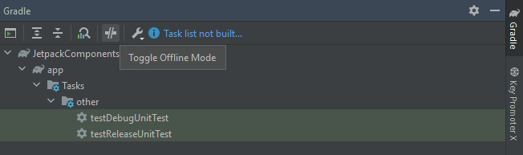

# Errores con AndroidStudio y con _Builds_

## ***Gradle* no reconoce una dependencia**
- Para los errores del tipo:

````bash
  No cached version of androidx.navigation:navigation-compose:<VERSION> available for offline mode
````

- Validar que `Command-lines Options` esté vacío:


- Abrir la ventana de *Gradle* y deshabilitar el *offline mode*:



## *Issue*: *Clean cache and restart*, *Sync with Gradle*, *Clean & Rebuild*, *Make project*, `--refresh-dependencies`, etc. no funcionan
- **Delete Gradle User Home Cache**:
    - Close Android Studio.
    - Locate your Gradle user home directory (usually `~/.gradle` on Linux/macOS or `C:\Users\<YourUser>\.gradle` on Windows) and delete the `caches` and `daemon` directories.
    - Restart Android Studio, Sync with Gradle, Clean and Rebuild.
