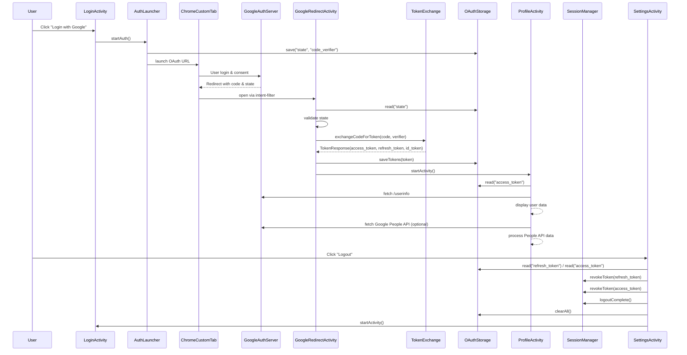

<h1><i>Networking & APIs</i></h1>

***Index***:
<!-- TOC -->
  * [*Retrofit*](#retrofit)
    * [🚀 Cheatsheet Retrofit](#-cheatsheet-retrofit)
    * [Dependencias y permisos](#dependencias-y-permisos)
    * [Modelo de Respuesta](#modelo-de-respuesta)
    * [*Interface API service*](#interface-api-service)
    * [Cliente OkHttp](#cliente-okhttp)
    * [Interceptores de OkHttp: diferencias y usos recomendados](#interceptores-de-okhttp-diferencias-y-usos-recomendados)
      * [🛂 *Application Interceptor*](#-application-interceptor)
      * [🌐 *Network Interceptor*](#-network-interceptor)
    * [Instancia de Retrofit](#instancia-de-retrofit)
    * [Manejo de respuestas y errores](#manejo-de-respuestas-y-errores)
  * [*Ktor* (cliente)](#ktor-cliente)
    * [🚀 Cheatsheet Ktor Client](#-cheatsheet-ktor-client)
    * [Dependencias y permisos](#dependencias-y-permisos-1)
    * [Modelo de respuesta con KotlinX Serialization](#modelo-de-respuesta-con-kotlinx-serialization)
    * [Configuración del cliente HTTP](#configuración-del-cliente-http)
    * [Realizar solicitudes](#realizar-solicitudes)
    * [Manejo de respuestas y errores](#manejo-de-respuestas-y-errores-1)
  * [OAuth 2.0](#oauth-20)
    * [¿Qué es OAuth 2.0?](#qué-es-oauth-20)
    * [¿Para qué sirve?](#para-qué-sirve)
    * [OAuth 2.0 "puro"](#oauth-20-puro)
      * [1. Registro de la Aplicación](#1-registro-de-la-aplicación)
      * [2. Redirección al Proveedor](#2-redirección-al-proveedor)
      * [3. Aprobación del Usuario y Código de Autorización](#3-aprobación-del-usuario-y-código-de-autorización)
      * [4. Intercambio Seguro](#4-intercambio-seguro)
      * [5. Recepción de *Tokens*](#5-recepción-de-tokens)
      * [6. La app llama al *Resource Server* con el ``access_token``](#6-la-app-llama-al-resource-server-con-el-access_token)
      * [7. El proveedor devuelve solo lo permitido por el ``scope``](#7-el-proveedor-devuelve-solo-lo-permitido-por-el-scope)
    * [*Authorization Code Flow* + *PKCE*](#authorization-code-flow--pkce)
      * [1. Registro de la Aplicación](#1-registro-de-la-aplicación-1)
      * [2. La app genera ``code_verifier`` y ``code_challenge``](#2-la-app-genera-code_verifier-y-code_challenge)
      * [3. Redirección al Proveedor con `code_challenge`](#3-redirección-al-proveedor-con-code_challenge)
      * [4. Aprobación del Usuario y Código de Autorización](#4-aprobación-del-usuario-y-código-de-autorización)
      * [5. Intercambio Seguro con `code_verifier`](#5-intercambio-seguro-con-code_verifier)
      * [6. Validaciones del Proveedor y Recepción de *Tokens*](#6-validaciones-del-proveedor-y-recepción-de-tokens)
      * [7. La app llama al *Resource Server* con el ``access_token``](#7-la-app-llama-al-resource-server-con-el-access_token)
      * [8. El proveedor devuelve solo lo permitido por el ``scope``](#8-el-proveedor-devuelve-solo-lo-permitido-por-el-scope)
    * [*OpenID Connect* (OIDC)](#openid-connect-oidc)
      * [¿Cómo encaja con Authorization Code Flow?](#cómo-encaja-con-authorization-code-flow)
    * [Integración con Google](#integración-con-google)
      * [1. Registro de la aplicación en *Google Cloud Console*](#1-registro-de-la-aplicación-en-google-cloud-console)
      * [2. Configuración del `redirect_uri` en la app](#2-configuración-del-redirect_uri-en-la-app)
      * [3. Generación de `state`, `code_verifier` y `code_challenge` en la app](#3-generación-de-state-code_verifier-y-code_challenge-en-la-app)
      * [4. Solicitud de autorización a Google](#4-solicitud-de-autorización-a-google)
      * [5. Recepción del `code`](#5-recepción-del-code)
      * [6. Intercambio del `code` por tokens](#6-intercambio-del-code-por-tokens)
      * [7. Obtención de información del usuario](#7-obtención-de-información-del-usuario)
      * [8. Cierre de sesión (*Logout*) / Revocación](#8-cierre-de-sesión-logout--revocación)
      * [9. Buenas prácticas](#9-buenas-prácticas)
      * [10. Errores comunes](#10-errores-comunes)
      * [Diagrama de Secuencia de ejemplo](#diagrama-de-secuencia-de-ejemplo)
  * [Firebase](#firebase)
<!-- TOC -->

---

## *Retrofit*
> 🔍 Referencias:  
> https://square.github.io/retrofit/  
> https://github.com/square/retrofit  
> https://square.github.io/okhttp/  
> https://johncodeos.com/how-to-make-post-get-put-and-delete-requests-with-retrofit-using-kotlin/

Es una librería con **seguridad de tipo** (_type-safe_) para **_realizar solicitudes HTTP_** y **_mapear las respuestas_** a objetos previamente modelados (con _data class_ en Kotlin).  
No tiene injerencia sobre _cache_, _retries_ ni _logging_. Estas responsabilidades recaen completamente en [OkHttp](#cliente-okhttp), no en Retrofit.

### 🚀 Cheatsheet Retrofit
1. **Definir el modelo de datos**

```kotlin
data class UserDto(
    val id: String,
    val name: String
)
```

2. **Definir interfaz del servicio**

```kotlin
interface UserApi {
    @GET("users/{id}")
    suspend fun fetchUser(
        @Path("id") id: String
    ): Response<UserDto>
}
```

3. **Crear instancia de Retrofit**

```kotlin
val retrofit = Retrofit.Builder()
    .baseUrl("https://api.example.com/")
    .addConverterFactory(GsonConverterFactory.create())
    .build()
```

4. **Crear implementación del servicio (una por cada interfaz en caso de haber más)**

```kotlin
val api = retrofit.create(UserApi::class.java)
```

5. **Ejecutar _request_ + Manejo de respuesta y errores**

```kotlin
suspend fun getUser(id: String): Result<UserDto> {
    return try {
        // Solicitud a la red
        val response = api.fetchUser(id)

        // Otras operaciones
    } catch (e: Exception) {
        // Gestionar errores
    }
}
```

### Dependencias y permisos
Agregar las dependencias necesarias en el archivo ``libs.versions.toml``:

```toml
[versions]
kotlinSerialization = "{VERSION}"
retrofit = "{VERSION}"
okhttp = "{VERSION}"

[libraries]
kotlinx-serialization-json = { module = "org.jetbrains.kotlinx:kotlinx-serialization-json", version.ref = "kotlinSerialization" }
retrofit = { module = "com.squareup.retrofit2:retrofit", version.ref = "retrofit" }
retrofit-converter-kotlinx = { module = "com.squareup.retrofit2:converter-kotlinx-serialization", version.ref = "retrofit" }
okhttp-logging = { module = "com.squareup.okhttp3:logging-interceptor", version.ref = "okhttp" }
```

Implementar las dependencias en el archivo ``build.gradle.kts`` del módulo que corresponda:

```kotlin
// Kotlinx Serialization
implementation(libs.kotlinx.serialization.json)

// Retrofit & OkHttp
implementation(libs.retrofit)
implementation(libs.retrofit.converter.kotlinx)
implementation(libs.okhttp.logging)
```

Agregar el permiso de internet en el ``Manifest``:

```xml
<uses-permission android:name="android.permission.INTERNET" />
```

### Modelo de Respuesta
> :warning: Es importante destacar que Retrofit no trae soporte nativo para KotlinX Serialization, ya que no es parte de Retrofit, sino un _converter_ externo. Gson, en cambio, sí tiene soporte oficial porque es el _converter_ por defecto recomendado históricamente.  
> Para usar el converter de KotlinX Serialization, se requiere agregar el módulo ``converter-kotlinx-serialization``.

A las propiedades de las _data class_ que modelan la respuesta del servicio, se les puede agregar una _annotation_ (por ejemplo, ``@SerializedName`` para Gson o ``@SerialName`` para KotlinX Serialization) y pasarle el nombre del atributo. Esto permite que el modelo sea agnóstico a los nombres "reales" y se pueda reutilizar más fácilmente. Dichas anotaciones son opcionales si el nombre de la propiedad coincide con el JSON.  
Además, en caso de usar el ``Converter`` propio de KotlinX Serialization, se debe anotar la clase con ``@Serializable``.

```kotlin
@Serializable
data class UserDto(
    @SerialName("user_id")
    val userId: String,
    @SerialName("name")
    val name: String,
    @SerialName("nickname")
    val nickname: String,
    @SerialName("followers")
    val followers: Int,
    @SerialName("following")
    val following: List<String>,
    @SerialName("user_type")
    val userType: Int,
)
```

### *Interface API service*
Crear una interfaz que declare los métodos para realizar las solicitudes HTTP y el tipo de retorno, el cual puede estar encapsulado en un ``Response<T>`` (ver [Manejo de respuestas y errores](#manejo-de-respuestas-y-errores)). Esto es opcional y se podría usar un tipo definido por el desarrollador directamente, pero ``Response`` sirve para leer _headers_, verificar si la respuesta fue exitosa con ``isSuccessful``, acceder al código de respuesta con ``code()`` y manejar errores de forma más controlada.  
Se anotan con el verbo de la llamada y, opcionalmente, se pueden pasar parámetros como _headers_, _query params_, _body_ (para los ``POST``, ``PUT`` o ``PATCH``), entre otros.

```kotlin
interface SampleApiService {
    @POST("update_user")
    suspend fun updateUser(
        @Header("Journey-Id") journeyId: String,
        @Query("session_id") sessionId: String?,
        @Body sampleBody: SampleBody?,
    ): Response<SampleUpdateResponse>

    @GET("users/{id}")
    suspend fun fetchUser(
        @Header("Journey-Id") journeyId: String,
        @Query("session_id") sessionId: String?,
        @Path("id") id: String,
    ): Response<SampleFetchResponse>
}
```

### Cliente OkHttp
> ⚠️ Importante: Para poder utilizar ``BuildConfig``, se debe agregar la _flag_ ``buildConfig = true`` dentro del bloque ``android.buildFeatures`` en el archivo ``build.gradle.kts(:app)``

Retrofit usa OkHttp internamente como cliente HTTP, NO lo reemplaza. Por eso es posible personalizarlo antes de pasárselo a Retrofit.  
Permite configurar el comportamiento real de las conexiones HTTP, incluyendo interceptores, _timeouts_, _logging_, políticas de reintento, _cache_ y _headers_ globales (ver apartado siguiente sobre [interceptores](#interceptores-de-okhttp-diferencias-y-usos-recomendados)).

Ejemplo:

```kotlin
val okHttpClient = OkHttpClient.Builder()
    .connectTimeout(20, TimeUnit.SECONDS)
    .readTimeout(20, TimeUnit.SECONDS)
    .writeTimeout(20, TimeUnit.SECONDS)
    .addInterceptor(HttpLoggingInterceptor().apply {
        level = if (BuildConfig.DEBUG) {
            HttpLoggingInterceptor.Level.BODY
        } else {
            HttpLoggingInterceptor.Level.NONE
        }
    })
    .build()
```

### Interceptores de OkHttp: diferencias y usos recomendados
OkHttp permite agregar dos tipos de interceptores, que se ejecutan en distintos momentos del ciclo de una _request_.

| Característica                | 🛂 **Application Interceptor**                                                                            | 🌐 **Network Interceptor**                                                                                       |
|-------------------------------|-----------------------------------------------------------------------------------------------------------|------------------------------------------------------------------------------------------------------------------|
| **Cuándo se ejecuta**         | Antes de cualquier acceso a red                                                                           | Justo antes y después de tocar la red (socket)                                                                   |
| **Redirecciones**             | ❌ Se ejecuta **una sola vez**                                                                             | ✔️ Se ejecuta **por cada redirección**                                                                           |
| **Cache**                     | ✔️ Puede ver respuestas de cache                                                                          | ❌ **No** se ejecuta **cuando OkHttp responde desde el cache** (**sin tocar la red**)                             |
| **Logging**                   | Logging "lógico" (lo que el código envía)                                                                 | Logging "real" (lo que realmente se envió/recibió en red)                                                        |
| **Modificación de request**   | ✔️ Ideal para agregar headers o reescribir requests                                                       | ✔️ Puede modificar request pero ya "casi finalizada"                                                             |
| **Modificación de respuesta** | ✔️ Puede modificarla (incluyendo respuestas cacheadas), pero no es lo habitual                            | ✔️ Puede modificarla (solo cuando viene de red)                                                                  |
| **Casos ideales**             | - Headers globales<br>- Auth tokens<br>- Retries lógicos<br>- Logging de negocio<br>- Reescritura general | - TLS / Certificado<br>- Logging de red real<br>- Inspección de proxies/servidor<br>- Manejo específico de cache |
| **Acceso al socket**          | ❌ No                                                                                                      | ✔️ Sí                                                                                                            |
| **Uso más común**             | Interceptor general de la app                                                                             | Interceptor para debugging, inspección y validaciones profundas de red                                           |
| **Ejecutado sobre**           | La **request original**                                                                                   | La **request final** (después de compresión, headers automáticos, etc.)                                          |

#### 🛂 *Application Interceptor*
Se ejecuta **_antes de que la request llegue a la red_**, actuando en la capa más externa del OkHttpClient. En resumen: es el **_interceptor a usar para lógica de la aplicación_**, sin preocuparte por detalles de transporte o red.

Es ideal para:
- Agregar **_headers_ globales** 
- Manejar **autenticación** (_Tokens_, API _Keys_, _Bearer_, etc.)
- **_Logging_ general** que no dependa de la red
- **_Retries_ personalizados** que se quieran controlar manualmente
- Reescritura de **_requests_ y respuestas** a nivel de aplicación

Comportamiento clave:
- Se ejecuta **una sola vez por _request_**, incluso si hay _redirects_ o _retries_ internos de OkHttp.
- **Ve respuestas provenientes del _cache_**, porque OkHttp puede resolver una _request_ desde disco antes de tocar la red. 
- **No puede modificar la política del _cache_** (qué se guarda, cuándo expira, cómo se revalida), solo puede ver el resultado final. 
- No ve la versión final de la _request_ tal como OkHttp la enviaría por red, porque no participa en las transformaciones de bajo nivel (compresión, _headers_ automáticos, etc.).

Ejemplo:

```kotlin
val okHttpClient = OkHttpClient.Builder()
    .addInterceptor { chain ->
        val newRequest = chain.request()
            .newBuilder()
            .addHeader("User-Agent", "MyApp/1.0")
            .build()

        chain.proceed(newRequest)
    }
```

#### 🌐 *Network Interceptor*
Se ejecuta dos veces por ciclo de red: **_una al enviar la request al servidor_** y **_otra al recibir la respuesta desde la red_**. En resumen: es el **_interceptor para lógica estrictamente de red_**, no para lógica de aplicación.

Es ideal para:
- **_Logging_ real de red** (lo que realmente se envió y lo que realmente llegó)
- Inspeccionar **_headers_ generados por el servidor, _proxies_ o _gateways_** 
- Manipular _headers_ relacionados con **_cache_** (_Cache-Control_, _ETag_, _If-Modified-Since_)
- Operaciones que requieren acceso directo a la **conexión** (certificados, TLS, tamaño real de payload, etc.)

Comportamiento clave:
- Se ejecuta **en cada redirección**, porque cada salto reenvía la _request_ al servidor.
- **No se ejecuta cuando la respuesta proviene del _cache_** :arrow_right: Solo corre cuando hay un acceso real a la red.
- Ve la _request_ **después** de que OkHttp aplicó todas las transformaciones finales (como compresión o _headers_ automáticos).
- Puede modificar la respuesta **antes de que llegue a la capa superior**, lo cual es útil para casos muy específicos (no recomendado para lógica general).

Ejemplo:

```kotlin
val okHttpClient = OkHttpClient.Builder()
    .addNetworkInterceptor { chain ->
        val response = chain.proceed(chain.request())
        // Ideal para depurar headers reales enviados/recibidos
        response
    }
```

### Instancia de Retrofit
Para crear una instancia de Retrofit, es necesario llamar al _builder_ y configurar lo que se requiera. Esto puede hacerse en un archivo separado o como parte de un inyector de dependencias.

Consta de algunos elementos comunes:
- ``baseUrl`` :arrow_right: Configura la URL base de la API a consumir. Debe terminar con la ``/``.
- ``addConverterFactory`` :arrow_right: Agrega un _factory_ que creará una instancia del conversor que permitirá serializar y deserializar objetos. El más habitual suele ser **_Gson_**, pero existen varios más, incluyendo el de **_KotlinX Serialization_**.

```kotlin
val json = Json {
    ignoreUnknownKeys = true
    isLenient = true // Solo si es absolutamente necesario (APIs que no cumplen estándares)
}

Retrofit
    .Builder()
    .baseUrl("https://api.miservicio.com/")
    .addConverterFactory(
        json.asConverterFactory("application/json; charset=UTF-8".toMediaType())
        // También es bastante habitual utilizar el Converter de Gson:
        // GsonConverterFactory.create()
    )
    .client(okHttpClient) // Cliente OkHttp creado en el paso previo
    .build()
    .create(SampleApiService::class.java) // Implementación del servicio
```

### Manejo de respuestas y errores
> ⚠️ Importante:  
> Retrofit **NO lanza excepción** en errores HTTP (4xx/5xx) al usar ``Response<T>``. Solo lanza ``HttpException`` en errores HTTP si el método NO devuelve ``Response<T>``.  
> Retrofit **SÍ lanza excepción** en errores de red (_timeout_, DNS, desconexión, SSL) o serialización (JSON mal formado).

El manejo completo implica distinguir tres niveles:

1. **Excepciones de red o serialización (_throw_)**
Ocurre antes de recibir respuesta (conectividad, timeout, SSL…).

```kotlin
return try {
    val response = api.fetchUser()
    // Pasa al punto 2
    handleResponse(response)
} catch (e: IOException) {
    // Errores de red
    Result.Error("Network error: ${e.localizedMessage}")
} catch (e: MalformedJsonException) {
    // Errores de JSON
    Result.Error("Serialization error: ${e.localizedMessage}")
} catch (e: Exception) {
    // Errores inesperados
    Result.Error("Unexpected error: ${e.localizedMessage}")
}
```

2. **Respuesta HTTP exitosa o con error (2xx / 4xx / 5xx)**
Retrofit devuelve un ``Response<T>``.

```kotlin
fun handleResponse(response: Response<SampleFetchResponse>): Result<SampleFetchResponse> {
    if (response.isSuccessful) {
        val body = response.body()
        return if (body != null) {
            Result.Success(body)
        } else {
            Result.Error("Response body is null")
        }
    } else {
        // Error 4xx / 5xx
        val code = response.code()
        val errorMsg = response.errorBody()?.string()

        return Result.Error("HTTP $code: $errorMsg")
    }
}
```

3. **Mapeo final a un modelo de dominio**
Se puede estandarizar con un _wrapper_ propio, como puede ser ``Result``. Revisar también el uso de [``Either``](/Code%20Snippets%20with%20Kotlin/JSON%20operations%20&%20Error%20handling%20with%20Either.md#sealed-class-either-left-and-right)

```kotlin
sealed class Result<out T> {
    data class Success<T>(val data: T) : Result<T>()
    data class Error(val message: String) : Result<Nothing>()
}
```

## *Ktor* (cliente)
> 🔍 Referencias:  
> https://ktor.io/  
> https://www.slf4j.org/  
> https://logback.qos.ch/  
> https://logging.apache.org/log4j/2.x/index.html

Ktor es un _framework_ para crear aplicaciones asincrónicas **del lado del servidor y del lado del cliente** con facilidad.  
Incluye un cliente HTTP asincrónico multiplataforma, que permite realizar solicitudes, manejar respuestas y ampliar su funcionalidad con _plugins_, como autenticación, serialización JSON y más.  
A diferencia de Retrofit, Ktor **no usa anotaciones ni interfaces**: se trabaja directamente con un cliente configurado y se realiza cada solicitud mediante la función `client.request{}`.

Para utilizar el cliente HTTP de Ktor en un proyecto Android, se deben configurar los repositorios y agregar las dependencias mandatorias y opcionales en caso de requerirlas.

### 🚀 Cheatsheet Ktor Client
1. **Definir el modelo de datos**

```kotlin
@kotlinx.serialization.Serializable
data class UserDto(
    val id: String,
    val name: String
)
```

2. **Crear instancia de Ktor Client**

```kotlin
val client = HttpClient {
    install(ContentNegotiation) {
        json() // kotlinx.serialization
    }
    install(HttpTimeout) {
        requestTimeoutMillis = 15_000
    }
    install(DefaultRequest) {
        url("https://myapi.com/")
        headers.appendIfNameAbsent("X-Custom-Header", "Hello")
    }
}
```

3. **Crear “servicio” (una clase por cada conjunto de _endpoints_)**

```kotlin
class UserApi(private val client: HttpClient) {
    suspend fun fetchUser(id: String): HttpResponse {
        return client.get("users/$id")
    }
}
```

4. **Instanciar el servicio**

```kotlin
val api = UserApi(client)
```

5. **Ejecutar _request_ + Manejo de respuesta y errores**

```kotlin
suspend fun getUser(id: String): Result<UserDto> {
    return try {
        val response = api.fetchUser(id)

        if (response.status.isSuccess()) {
            val body = response.body<UserDto>()
            Result.success(body)
        } else {
            Result.failure(
                Exception("HTTP ${response.status.value}: ${response.status.description}")
            )
        }

    } catch (e: Exception) {
        Result.failure(Exception("Network/serialization error: ${e.localizedMessage}"))
    }
}
```

### Dependencias y permisos
Luego de asegurarse que está agregado el repositorio ``mavenCentral()``, se pueden agregar las dependencias en el archivo ``libs.versions.toml``:

```toml
[versions]
ktor = "{VERSION}"
slf4j = "{VERSION}"

[libraries]
ktor-client-core = { module = "io.ktor:ktor-client-core", version.ref = "ktor" }
ktor-client-okhttp = { module = "io.ktor:ktor-client-okhttp", version.ref = "ktor" }
ktor-client-logging = { module = "io.ktor:ktor-client-logging", version.ref = "ktor" }
ktor-client-content-negotiation = { module = "io.ktor:ktor-client-content-negotiation", version.ref = "ktor" }
ktor-serialization-kotlinx-json = { module = "io.ktor:ktor-serialization-kotlinx-json", version.ref = "ktor" }
slf4j-android = { module = "org.slf4j:slf4j-android", version.ref = "slf4j" }
```

**A tener en cuenta**:

- La funcionalidad principal del cliente está disponible en el artefacto ``ktor-client-core``.
- Un **motor** (**_engine_**) se encarga de **procesar las solicitudes de red**. Existen diferentes motores de cliente disponibles para diversas plataformas, como Apache, CIO, Android, iOS, etc.
- Muchas aplicaciones requieren **funciones comunes que escapan a la lógica de la aplicación**. Estas pueden ser funciones como el _logging_, la serialización o la autorización. Todas estas funciones se proporcionan en Ktor mediante **_plugins_**.
- En JVM, Ktor utiliza **_Simple Logging Facade for Java_** (**_SLF4J_**) como una capa de abstracción para el _logging_. SLF4J desacopla la API de _logging_ de la implementación de _logging_ subyacente, lo que permite integrar el _framework_ de _logging_ que mejor se adapte a los requisitos de la aplicación. Las opciones más comunes incluyen **_Logback_** o **_Log4j_**. Si no se proporciona ningún _framework_, SLF4J utilizará por defecto una implementación sin operación (NOP), que básicamente deshabilita el _logging_.

Implementar las dependencias en el archivo ``build.gradle.kts`` del módulo que corresponda:

```kotlin
// Ktor
implementation(libs.ktor.client.core)
implementation(libs.ktor.client.okhttp)
implementation(libs.ktor.client.logging)
implementation(libs.ktor.client.content.negotiation)
implementation(libs.ktor.serialization.kotlinx.json)
implementation(libs.slf4j.android)
```

Agregar el permiso de internet en el ``Manifest``:

```xml
<uses-permission android:name="android.permission.INTERNET" />
```

### Modelo de respuesta con KotlinX Serialization
Ktor sí depende de KotlinX Serialization para el manejo de JSONs, por lo cual se requiere anotar los modelos con ``@Serializable``.

```kotlin
@Serializable
data class UserDto(
    @SerialName("user_id")
    val userId: String,
    @SerialName("name")
    val name: String,
    @SerialName("nickname")
    val nickname: String,
    @SerialName("followers")
    val followers: Int,
    @SerialName("following")
    val following: List<String>,
    @SerialName("user_type")
    val userType: Int,
)
```

### Configuración del cliente HTTP
> ⚠️ Importante:  A diferencia de Retrofit, el cliente de Ktor sí debe cerrarse cuando ya no va a utilizarse.  
> Para eso, se llama a ``client.close()``.
> Si se usa DI esto no hace falta, ya que el cliente **se cierra automáticamente** al liberar el contenedor.

Ktor requiere configurar un **_engine_**: para Android/JVM, el más común es **OkHttp**. En KMP, se suele usar CIO.  
Además, toda la funcionalidad extra se incorpora mediante **_plugins_**, los cuales se agregan con ``install``:

- ``ContentNegotiation`` :arrow_right: JSON via _KotlinX Serialization_
- ``Logging`` :arrow_right: _Logging_ configurable (dependiendo del backend SLF4J)
- ``DefaultRequest`` :arrow_right: URL base, _headers_ comunes, etc.

Ejemplo:

```kotlin
val client = HttpClient(engineFactory = OkHttp) {
    install(plugin = ContentNegotiation) {
        json(
            Json {
                ignoreUnknownKeys = true
                isLenient = false
            }
        )
    }

    if (BuildConfig.DEBUG) {
        install(Logging) {
            logger = Logger.DEFAULT
            level = LogLevel.BODY
        }
    }

    install(plugin = DefaultRequest) {
        url("https://api.miservicio.com/")
        header("User-Agent", "My-App/1.0")
        headers.appendIfNameAbsent("X-Custom-Header", "Hello")
    }
}
```

### Realizar solicitudes
Ktor no utiliza interfaces como Retrofit: se usa la función ``client.request``.

La clase ``HttpRequestBuilder`` ofrece:

- Método HTTP (``method = HttpMethod.Get``)
- URL (``url("users/1")``)
- Headers (``headers.append``)
- Body (``setBody()``)

Ejemplo:

```kotlin
suspend fun fetchUser(client: HttpClient): SampleResponse {
    val response: HttpResponse = client.request {
        method = HttpMethod.Get
        url("users/1")
        header("Journey-Id", "12345")
    }

    return response.body()
}
```

### Manejo de respuestas y errores
> ⚠️ Importante:  
> Ktor **SÍ lanza excepción** en errores HTTP por defecto (``ClientRequestException`` para los 4xx, ``ServerResponseException`` para los 5xx). Se puede configurar manualmente el ``HttpResponseValidator`` para que no lance excepciones.  
> Ktor **SÍ lanza excepción** en errores de red (_timeout_, DNS, desconexión, SSL) o serialización.

El tipo de respuesta que devuelve es un ``HttpResponse``.

Ejemplo:

```kotlin
suspend fun safeCall(client: HttpClient): Result<SampleResponse> {
    return try {
        val response: HttpResponse = client.request {
            url("users/1")
        }

        if (response.status.isSuccess()) {
            Result.Success(response.body())
        } else {
            Result.Error("HTTP ${response.status.value}: ${response.bodyAsText()}")
        }

    } catch (e: Exception) {
        Result.Error("Network error: ${e.localizedMessage}")
    }
}
```

## OAuth 2.0
### ¿Qué es OAuth 2.0?
> 🔍 Referencia:  
> https://oauth.net/2/

Es un **_protocolo abierto de autorización delegada_**. Permite que una aplicación obtenga acceso limitado a recursos protegidos **_sin que el usuario comparta su contraseña_** con esa aplicación. En lugar de credenciales, la aplicación recibe **_tokens_** que representan permisos específicos.

> ⚠️ Importante  
> OAuth **no es un sistema de autenticación por sí mismo** (o sea, no fue diseñado originalmente para “_login_”).  
> Cuando se usa para identificar usuarios (_login_), suele hacerse mediante [**_OpenID Connect_**](#openid-connect-oidc), que es lo que usa Google.

### ¿Para qué sirve?
- **Inicio de sesión simplificado**:
    - Permite autenticarse usando un proveedor de identidad (por ejemplo, Google) sin crear nuevas cuentas.
- **Mayor seguridad**:
    - La app nunca ve la contraseña del usuario.
    - Los permisos se conceden mediante **_tokens con expiración_**.
- **Permisos granulares**:
    - El usuario puede autorizar **_solo ciertas acciones_** (email, perfil, fotos, etc.).
- **Delegación de capacidades**:
    - Una app puede publicar contenido, acceder al calendario, ver fotos, etc., en nombre del usuario, si este lo autoriza.

### OAuth 2.0 "puro"
> ⚠️ Importante  
> El flujo explicado a continuación es el OAuth 2.0 "clásico" o "puro", según la especificación original ([RFC 6749](https://datatracker.ietf.org/doc/html/rfc6749)), que asume que el cliente puede mantener seguro su `client_secret` (por ejemplo, un _backend_).  
> Esto no es posible en apps móviles, por lo cual se utiliza una extensión moderna y segura llamada [**_Authorization Code Flow + PKCE_**](#authorization-code-flow--pkce), que elimina la necesidad del `client_secret`.

OAuth 2.0 define un mecanismo para que una aplicación (cliente) obtenga **_permiso controlado_** para acceder a recursos protegidos en nombre del usuario. El flujo más común (y el más seguro cuando la aplicación puede abrir un navegador) es el **_Authorization Code Flow_**, que constituye la base del OAuth 2.0 “puro”.

#### 1. Registro de la Aplicación
Se debe registrar la aplicación en el portal de desarrolladores de cada proveedor (Google API Console, por ejemplo).

- ``client_id`` y ``client_secret`` :arrow_right: Los genera el proveedor cuando se registra la aplicación.
- ``redirect_uri`` :arrow_right: Se configura en el panel del proveedor y además se envía desde la app.

#### 2. Redirección al Proveedor
La app inicia la autorización para acceder a datos protegidos del usuario (por ejemplo: email, foto de perfil).  
Para eso, la aplicación abre el navegador del usuario y lo dirige a la **_URL de autorización del proveedor_**, enviando parámetros como:
- ``client_id`` :arrow_right: Identifica la app 
- ``redirect_uri`` :arrow_right: URL adonde volverá el usuario luego de autorizar 
- ``response_type=code`` :arrow_right: Indica que queremos un _authorization code_ 
- ``scope`` :arrow_right: Qué permisos solicita la app 
- ``state`` :arrow_right: Valor aleatorio para prevenir ataques CSRF

📌 Ejemplo:

```text
GET https://accounts.google.com/o/oauth2/v2/auth
 ?client_id=abc123.apps.googleusercontent.com
 &redirect_uri=myapp://auth/callback
 &response_type=code
 &scope=email%20profile
 &state=q9x82k
```

#### 3. Aprobación del Usuario y Código de Autorización
El usuario inicia sesión en el sitio del proveedor, el cual muestra la pantalla de _login_ y los permisos.  
Si el usuario da su consentimiento para que la aplicación acceda a sus datos básicos, el proveedor **_genera internamente un nuevo authorization code_**, el cual es **_único, temporal y de un solo uso_**.  
Luego, el proveedor redirecciona al ``redirect_uri`` de la app agregando ese ``code`` en la URL.

> ℹ️ La app **_NO obtiene datos del usuario todavía_**, solo la autorización para pedirlos.

📌 Ejemplo:

```text
myapp://auth/callback?code=4f92e1...&state=q9x82k
```

#### 4. Intercambio Seguro
El *backend* (o a veces el cliente directamente, dependiendo del proveedor y la arquitectura) envía el ``code`` y el ``client_secret`` al **_token endpoint_** del proveedor para obtener los _tokens_.

📌 Ejemplo:

```text
POST https://oauth2.googleapis.com/token
Content-Type: application/x-www-form-urlencoded

grant_type=authorization_code
code=4f92e1...
redirect_uri=myapp://auth/callback
client_id=abc123.apps.googleusercontent.com
client_secret=XYZ987 (solo apps seguras / servidores)
```

#### 5. Recepción de *Tokens*
El proveedor responde con los siguientes *tokens*, los cuales **_no contienen los datos del usuario_**, solo **_autorizan el acceso para llamar a sus APIs_**:

- ``access_token`` :arrow_right: Sirve para llamar APIs protegidas
- ``refresh_token`` (opcional) :arrow_right: Para pedir nuevos _access tokens_ cuando expiren

📌 Ejemplo:

```json lines
{
  "access_token": "ya29.a0AfH6SMD...",
  "expires_in": 3600,
  "refresh_token": "1//0gkfj39...",
  "token_type": "Bearer"
}
```

#### 6. La app llama al *Resource Server* con el ``access_token``
Con el ``access_token``, el cual se usa como “credencial temporal”, ahora sí la app puede pedir datos protegidos a cualquiera de las APIs del proveedor.

📌 Ejemplo Google People API:

```text
GET https://people.googleapis.com/v1/people/me?personFields=names,emailAddresses
Authorization: Bearer <access_token>
```

#### 7. El proveedor devuelve solo lo permitido por el ``scope``
El _scope_ funciona como una **_whitelist_** de los datos que puede pedir la app.  
Si la app pidió ``scope=email profile``, el proveedor solo devolverá eso:

```json lines
{
  "email": "user@gmail.com",
  "name": "Juan Pérez",
  "picture": "https://..."
}
```

### *Authorization Code Flow* + *PKCE*
> ⚠️ Importante  
> En apps móviles o _desktop_ no se puede guardar un ``client_secret`` de forma segura (cualquiera puede extraerlo del APK).  
> **PKCE** agrega una capa de seguridad que evita el robo o intercambio fraudulento del ``code``, sin usar ``client_secret`` ([RFC 7636](https://datatracker.ietf.org/doc/html/rfc7636)).

**PKCE** (**_Proof Key for Code Exchange_**) es una **_extensión moderna_** del _Authorization Code Flow_. Es el estándar recomendado para trabajar con aplicaciones Android, iOS, Desktop o de una sola página (SPAs) Web/JavaScript y el adecuado **_incluso cuando sí existe backend_** (Google recomienda usar PKCE siempre).

El flujo es casi igual al OAuth "puro", pero agrega dos parámetros clave:
- ``code_verifier`` :arrow_right: Cadena aleatoria (se genera en la app)
- ``code_challenge`` :arrow_right: _Hash_ derivado del ``code_verifier`` que se envía al iniciar la autorización

El proveedor luego exige el ``code_verifier`` durante el intercambio para asegurarse de que la app que inició el flujo es la misma que lo finaliza.

#### 1. Registro de la Aplicación
Igual que en OAuth "puro" (ver [acá](#1-registro-de-la-aplicación)).

#### 2. La app genera ``code_verifier`` y ``code_challenge``
Estos valores no los entrega Google ni ningún proveedor: **los genera la app en cada inicio de _login_**, antes de redirigir al proveedor. Solo se guardan en memoria durante el flujo. **No se persisten en disco y se descartan luego de obtener los _tokens_**. 

```text
code_verifier  = cadena aleatoria larga (43–128 chars)
code_challenge = BASE64URL( SHA256(code_verifier) )
code_challenge_method = "S256"
```

📌 Ejemplo:

```text
code_verifier:  dBjftJeZ4CVP-mB92K27uhbUJU1p1r_wW1gFWFOEjXk
code_challenge: E9Melhoa2OwvFrEMTJguCHaoeK1t8URWbuGJSstw-cM
```

#### 3. Redirección al Proveedor con `code_challenge`
Similar a lo que hace OAuth "puro" (ver [acá](#2-redirección-al-proveedor)), con la diferencia de que con PKCE, además de los parámetros mencionados, también se envía el `code_challenge` y el ``code_challenge_method``.

📌 Ejemplo:

```text
GET https://accounts.google.com/o/oauth2/v2/auth
 ?client_id=abc123.apps.googleusercontent.com
 &redirect_uri=myapp://auth/callback
 &response_type=code
 &scope=email%20profile
 &state=q9x82k
 &code_challenge=E9Melhoa2OwvFrEMTJguCHaoeK1t8URWbuGJSstw-cM
 &code_challenge_method=S256
```

#### 4. Aprobación del Usuario y Código de Autorización
Esto es igual que en OAuth "puro" (ver [acá](#3-aprobación-del-usuario-y-código-de-autorización)).

#### 5. Intercambio Seguro con `code_verifier`
Similar a lo que hace OAuth "puro" (ver [acá](#4-intercambio-seguro)), con la diferencia de que con PKCE, en lugar del ``client_secret``, se envía el `code_verifier` original al _token endpoint_ del proveedor.

📌 Ejemplo:

```text
POST https://oauth2.googleapis.com/token
Content-Type: application/x-www-form-urlencoded

grant_type=authorization_code
code=4f92e1...
redirect_uri=myapp://auth/callback
client_id=abc123.apps.googleusercontent.com
code_verifier=dBjftJeZ4CVP-mB92K27uhbUJU1p1r_wW1gFWFOEjXk
```

#### 6. Validaciones del Proveedor y Recepción de *Tokens*
Similar a lo que hace OAuth "puro" (ver [acá](#5-recepción-de-tokens)), con la diferencia de que con PKCE, el proveedor verifica lo siguiente antes de devolver los *tokens*:

1. ¿Coincide ``SHA256(code_verifier)`` con el ``code_challenge`` inicial?
2. ¿El ``code`` es válido, reciente y de un solo uso?

Si todo está OK :arrow_right: El proveedor responde con el ``access_token``.

> **_Sin PKCE_**, cualquiera que robara el ``code`` podría canjearlo por el ``access_token``.  
> **_Con PKCE_**, sin el ``code_verifier``, el ``code`` es inútil.

#### 7. La app llama al *Resource Server* con el ``access_token``
Igual que en OAuth "puro" (ver [acá](#6-la-app-llama-al-resource-server-con-el-access_token)).

#### 8. El proveedor devuelve solo lo permitido por el ``scope``
Igual que en OAuth "puro" (ver [acá](#7-el-proveedor-devuelve-solo-lo-permitido-por-el-scope)).

### *OpenID Connect* (OIDC)
Es una **_capa de identidad_** construida encima de OAuth 2.0.  
Mientras OAuth 2.0 define **_cómo una app obtiene permiso_**, OIDC define **_cómo una app obtiene información verificada del usuario_**.

OIDC suma dos cosas clave:

1. **``id_token``**  
   - Es un **_[JWT](/Glosary%20&%20Core%20Concepts/Software%20in%20general.md#jwt-json-web-token) firmado digitalmente por el proveedor_**.
   - La app lo recibe en el momento del _login_, lo abre, valida la firma digital del proveedor y extrae los [reclamos](/Glosary%20&%20Core%20Concepts/Software%20in%20general.md#claims-reclamos) de identidad, como pueden ser:
     - ``sub`` (identificador único del usuario)
     - ``email`` 
     - ``email_verified`` 
     - ``name``, ``picture`` (según el proveedor)
   - Se usa **_para saber quién es el usuario_** (**_identidad_**) de forma confiable.
   - Al ser la identidad su único propósito, **_NO se usa para llamar APIs ni para autorización_**.

> ⚠️ Importante:  
> El **``id_token`` no reemplaza al ``access_token``**.
> - ``id_token`` :arrow_right: **Identidad**
> - ``access_token`` :arrow_right: **Acceso a recursos protegidos**

2. **_UserInfo Endpoint_**  
   - Es un **_endpoint estándar definido por OIDC_** al que la aplicación puede llamar (si es necesario, **_no es obligatorio_**) usando el ``access_token`` para obtener **_información adicional del perfil del usuario_**.  
   - El estándar define que el _endpoint_ se llama ``/userinfo``, aunque la URL completa cambia según el proveedor.

📌 Ejemplos:

```text
// Google
https://openidconnect.googleapis.com/v1/userinfo

// Auth0
https://<tu-dominio>.auth0.com/userinfo

// Azure AD
https://graph.microsoft.com/oidc/userinfo
```

<br>

| Característica    | id_token             | UserInfo Endpoint      |
|-------------------|----------------------|------------------------|
| Fuente            | JWT firmado          | API HTTP               |
| Requiere red      | ❌ No                 | ✔️ Sí                  |
| Propósito         | Identidad            | Perfil adicional       |
| Validación        | Local (firma)        | Google valida el token |
| Campos típicos    | email, name, picture | email, name, picture   |
| Datos adicionales | ❌ Normalmente no     | ✔️ Posibles            |
| Uso recomendado   | Login rápido         | Perfil actualizado     |

#### ¿Cómo encaja con Authorization Code Flow?
OIDC se construye **_encima del mismo flujo Authorization Code (con o sin PKCE)_**.  
La única diferencia es que, al intercambiar el ``code`` (ver [acá](#5-intercambio-seguro-con-code_verifier)), el servidor devuelve:

- ``access_token`` :arrow_right: OAuth
- ``refresh_token`` :arrow_right: OAuth (opcional)
- ``id_token`` :arrow_right: OIDC

> ℹ️ **Es decir:**  
> **_Authorization Code Flow_** / **_Authorization Code + PKCE_** :arrow_right: **Transporte seguro**  
> **_OIDC_** :arrow_right: **Identidad del usuario**

### Integración con Google
> 🔍 Referencia:  
> https://developers.google.com/identity/protocols/oauth2

Google ofrece soporte nativo para **OAuth 2.0 + PKCE** y **OpenID Connect (OIDC)**.  
A continuación se describe cómo integrar una aplicación Android con Google como proveedor externo de identidad, siguiendo el flujo estándar de autorización con *Authorization Code + PKCE*.  
Esta guía **_NO incluye la integración usando el SDK de Google Sign-In_** (librería oficial de Google que encapsula todo el flujo OAuth/OIDC y da una forma simplificada de autenticar usuarios en Android, iOS y web).

📌 Ejemplos de código: ver [acá](/Code%20Snippets%20with%20Kotlin/Security.md)

#### 1. Registro de la aplicación en *Google Cloud Console*
1. Crear un proyecto en **_Google Cloud Console_**.
2. Abrir **_APIs & Services_ :arrow_right: _OAuth consent screen_** y configurar:
    - Nombre de la app
    - _Scopes_ visibles para el usuario
    - Dominios y correos de soporte
3. Ir a **_Credentials_ :arrow_right: _Create credentials_ :arrow_right: _OAuth Client ID_**.
4. Elegir el tipo “Android” (si se usa el SDK de **_Google Sign-In_**) o “Desktop” (si se usa PKCE puro (OAuth manual)).
5. Obtener `client_id`
6. Registrar `redirect_uri` al estilo Google (`com.googleusercontent.apps.<client-id>:/oauth2redirect`)

> ⚠️ Importante:  
> El `redirect_uri` debe coincidir *exactamente* en consola, app y _request_.

📌 Ejemplo de `redirect_uri` registrado:

```text
com.googleusercontent.apps.1234567890-abcdef:/oauth2redirect
```

#### 2. Configuración del `redirect_uri` en la app
Google redirigirá a la aplicación usando el `redirect_uri` que se registró previamente en _Google Cloud Console_.  
Esto se captura mediante un `intent-filter` asociado al mismo esquema y _host_, el cual debe registrarse en el `Manifest.xml`.

Puntos clave:
- `android:scheme` = Parte antes de `://` en el `redirect_uri`.
- `android:host` = Valor fijo ``oauth2redirect`` (formato estándar del ``redirect_uri`` de Google para apps móviles).
- La actividad (`GoogleRedirectActivity`) será quien reciba:
    - `code`
    - `state`
- El esquema debe ser **único**, para evitar conflictos con otras apps.

#### 3. Generación de `state`, `code_verifier` y `code_challenge` en la app
1. Generar ``state``
2. Generar un `code_verifier` aleatorio y criptográficamente seguro.
3. Calcular `code_challenge = BASE64URL( SHA-256(code_verifier) )`.
4. Guardar el `code_verifier` temporalmente para el paso 6 (intercambio del `code`).

Puntos clave:
- Google **requiere** `code_challenge_method=S256` para apps móviles.
- Si no se enviá PKCE, Google rechazará el flujo en apps móviles.

#### 4. Solicitud de autorización a Google
> ⚠️ Importante:  
> Google prohíbe explícitamente el uso de _WebViews_ para OAuth. Por lo cual, debe usarse siempre _Chrome Custom Tabs_.

Para iniciar el flujo OAuth 2.0 con PKCE, la app debe abrir la pantalla de _login_ de Google. Una vez que el usuario ingresa sus credenciales (da autorización), Google va a continuar con el paso siguiente: redirigir al ``redirect_uri`` (_deeplink_) con ``code`` y ``state``.

El _endpoint_ de autorización es el siguiente:

```text
https://accounts.google.com/o/oauth2/v2/auth
```

**Parámetros Obligatorios**:
- `client_id`  
  El ID de la aplicación en _Google Cloud Console_.
- `redirect_uri`  
  URI registrada donde Google redirigirá después del _login_.  
  Debe coincidir exactamente con la configuración del proyecto.
- `response_type=code`  
  Indica que se solicita un **Authorization Code**.
- `scope`  
  Permisos que la app solicita (OIDC + datos del perfil).
- `state`  
  Cadena aleatoria para proteger contra ataques CSRF.  
  La app debe validar que coincida al recibir el `code`.
- `code_challenge`  
  Valor derivado del `code_verifier` mediante **SHA-256 + Base64URL** (PKCE).
- `code_challenge_method=S256`  
  Indica que el `code_challenge` se generó con SHA-256.

**Parámetros Opcionales**:
- `access_type=offline`  
  Solicita un **refresh_token** para acceso prolongado.
- `prompt=consent`  
  Forza que Google muestre la pantalla de consentimiento.  
  Útil para obtener un nuevo `refresh_token` incluso si ya se otorgó uno previamente.

**_Scopes_ recomendados**:
- `openid` :arrow_right: Requerido para OIDC (habilita `id_token`).
- `email` :arrow_right: Acceso al email y estado `email_verified`.
- `profile` :arrow_right: Nombre, foto y datos básicos del usuario.

📌 **Ejemplo de URL de autorización que termina abriendo la pantalla de _login_ de Google**

```text
https://accounts.google.com/o/oauth2/v2/auth?
  response_type=code
  &client_id=1234567890-abcdef.apps.googleusercontent.com
  &redirect_uri=com.googleusercontent.apps.1234567890-abcdef:/oauth2redirect
  &scope=openid%20email%20profile
  &state=xyz123
  &code_challenge=abc456
  &code_challenge_method=S256
  &access_type=offline
  &prompt=consent
```

#### 5. Recepción del `code`
Luego de que el usuario completa el _login_, Google redirige a la app usando el `redirect_uri` registrado y agregado en el ``Manifest``. La redirección incluye el `code` y el `state` enviados previamente.

```text
com.googleusercontent.apps.1234567890-abcdef:/oauth2redirect?code=4f92e1...&state=s9dk3a
```

La app debe:
1. Leer el parámetro `code`.
2. Leer y validar el parámetro `state`
    - Debe coincidir con el valor que se generó antes de abrir el navegador.
    - Si no coincide, cancelar el proceso por riesgo de ataque CSRF.
3. Recuperar el `code_verifier` generado al inicio (se necesitará en el siguiente paso).

#### 6. Intercambio del `code` por tokens
Una vez recibido el `code`, la app debe enviarlo al _endpoint_ de Google para obtener el `access_token`.  
Este paso completa el flujo **Authorization Code + PKCE**.

```text
https://oauth2.googleapis.com/token
```

**Parámetros Obligatorios**:

- `code`  
  El código recibido en el paso anterior.
- `redirect_uri`  
  Debe ser **idéntico** al usado en el paso 4 (solicitud de autorización)
- `client_id`  
  El ID de la aplicación en _Google Cloud Console_.
- `code_verifier`  
  El valor original generado en el paso 3.  
  Google recalculará el `code_challenge` y validará que coincida.
- `grant_type=authorization_code`  
  Indica que se está usando el flujo _Authorization Code_.

**Parámetros Opcionales**:
- `code_challenge_method`  
  *No se envía en este paso.* Solo aparece en la fase inicial.
- `client_secret`  
  **⚠️ No se usa en apps móviles.**  
  Solo obligatorio en entornos confidenciales (_backend_).
- `redirect_uri` en forma URL-encoded  
  (Según el cliente HTTP que se use).
- `include_granted_scopes=true`  
  Permite ampliar _scopes_ sin volver a pedir consentimiento.  
  No es habitual en móviles.

📌 Ejemplo de _Request_:

```text
POST /token
Content-Type: application/x-www-form-urlencoded

grant_type=authorization_code
code=4f92e1...
redirect_uri=com.googleusercontent.apps.1234567890-abcdef:/oauth2redirect
client_id=1234567890-abcdef.apps.googleusercontent.com
code_verifier=<verifier-original>
```

📌 Ejemplo de Respuesta:

```json lines
{
  "access_token": "ya29.a0Af...",
  "expires_in": 3599,
  "refresh_token": "1//0g...", // Cuando se solicita `access_type=offline` o `prompt=consent`
  "scope": "openid email profile",
  "token_type": "Bearer",
  "id_token": "eyJhbGciOiJSUzI1NiIs..."
}
```

#### 7. Obtención de información del usuario
Una vez obtenido el `access_token`, la app puede solicitar los datos básicos del usuario.  
Google permite obtener estos datos a través de distintos mecanismos. Cada uno cumple un propósito diferente y se complementan entre sí.

**A. Usando el `id_token` (OIDC)**  
Cuando se solicita el scope `openid`, Google devuelve un `id_token` con información básica de identidad (formato JWT), **_firmado con una clave privada_**. Para verificarlo localmente, se necesita la **_clave pública_** que corresponde a esa privada.  
Google publica un conjunto de claves públicas (JWKs = _JSON Web Keys_) en:

```text
https://www.googleapis.com/oauth2/v3/certs
```

Cada _token_ firmado tiene un índice ``kid``. La librería **_Nimbus_** (por ejemplo) descarga las JWK, busca la que coincide con el ``kid`` y **verifica la firma del _token_**.

📌 Ejemplo de _payload_ (_claims_ del ``id_token``):

```json lines
{
  "iss": "https://accounts.google.com",
  "sub": "11223344556677889900",
  "email": "juan@example.com",
  "email_verified": true,
  "name": "Juan Perez",
  "picture": "https://lh3.googleusercontent.com/a-/AOh14Gg..."
}
```

Validaciones recomendadas:
- `iss == "https://accounts.google.com"`
- `aud == <client_id>`
- `exp` vigente
- Firma válida :arrow_right: Uso de JWKs públicas de Google

**B. Usando el _UserInfo Endpoint_**  
Si se necesita información adicional o estandarizada, Google expone el endpoint OIDC `userinfo`, accesible con el `access_token`.

```text
GET https://openidconnect.googleapis.com/v1/userinfo
Authorization: Bearer <access_token>
```

📌 Ejemplo:

```json lines
{
  "sub": "11223344556677889900",
  "email": "juan@example.com",
  "email_verified": true,
  "name": "Juan Perez",
  "picture": "https://lh3.googleusercontent.com/a-/AOh14Gg..."
}
```

**C. Usando _Google People API_ (más completo)**  
> ℹ️ Nota:  
> Requiere el uso de ``scopes`` adicionales

Para obtener datos de perfil más ricos (varios nombres, fotos, aliases, etc.), se puede consultar la People API:

```text
GET https://people.googleapis.com/v1/people/me?personFields=names,emailAddresses,photos
Authorization: Bearer <access_token>
```

#### 8. Cierre de sesión (*Logout*) / Revocación
Para cerrar sesión correctamente en Google y minimizar el riesgo de _tokens_ válidos residuales, no alcanza con borrar los _tokens_ localmente: conviene revocar los _tokens_ en el servidor de Google y luego limpiar el estado local.

**Pasos recomendados**:
1. Llamar al _endpoint_ de revocación enviando el ``refresh_token`` (preferible) o el ``access_token``. 
2. Borrar todos los _tokens_ locales (``access_token``, ``refresh_token``, ``id_token``) y el estado de sesión.
3. (Opcional) Cerrar sesión del navegador para forzar _logout_ visual.  
   Esto **no revoca _tokens_**, solo borra _cookies_.

**_Endpoint_ de revocación**:

```text
POST https://oauth2.googleapis.com/revoke
Content-Type: application/x-www-form-urlencoded

token=<access_or_refresh_token>
```

#### 9. Buenas prácticas
- Usar siempre PKCE (S256).
- Validar siempre `id_token`.
- No guardar _tokens_ en _logs_, ``intents`` ni almacenamiento sin cifrado (``EncryptedSharedPreferences`` o **_Keystore-based_**).
- Pedir solo los ``scopes`` necesarios.
- Usar `refresh_token` solo si hace falta.

#### 10. Errores comunes
- `redirect_uri_mismatch`: La `redirect_uri` no coincide exactamente con la configurada en _Google Cloud_.
- `invalid_scope`: _Scopes_ incorrectos o falta `openid` si se espera un `id_token`.
- `invalid_grant`:
    - `code` reutilizado
    - `code_verifier` incorrecto (PKCE inválido)
- `invalid_client`: Error de configuración del **Client ID**, del tipo de aplicación o credenciales.
- `id_token` inválido: Firma, `aud`, `iss` o `exp` no válidos.
- `access_denied`: El usuario canceló el _login_ o no otorgó permisos.

#### Diagrama de Secuencia de ejemplo


## Firebase

