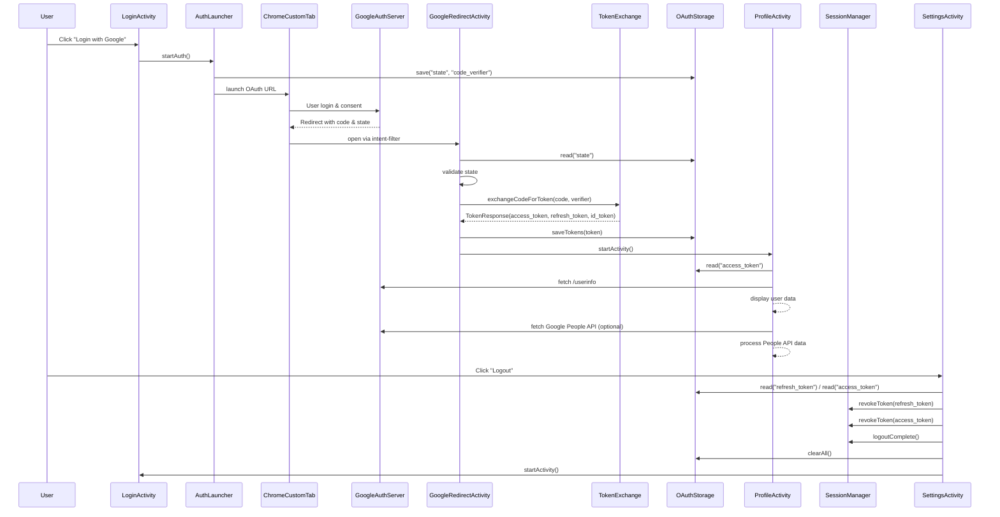

<h1><i>Security</i></h1>

> 🔍 Referencia:  
> https://developer.android.com/security

***Index***:
<!-- TOC -->
  * [OAuth 2.0](#oauth-20)
    * [¿Qué es OAuth 2.0?](#qué-es-oauth-20)
    * [¿Para qué sirve?](#para-qué-sirve)
    * [OAuth 2.0 "puro"](#oauth-20-puro)
      * [1. Registro de la Aplicación](#1-registro-de-la-aplicación)
      * [2. Redirección al Proveedor](#2-redirección-al-proveedor)
      * [3. Aprobación del Usuario y Código de Autorización](#3-aprobación-del-usuario-y-código-de-autorización)
      * [4. Intercambio Seguro](#4-intercambio-seguro)
      * [5. Recepción de *Tokens*](#5-recepción-de-tokens)
      * [6. La app llama al *Resource Server* con el ``access_token``](#6-la-app-llama-al-resource-server-con-el-access_token)
      * [7. El proveedor devuelve solo lo permitido por el ``scope``](#7-el-proveedor-devuelve-solo-lo-permitido-por-el-scope)
    * [*Authorization Code Flow* + *PKCE*](#authorization-code-flow--pkce)
      * [1. Registro de la Aplicación](#1-registro-de-la-aplicación-1)
      * [2. La app genera ``code_verifier`` y ``code_challenge``](#2-la-app-genera-code_verifier-y-code_challenge)
      * [3. Redirección al Proveedor con `code_challenge`](#3-redirección-al-proveedor-con-code_challenge)
      * [4. Aprobación del Usuario y Código de Autorización](#4-aprobación-del-usuario-y-código-de-autorización)
      * [5. Intercambio Seguro con `code_verifier`](#5-intercambio-seguro-con-code_verifier)
      * [6. Validaciones del Proveedor y Recepción de *Tokens*](#6-validaciones-del-proveedor-y-recepción-de-tokens)
      * [7. La app llama al *Resource Server* con el ``access_token``](#7-la-app-llama-al-resource-server-con-el-access_token)
      * [8. El proveedor devuelve solo lo permitido por el ``scope``](#8-el-proveedor-devuelve-solo-lo-permitido-por-el-scope)
    * [*OpenID Connect* (OIDC)](#openid-connect-oidc)
      * [¿Cómo encaja con Authorization Code Flow?](#cómo-encaja-con-authorization-code-flow)
    * [Integración con Google](#integración-con-google)
      * [1. Registro de la aplicación en *Google Cloud Console*](#1-registro-de-la-aplicación-en-google-cloud-console)
      * [2. Configuración del `redirect_uri` en la app](#2-configuración-del-redirect_uri-en-la-app)
      * [3. Generación de `state`, `code_verifier` y `code_challenge` en la app](#3-generación-de-state-code_verifier-y-code_challenge-en-la-app)
      * [4. Solicitud de autorización a Google](#4-solicitud-de-autorización-a-google)
      * [5. Recepción del `code`](#5-recepción-del-code)
      * [6. Intercambio del `code` por tokens](#6-intercambio-del-code-por-tokens)
      * [7. Obtención de información del usuario](#7-obtención-de-información-del-usuario)
      * [8. Cierre de sesión (*Logout*) / Revocación](#8-cierre-de-sesión-logout--revocación)
      * [9. Buenas prácticas](#9-buenas-prácticas)
      * [10. Errores comunes](#10-errores-comunes)
      * [Diagrama de Secuencia de ejemplo](#diagrama-de-secuencia-de-ejemplo)
<!-- TOC -->

---

## OAuth 2.0
### ¿Qué es OAuth 2.0?
> 🔍 Referencia:  
> https://oauth.net/2/

Es un **_protocolo abierto de autorización delegada_**. Permite que una aplicación obtenga acceso limitado a recursos protegidos **_sin que el usuario comparta su contraseña_** con esa aplicación. En lugar de credenciales, la aplicación recibe **_tokens_** que representan permisos específicos.

> ⚠️ Importante  
> OAuth **no es un sistema de autenticación por sí mismo** (o sea, no fue diseñado originalmente para “_login_”).  
> Cuando se usa para identificar usuarios (_login_), suele hacerse mediante [**_OpenID Connect_**](#openid-connect-oidc), que es lo que usa Google.

### ¿Para qué sirve?
- **Inicio de sesión simplificado**:
    - Permite autenticarse usando un proveedor de identidad (por ejemplo, Google) sin crear nuevas cuentas.
- **Mayor seguridad**:
    - La app nunca ve la contraseña del usuario.
    - Los permisos se conceden mediante **_tokens con expiración_**.
- **Permisos granulares**:
    - El usuario puede autorizar **_solo ciertas acciones_** (email, perfil, fotos, etc.).
- **Delegación de capacidades**:
    - Una app puede publicar contenido, acceder al calendario, ver fotos, etc., en nombre del usuario, si este lo autoriza.

### OAuth 2.0 "puro"
> ⚠️ Importante  
> El flujo explicado a continuación es el OAuth 2.0 "clásico" o "puro", según la especificación original ([RFC 6749](https://datatracker.ietf.org/doc/html/rfc6749)), que asume que el cliente puede mantener seguro su `client_secret` (por ejemplo, un _backend_).  
> Esto no es posible en apps móviles, por lo cual se utiliza una extensión moderna y segura llamada [**_Authorization Code Flow + PKCE_**](#authorization-code-flow--pkce), que elimina la necesidad del `client_secret`.

OAuth 2.0 define un mecanismo para que una aplicación (cliente) obtenga **_permiso controlado_** para acceder a recursos protegidos en nombre del usuario. El flujo más común (y el más seguro cuando la aplicación puede abrir un navegador) es el **_Authorization Code Flow_**, que constituye la base del OAuth 2.0 “puro”.

#### 1. Registro de la Aplicación
Se debe registrar la aplicación en el portal de desarrolladores de cada proveedor (Google API Console, por ejemplo).

- ``client_id`` y ``client_secret`` :arrow_right: Los genera el proveedor cuando se registra la aplicación.
- ``redirect_uri`` :arrow_right: Se configura en el panel del proveedor y además se envía desde la app.

#### 2. Redirección al Proveedor
La app inicia la autorización para acceder a datos protegidos del usuario (por ejemplo: email, foto de perfil).  
Para eso, la aplicación abre el navegador del usuario y lo dirige a la **_URL de autorización del proveedor_**, enviando parámetros como:
- ``client_id`` :arrow_right: Identifica la app
- ``redirect_uri`` :arrow_right: URL adonde volverá el usuario luego de autorizar
- ``response_type=code`` :arrow_right: Indica que queremos un _authorization code_
- ``scope`` :arrow_right: Qué permisos solicita la app
- ``state`` :arrow_right: Valor aleatorio para prevenir ataques CSRF

📌 Ejemplo:

```text
GET https://accounts.google.com/o/oauth2/v2/auth
 ?client_id=abc123.apps.googleusercontent.com
 &redirect_uri=myapp://auth/callback
 &response_type=code
 &scope=email%20profile
 &state=q9x82k
```

#### 3. Aprobación del Usuario y Código de Autorización
El usuario inicia sesión en el sitio del proveedor, el cual muestra la pantalla de _login_ y los permisos.  
Si el usuario da su consentimiento para que la aplicación acceda a sus datos básicos, el proveedor **_genera internamente un nuevo authorization code_**, el cual es **_único, temporal y de un solo uso_**.  
Luego, el proveedor redirecciona al ``redirect_uri`` de la app agregando ese ``code`` en la URL.

> ℹ️ La app **_NO obtiene datos del usuario todavía_**, solo la autorización para pedirlos.

📌 Ejemplo:

```text
myapp://auth/callback?code=4f92e1...&state=q9x82k
```

#### 4. Intercambio Seguro
El *backend* (o a veces el cliente directamente, dependiendo del proveedor y la arquitectura) envía el ``code`` y el ``client_secret`` al **_token endpoint_** del proveedor para obtener los _tokens_.

📌 Ejemplo:

```text
POST https://oauth2.googleapis.com/token
Content-Type: application/x-www-form-urlencoded

grant_type=authorization_code
code=4f92e1...
redirect_uri=myapp://auth/callback
client_id=abc123.apps.googleusercontent.com
client_secret=XYZ987 (solo apps seguras / servidores)
```

#### 5. Recepción de *Tokens*
El proveedor responde con los siguientes *tokens*, los cuales **_no contienen los datos del usuario_**, solo **_autorizan el acceso para llamar a sus APIs_**:

- ``access_token`` :arrow_right: Sirve para llamar APIs protegidas
- ``refresh_token`` (opcional) :arrow_right: Para pedir nuevos _access tokens_ cuando expiren

📌 Ejemplo:

```json lines
{
  "access_token": "ya29.a0AfH6SMD...",
  "expires_in": 3600,
  "refresh_token": "1//0gkfj39...",
  "token_type": "Bearer"
}
```

#### 6. La app llama al *Resource Server* con el ``access_token``
Con el ``access_token``, el cual se usa como “credencial temporal”, ahora sí la app puede pedir datos protegidos a cualquiera de las APIs del proveedor.

📌 Ejemplo Google People API:

```text
GET https://people.googleapis.com/v1/people/me?personFields=names,emailAddresses
Authorization: Bearer <access_token>
```

#### 7. El proveedor devuelve solo lo permitido por el ``scope``
El _scope_ funciona como una **_whitelist_** de los datos que puede pedir la app.  
Si la app pidió ``scope=email profile``, el proveedor solo devolverá eso:

```json lines
{
  "email": "user@gmail.com",
  "name": "Juan Pérez",
  "picture": "https://..."
}
```

### *Authorization Code Flow* + *PKCE*
> ⚠️ Importante  
> En apps móviles o _desktop_ no se puede guardar un ``client_secret`` de forma segura (cualquiera puede extraerlo del APK).  
> **PKCE** agrega una capa de seguridad que evita el robo o intercambio fraudulento del ``code``, sin usar ``client_secret`` ([RFC 7636](https://datatracker.ietf.org/doc/html/rfc7636)).

**PKCE** (**_Proof Key for Code Exchange_**) es una **_extensión moderna_** del _Authorization Code Flow_. Es el estándar recomendado para trabajar con aplicaciones Android, iOS, Desktop o de una sola página (SPAs) Web/JavaScript y el adecuado **_incluso cuando sí existe backend_** (Google recomienda usar PKCE siempre).

El flujo es casi igual al OAuth "puro", pero agrega dos parámetros clave:
- ``code_verifier`` :arrow_right: Cadena aleatoria (se genera en la app)
- ``code_challenge`` :arrow_right: _Hash_ derivado del ``code_verifier`` que se envía al iniciar la autorización

El proveedor luego exige el ``code_verifier`` durante el intercambio para asegurarse de que la app que inició el flujo es la misma que lo finaliza.

#### 1. Registro de la Aplicación
Igual que en OAuth "puro" (ver [acá](#1-registro-de-la-aplicación)).

#### 2. La app genera ``code_verifier`` y ``code_challenge``
Estos valores no los entrega Google ni ningún proveedor: **los genera la app en cada inicio de _login_**, antes de redirigir al proveedor. Solo se guardan en memoria durante el flujo. **No se persisten en disco y se descartan luego de obtener los _tokens_**.

```text
code_verifier  = cadena aleatoria larga (43–128 chars)
code_challenge = BASE64URL( SHA256(code_verifier) )
code_challenge_method = "S256"
```

📌 Ejemplo:

```text
code_verifier:  dBjftJeZ4CVP-mB92K27uhbUJU1p1r_wW1gFWFOEjXk
code_challenge: E9Melhoa2OwvFrEMTJguCHaoeK1t8URWbuGJSstw-cM
```

#### 3. Redirección al Proveedor con `code_challenge`
Similar a lo que hace OAuth "puro" (ver [acá](#2-redirección-al-proveedor)), con la diferencia de que con PKCE, además de los parámetros mencionados, también se envía el `code_challenge` y el ``code_challenge_method``.

📌 Ejemplo:

```text
GET https://accounts.google.com/o/oauth2/v2/auth
 ?client_id=abc123.apps.googleusercontent.com
 &redirect_uri=myapp://auth/callback
 &response_type=code
 &scope=email%20profile
 &state=q9x82k
 &code_challenge=E9Melhoa2OwvFrEMTJguCHaoeK1t8URWbuGJSstw-cM
 &code_challenge_method=S256
```

#### 4. Aprobación del Usuario y Código de Autorización
Esto es igual que en OAuth "puro" (ver [acá](#3-aprobación-del-usuario-y-código-de-autorización)).

#### 5. Intercambio Seguro con `code_verifier`
Similar a lo que hace OAuth "puro" (ver [acá](#4-intercambio-seguro)), con la diferencia de que con PKCE, en lugar del ``client_secret``, se envía el `code_verifier` original al _token endpoint_ del proveedor.

📌 Ejemplo:

```text
POST https://oauth2.googleapis.com/token
Content-Type: application/x-www-form-urlencoded

grant_type=authorization_code
code=4f92e1...
redirect_uri=myapp://auth/callback
client_id=abc123.apps.googleusercontent.com
code_verifier=dBjftJeZ4CVP-mB92K27uhbUJU1p1r_wW1gFWFOEjXk
```

#### 6. Validaciones del Proveedor y Recepción de *Tokens*
Similar a lo que hace OAuth "puro" (ver [acá](#5-recepción-de-tokens)), con la diferencia de que con PKCE, el proveedor verifica lo siguiente antes de devolver los *tokens*:

1. ¿Coincide ``SHA256(code_verifier)`` con el ``code_challenge`` inicial?
2. ¿El ``code`` es válido, reciente y de un solo uso?

Si todo está OK :arrow_right: El proveedor responde con el ``access_token``.

> **_Sin PKCE_**, cualquiera que robara el ``code`` podría canjearlo por el ``access_token``.  
> **_Con PKCE_**, sin el ``code_verifier``, el ``code`` es inútil.

#### 7. La app llama al *Resource Server* con el ``access_token``
Igual que en OAuth "puro" (ver [acá](#6-la-app-llama-al-resource-server-con-el-access_token)).

#### 8. El proveedor devuelve solo lo permitido por el ``scope``
Igual que en OAuth "puro" (ver [acá](#7-el-proveedor-devuelve-solo-lo-permitido-por-el-scope)).

### *OpenID Connect* (OIDC)
Es una **_capa de identidad_** construida encima de OAuth 2.0.  
Mientras OAuth 2.0 define **_cómo una app obtiene permiso_**, OIDC define **_cómo una app obtiene información verificada del usuario_**.

OIDC suma dos cosas clave:

1. **``id_token``**
    - Es un **_[JWT](/Glosary%20&%20Core%20Concepts/Software%20in%20general.md#jwt-json-web-token) firmado digitalmente por el proveedor_**.
    - La app lo recibe en el momento del _login_, lo abre, valida la firma digital del proveedor y extrae los [reclamos](/Glosary%20&%20Core%20Concepts/Software%20in%20general.md#claims-reclamos) de identidad, como pueden ser:
        - ``sub`` (identificador único del usuario)
        - ``email``
        - ``email_verified``
        - ``name``, ``picture`` (según el proveedor)
    - Se usa **_para saber quién es el usuario_** (**_identidad_**) de forma confiable.
    - Al ser la identidad su único propósito, **_NO se usa para llamar APIs ni para autorización_**.

> ⚠️ Importante:  
> El **``id_token`` no reemplaza al ``access_token``**.
> - ``id_token`` :arrow_right: **Identidad**
> - ``access_token`` :arrow_right: **Acceso a recursos protegidos**

2. **_UserInfo Endpoint_**
    - Es un **_endpoint estándar definido por OIDC_** al que la aplicación puede llamar (si es necesario, **_no es obligatorio_**) usando el ``access_token`` para obtener **_información adicional del perfil del usuario_**.
    - El estándar define que el _endpoint_ se llama ``/userinfo``, aunque la URL completa cambia según el proveedor.

📌 Ejemplos:

```text
// Google
https://openidconnect.googleapis.com/v1/userinfo

// Auth0
https://<tu-dominio>.auth0.com/userinfo

// Azure AD
https://graph.microsoft.com/oidc/userinfo
```

<br>

| Característica    | id_token             | UserInfo Endpoint      |
|-------------------|----------------------|------------------------|
| Fuente            | JWT firmado          | API HTTP               |
| Requiere red      | ❌ No                 | ✔️ Sí                  |
| Propósito         | Identidad            | Perfil adicional       |
| Validación        | Local (firma)        | Google valida el token |
| Campos típicos    | email, name, picture | email, name, picture   |
| Datos adicionales | ❌ Normalmente no     | ✔️ Posibles            |
| Uso recomendado   | Login rápido         | Perfil actualizado     |

#### ¿Cómo encaja con Authorization Code Flow?
OIDC se construye **_encima del mismo flujo Authorization Code (con o sin PKCE)_**.  
La única diferencia es que, al intercambiar el ``code`` (ver [acá](#5-intercambio-seguro-con-code_verifier)), el servidor devuelve:

- ``access_token`` :arrow_right: OAuth
- ``refresh_token`` :arrow_right: OAuth (opcional)
- ``id_token`` :arrow_right: OIDC

> ℹ️ **Es decir:**  
> **_Authorization Code Flow_** / **_Authorization Code + PKCE_** :arrow_right: **Transporte seguro**  
> **_OIDC_** :arrow_right: **Identidad del usuario**

### Integración con Google
> 🔍 Referencia:  
> https://developers.google.com/identity/protocols/oauth2

Google ofrece soporte nativo para **OAuth 2.0 + PKCE** y **OpenID Connect (OIDC)**.  
A continuación se describe cómo integrar una aplicación Android con Google como proveedor externo de identidad, siguiendo el flujo estándar de autorización con *Authorization Code + PKCE*.  
Esta guía **_NO incluye la integración usando el SDK de Google Sign-In_** (librería de Google que encapsula todo el flujo OAuth/OIDC y da una forma simplificada de autenticar usuarios en Android, iOS y web) como **_tampoco Google Identity Services + Credential Manager_** (recomendado por Google, más moderno, funciona sin depender de ``startActivityForResult``).

📌 Ejemplos de código: ver [acá](/Code%20Snippets%20with%20Kotlin/Security.md)

#### 1. Registro de la aplicación en *Google Cloud Console*
1. Crear un proyecto en **_Google Cloud Console_**.
2. Abrir **_APIs & Services_ :arrow_right: _OAuth consent screen_** y configurar:
    - Nombre de la app
    - _Scopes_ visibles para el usuario
    - Dominios y correos de soporte
3. Ir a **_Credentials_ :arrow_right: _Create credentials_ :arrow_right: _OAuth Client ID_**.
4. Elegir el tipo “Android” (si se usa el SDK de **_Google Sign-In_**), "Web" (si se usa **_Credential Manager + Google Identity Services con Firebase Auth_**) o “Desktop” (si se usa PKCE puro (OAuth manual)).
5. Obtener `client_id`
6. Registrar `redirect_uri` al estilo Google (`com.googleusercontent.apps.<client-id>:/oauth2redirect`)

> ⚠️ Importante:  
> El `redirect_uri` debe coincidir *exactamente* en consola, app y _request_.

📌 Ejemplo de `redirect_uri` registrado:

```text
com.googleusercontent.apps.1234567890-abcdef:/oauth2redirect
```

#### 2. Configuración del `redirect_uri` en la app
Google redirigirá a la aplicación usando el `redirect_uri` que se registró previamente en _Google Cloud Console_.  
Esto se captura mediante un `intent-filter` asociado al mismo esquema y _host_, el cual debe registrarse en el `Manifest.xml`.

Puntos clave:
- `android:scheme` = Parte antes de `://` en el `redirect_uri`.
- `android:host` = Valor fijo ``oauth2redirect`` (formato estándar del ``redirect_uri`` de Google para apps móviles).
- La actividad (`GoogleRedirectActivity`) será quien reciba:
    - `code`
    - `state`
- El esquema debe ser **único**, para evitar conflictos con otras apps.

#### 3. Generación de `state`, `code_verifier` y `code_challenge` en la app
1. Generar ``state``
2. Generar un `code_verifier` aleatorio y criptográficamente seguro.
3. Calcular `code_challenge = BASE64URL( SHA-256(code_verifier) )`.
4. Guardar el `code_verifier` temporalmente para el paso 6 (intercambio del `code`).

Puntos clave:
- Google **requiere** `code_challenge_method=S256` para apps móviles.
- Si no se envía PKCE, Google rechazará el flujo en apps móviles.

#### 4. Solicitud de autorización a Google
> ⚠️ Importante:  
> Google prohíbe explícitamente el uso de _WebViews_ para OAuth. Por lo cual, debe usarse siempre _Chrome Custom Tabs_.

Para iniciar el flujo OAuth 2.0 con PKCE, la app debe abrir la pantalla de _login_ de Google. Una vez que el usuario ingresa sus credenciales (da autorización), Google va a continuar con el paso siguiente: redirigir al ``redirect_uri`` (_deeplink_) con ``code`` y ``state``.

El _endpoint_ de autorización es el siguiente:

```text
https://accounts.google.com/o/oauth2/v2/auth
```

**Parámetros Obligatorios**:
- `client_id`  
  El ID de la aplicación en _Google Cloud Console_.
- `redirect_uri`  
  URI registrada donde Google redirigirá después del _login_.  
  Debe coincidir exactamente con la configuración del proyecto.
- `response_type=code`  
  Indica que se solicita un **Authorization Code**.
- `scope`  
  Permisos que la app solicita (OIDC + datos del perfil).
- `state`  
  Cadena aleatoria para proteger contra ataques CSRF.  
  La app debe validar que coincida al recibir el `code`.
- `code_challenge`  
  Valor derivado del `code_verifier` mediante **SHA-256 + Base64URL** (PKCE).
- `code_challenge_method=S256`  
  Indica que el `code_challenge` se generó con SHA-256.

**Parámetros Opcionales**:
- `access_type=offline`  
  Solicita un **refresh_token** para acceso prolongado.
- `prompt=consent`  
  Forza que Google muestre la pantalla de consentimiento.  
  Útil para obtener un nuevo `refresh_token` incluso si ya se otorgó uno previamente.

**_Scopes_ recomendados**:
- `openid` :arrow_right: Requerido para OIDC (habilita `id_token`).
- `email` :arrow_right: Acceso al email y estado `email_verified`.
- `profile` :arrow_right: Nombre, foto y datos básicos del usuario.

📌 **Ejemplo de URL de autorización que termina abriendo la pantalla de _login_ de Google**

```text
https://accounts.google.com/o/oauth2/v2/auth?
  response_type=code
  &client_id=1234567890-abcdef.apps.googleusercontent.com
  &redirect_uri=com.googleusercontent.apps.1234567890-abcdef:/oauth2redirect
  &scope=openid%20email%20profile
  &state=xyz123
  &code_challenge=abc456
  &code_challenge_method=S256
  &access_type=offline
  &prompt=consent
```

#### 5. Recepción del `code`
Luego de que el usuario completa el _login_, Google redirige a la app usando el `redirect_uri` registrado y agregado en el ``Manifest``. La redirección incluye el `code` y el `state` enviados previamente.

```text
com.googleusercontent.apps.1234567890-abcdef:/oauth2redirect?code=4f92e1...&state=s9dk3a
```

La app debe:
1. Leer el parámetro `code`.
2. Leer y validar el parámetro `state`
    - Debe coincidir con el valor que se generó antes de abrir el navegador.
    - Si no coincide, cancelar el proceso por riesgo de ataque CSRF.
3. Recuperar el `code_verifier` generado al inicio (se necesitará en el siguiente paso).

#### 6. Intercambio del `code` por tokens
Una vez recibido el `code`, la app debe enviarlo al _endpoint_ de Google para obtener el `access_token`.  
Este paso completa el flujo **Authorization Code + PKCE**.

```text
https://oauth2.googleapis.com/token
```

**Parámetros Obligatorios**:

- `code`  
  El código recibido en el paso anterior.
- `redirect_uri`  
  Debe ser **idéntico** al usado en el paso 4 (solicitud de autorización)
- `client_id`  
  El ID de la aplicación en _Google Cloud Console_.
- `code_verifier`  
  El valor original generado en el paso 3.  
  Google recalculará el `code_challenge` y validará que coincida.
- `grant_type=authorization_code`  
  Indica que se está usando el flujo _Authorization Code_.

**Parámetros Opcionales**:
- `code_challenge_method`  
  *No se envía en este paso.* Solo aparece en la fase inicial.
- `client_secret`  
  **⚠️ No se usa en apps móviles.**  
  Solo obligatorio en entornos confidenciales (_backend_).
- `redirect_uri` en forma URL-encoded  
  (Según el cliente HTTP que se use).
- `include_granted_scopes=true`  
  Permite ampliar _scopes_ sin volver a pedir consentimiento.  
  No es habitual en móviles.

📌 Ejemplo de _Request_:

```text
POST /token
Content-Type: application/x-www-form-urlencoded

grant_type=authorization_code
code=4f92e1...
redirect_uri=com.googleusercontent.apps.1234567890-abcdef:/oauth2redirect
client_id=1234567890-abcdef.apps.googleusercontent.com
code_verifier=<verifier-original>
```

📌 Ejemplo de Respuesta:

```json lines
{
  "access_token": "ya29.a0Af...",
  "expires_in": 3599,
  "refresh_token": "1//0g...", // Cuando se solicita `access_type=offline` o `prompt=consent`
  "scope": "openid email profile",
  "token_type": "Bearer",
  "id_token": "eyJhbGciOiJSUzI1NiIs..."
}
```

#### 7. Obtención de información del usuario
Una vez obtenido el `access_token`, la app puede solicitar los datos básicos del usuario.  
Google permite obtener estos datos a través de distintos mecanismos. Cada uno cumple un propósito diferente y se complementan entre sí.

**A. Usando el `id_token` (OIDC)**  
Cuando se solicita el scope `openid`, Google devuelve un `id_token` con información básica de identidad (formato JWT), **_firmado con una clave privada_**. Para verificarlo localmente, se necesita la **_clave pública_** que corresponde a esa privada.  
Google publica un conjunto de claves públicas (JWKs = _JSON Web Keys_) en:

```text
https://www.googleapis.com/oauth2/v3/certs
```

Cada _token_ firmado tiene un índice ``kid``. La librería **_Nimbus_** (por ejemplo) descarga las JWK, busca la que coincide con el ``kid`` y **verifica la firma del _token_**.

📌 Ejemplo de _payload_ (_claims_ del ``id_token``):

```json lines
{
  "iss": "https://accounts.google.com",
  "sub": "11223344556677889900",
  "email": "juan@example.com",
  "email_verified": true,
  "name": "Juan Perez",
  "picture": "https://lh3.googleusercontent.com/a-/AOh14Gg..."
}
```

Validaciones recomendadas:
- `iss == "https://accounts.google.com"`
- `aud == <client_id>`
- `exp` vigente
- Firma válida :arrow_right: Uso de JWKs públicas de Google

**B. Usando el _UserInfo Endpoint_**  
Si se necesita información adicional o estandarizada, Google expone el endpoint OIDC `userinfo`, accesible con el `access_token`.

```text
GET https://openidconnect.googleapis.com/v1/userinfo
Authorization: Bearer <access_token>
```

📌 Ejemplo:

```json lines
{
  "sub": "11223344556677889900",
  "email": "juan@example.com",
  "email_verified": true,
  "name": "Juan Perez",
  "picture": "https://lh3.googleusercontent.com/a-/AOh14Gg..."
}
```

**C. Usando _Google People API_ (más completo)**
> ℹ️ Nota:  
> Requiere el uso de ``scopes`` adicionales

Para obtener datos de perfil más ricos (varios nombres, fotos, alias, etc.), se puede consultar la People API:

```text
GET https://people.googleapis.com/v1/people/me?personFields=names,emailAddresses,photos
Authorization: Bearer <access_token>
```

#### 8. Cierre de sesión (*Logout*) / Revocación
Para cerrar sesión correctamente en Google y minimizar el riesgo de _tokens_ válidos residuales, no alcanza con borrar los _tokens_ localmente: conviene revocar los _tokens_ en el servidor de Google y luego limpiar el estado local.

**Pasos recomendados**:
1. Llamar al _endpoint_ de revocación enviando el ``refresh_token`` (preferible) o el ``access_token``.
2. Borrar todos los _tokens_ locales (``access_token``, ``refresh_token``, ``id_token``) y el estado de sesión.
3. (Opcional) Cerrar sesión del navegador para forzar _logout_ visual.  
   Esto **no revoca _tokens_**, solo borra _cookies_.

**_Endpoint_ de revocación**:

```text
POST https://oauth2.googleapis.com/revoke
Content-Type: application/x-www-form-urlencoded

token=<access_or_refresh_token>
```

#### 9. Buenas prácticas
- Usar siempre PKCE (S256).
- Validar siempre `id_token`.
- No guardar _tokens_ en _logs_, ``intents`` ni almacenamiento sin cifrado (``EncryptedSharedPreferences`` o **_Keystore-based_**).
- Pedir solo los ``scopes`` necesarios.
- Usar `refresh_token` solo si hace falta.

#### 10. Errores comunes
- `redirect_uri_mismatch`: La `redirect_uri` no coincide exactamente con la configurada en _Google Cloud_.
- `invalid_scope`: _Scopes_ incorrectos o falta `openid` si se espera un `id_token`.
- `invalid_grant`:
    - `code` reutilizado
    - `code_verifier` incorrecto (PKCE inválido)
- `invalid_client`: Error de configuración del **Client ID**, del tipo de aplicación o credenciales.
- `id_token` inválido: Firma, `aud`, `iss` o `exp` no válidos.
- `access_denied`: El usuario canceló el _login_ o no otorgó permisos.

#### Diagrama de Secuencia de ejemplo

