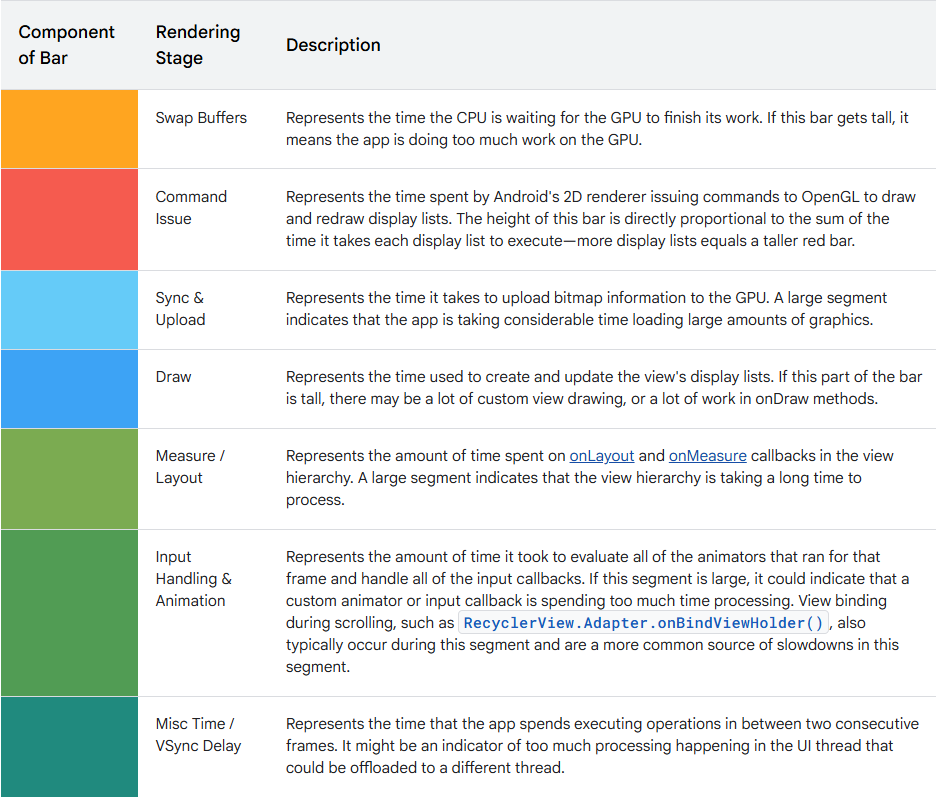

<h1>Android Performance</h1>

***Index***:
<!-- TOC -->
  * [Ciclo de Rendimiento](#ciclo-de-rendimiento)
    * [Developer Options](#developer-options)
  * [*Overdraw* (redibujado o superposición)](#overdraw-redibujado-o-superposición)
    * [Qué es](#qué-es)
    * [Análisis](#análisis)
    * [Soluciones comunes y estrategias](#soluciones-comunes-y-estrategias)
  * [Jerarquía de vistas](#jerarquía-de-vistas)
    * [Qué es](#qué-es-1)
    * [Análisis](#análisis-1)
    * [Soluciones comunes y estrategias](#soluciones-comunes-y-estrategias-1)
  * [*Profile* GPU](#profile-gpu)
    * [Qué es](#qué-es-2)
    * [Análisis](#análisis-2)
    * [Soluciones comunes y estrategias](#soluciones-comunes-y-estrategias-2)
  * [Fugas de Memoria o *Memory Leaks*](#fugas-de-memoria-o-memory-leaks)
    * [Qué es](#qué-es-3)
    * [Análisis](#análisis-3)
    * [Soluciones comunes y estrategias](#soluciones-comunes-y-estrategias-3)
  * [Minificación del APK](#minificación-del-apk)
    * [Archivos de Proguard](#archivos-de-proguard)
    * [¿Cómo funcionan juntos?](#cómo-funcionan-juntos)
    * [Problemas con *Reflection*](#problemas-con-reflection)
  * [**AAB - *Android App Bundle***](#aab---android-app-bundle)
  * [Algunos consejos para imágenes](#algunos-consejos-para-imágenes)
    * [Procesa los archivos PNG](#procesa-los-archivos-png)
    * [Comprime los archivos PNG y JPEG](#comprime-los-archivos-png-y-jpeg)
    * [Usa el formato de archivo WebP](#usa-el-formato-de-archivo-webp)
  * [*Android Vitals*](#android-vitals)
  * [``StrictMode``: Libres de ANR](#strictmode-libres-de-anr)
<!-- TOC -->

---

## Ciclo de Rendimiento

Consiste en ***iterar sobre un ciclo de recopilación, análisis y toma de acción*** para resolver o mitigar problemas de rendimiento de la aplicación.

- ***Recopilar*** :arrow_right: Buscar evidencia. Obtener datos mediante las herramientas disponibles sobre *overdraw*, *memory leaks*, *networking traffic*, etc.
- ***Analizar*** :arrow_right: A partir de los datos recopilados, obtener información. Es decir, comprender qué significan esos datos.
- ***Accionar*** :arrow_right: Aplicar solución. Optimizar diseños, cambiar algo del código fuente, actualizar librerías de terceros, etc.

Algunas de las herramientas disponibles para investigar son:

- *Developer Options* (ver [acá](#developer-options))
- *Layout Inspector*
- *Android Profiler*
- *Leak Canary*
- *Lint*
- R8

### Developer Options

> Los nombres y ubicación pueden variar, dependiendo de la versión de Android y del dispositivo

Algunas de las opciones para desarrolladores más utilizadas:

- ***System UI demo mode*** :arrow_right: Deja la barra de notificaciones limpia y homogénea, útil para la toma de evidencias.
- ***Quick settings developer tiles*** :arrow_right: Permite mostrar opciones en el desplegable de mosaicos (*tiles*) para activarlos o desactivarlos, como por ejemplo, *Sensors Off*, *Show taps*, *Show layout bounds*, etc.
- ***USB debugging*** :arrow_right: Para que el dispositivo pueda ser detectado por Android Studio.
- ***Show taps*** :arrow_right: Para mostrar *taps.*
- ***Pointer location*** :arrow_right: Para mostrar datos de los toques que realiza el usuario (ubicación en pantalla y movimientos).
- ***Show layout bounds*** :arrow_right: Para mostrar límites de los diseños (*layouts*), márgenes, etc.
- ***Strict mode enabled*** :arrow_right: Hace que la pantalla parpadee cuando la app hace operaciones largas en el hilo principal (*main thread*).
- ***Background process limit*** :arrow_right: Permite establecer un límite de procesos en segundo plano.
- ***Debug GPU overdraw*** :arrow_right: Muestra, según un código de colores (ver en la sección siguiente), la cantidad de veces que un elemento es redibujado en pantalla.
- ***Show surface updates*** :arrow_right: Hace que las superficies de la ventana parpadeen cuando se actualizan.
- ***Show view updates*** :arrow_right: Hace que las vistas dentro de las ventanas parpadeen cuando son dibujadas.
- ***Disable HW overlays*** :arrow_right: Fuerza a usar siempre la GPU para la composición de la pantalla (ver [*Screen compositing*](/Glosary%20&%20Core%20Concepts/Android%20specific.md#screen-compositing)).
- ***Profile HWUI rendering*** :arrow_right: La opción ***On screen as bars***, muestra barras verticales que representan el tiempo que tarda en dibujarse cada *frame* o fotograma.

## *Overdraw* (redibujado o superposición)

### Qué es

> Con base en la forma de trabajar de *Jetpack Compose*, el *Overdraw* ya no es un problema

El *overdraw* es cuando una app pinta un pixel más de una vez dentro de un único frame. En general, esta superposición es innecesaria y es mejor eliminarla, ya que se pierde tiempo en que la GPU (Graphics Processing Unit o Unidad de Procesamiento Gráfico) procese pixels que no contribuyen a lo que el usuario ve en pantalla.

### Análisis

> 🔍 Reference:  
> https://developer.android.com/topic/performance/rendering/inspect-gpu-rendering#debug_overdraw
>

Para analizar el overdraw, se puede utilizar la herramienta ***Lint*** (Menú ***Code*** :arrow_right: ***Inspect Code…*** :arrow_right: ***Analyze*** :arrow_right: Buscar la categoría *Android Lint: Performance* en el árbol de resultados :arrow_right: Buscar y expandir el panel de *Overdraw*).

También se puede activar el ***Debug GPU overdraw*** :arrow_right: ***Show overdraw areas*** en las *Developer options*, la cual muestra colores semitransparentes en pantalla según la siguiente tabla, para determinar la cantidad de veces que un pixel se redibuja:

| Color      | Overdraw X  |
|------------|-------------|
| True color | No overdraw |
| Blue       | 1x          |
| Green      | 2x          |
| Pink       | 3x          |
| Red        | 4x or more  |

<br>


### Soluciones comunes y estrategias

Hay tres estrategias principales para reducir o eliminar el overdraw:

1. ***Eliminar fondos innecesarios en los XML***: Los `android:background` repetidos en la jerarquía de vistas, puede hacer que el mismo fondo se redibuje varias veces en pantalla. Las imágenes *placeholder* también pueden generar *overdraw* si luego se le va a agregar una imagen encima.
2. ***Acoplar las jerarquías de vistas***: Disminuye la cantidad de veces que se debe dibujar una vista (ver [Jerarquía de vistas](#jerarquía-de-vistas)).
3. ***Reducir las transparencias***: La representación de pixels transparentes en la pantalla se denomina ***representación alfa***. Esta contribuye al overdraw, porque el sistema tiene que representar tanto el pixel transparente como lo que está debajo de ese pixel; y luego requiere un cálculo adicional para mezclar ambos y así crear el efecto de transparencia. Con esas transparencias se tiene que usar una técnica de dibujo de doble pasada, que comienza por dibujar toda la vista normalmente, con opacidad normal; pero no la dibuja directamente en la pantalla, sino en un buffer fuera de la pantalla llamado ***Hardware layer*** (ver [Hardware acceleration](https://developer.android.com/topic/performance/hardware-accel)). En la segunda pasada, el procesador le indica al GPU que copie todos los pixels desde la capa de Hardware hacia la pantalla y le aplica el nuevo valor de alfa en el proceso de copiado. Dado que las capas de hardware consumen memoria de video, se recomienda habilitarlas solo durante la animación y deshabilitarlas una vez finalizada con [`View.setLayerType`](https://developer.android.com/reference/kotlin/android/view/View#setlayertype).

    ```kotlin
    view.setLayerType(View.LAYER_TYPE_HARDWARE, null)
    ObjectAnimator.ofFloat(view, "rotationY", 180f).apply {
        addListener(object : AnimatorListenerAdapter() {
            override fun onAnimationEnd(animation: Animator) {
                view.setLayerType(View.LAYER_TYPE_NONE, null)
            }
        })
        start()
    }
    ```

   O también usando [`ViewPropertyAnimator.withLayer`](https://developer.android.com/reference/kotlin/android/view/ViewPropertyAnimator#withlayer), para que el animador administre el tipo de capa automáticamente.

    ```kotlin
    ViewPropertyAnimator.alpha(0.0f).withLayer()
    ```


## Jerarquía de vistas

### Qué es

La jerarquía (o árbol) de vistas o de UI, es la forma y cantidad de componentes `View` de los XML. Para renderizar cada vista, el SO pasa por tres etapas: Medición, Diseño y Dibujado (ver [How Android draws](https://developer.android.com/guide/topics/ui/how-android-draws)):

1. ***Measure***  
El método [`measure(widthMeasureSpec: Int, heightMeasureSpec: Int)`](https://developer.android.com/reference/android/view/View#measure(int,%20int)):

- Recibe especificaciones de medida para ancho y alto (`MeasureSpec`)
- Determina el tamaño que necesita la vista según sus contenidos y restricciones
- Calcula y almacena los valores de **`measuredWidth`** y **`measuredHeight`**
- No asigna posición, solo calcula dimensiones
- Es llamado por el padre de la vista durante la fase de medición
- Los `MeasureSpec` contienen tanto el tamaño como el modo (`EXACTLY`, `AT_MOST`, `UNSPECIFIED`)

2. ***Layout*** **(Disposición o Diseño)**  
El método [`layout(l: Int, t: Int, r: Int, b: Int)`](https://developer.android.com/reference/android/view/View#layout(int,%20int,%20int,%20int)):

- Asigna la posición final y tamaño de la vista dentro de su padre
- Parámetros: coordenadas del rectángulo que ocupará la vista (*left*, *top*, *right*, *bottom*)
- Establece los valores de **`left`**, **`top`**, **`right`** y **`bottom`** de la vista
- Calcula la posición de los hijos llamando a sus métodos `layout`
- Es llamado después de `measure`, cuando el padre ya conoce dónde colocar la vista
- Actualiza las propiedades **`x`**, **`y`**, **`width`** y **`height`** de la vista

3. ***Draw***  
El método [`draw(canvas: android.graphics.Canvas)`](https://developer.android.com/reference/android/view/View#draw(android.graphics.Canvas)):

- Dibuja la vista y su contenido en el *canvas* proporcionado
- Renderiza el fondo, contenido, hijos y decoraciones (en ese orden)
- Utiliza el *canvas* para aplicar transformaciones, filtros y efectos visuales
- Es llamado cuando el sistema está listo para mostrar la vista en pantalla
- Puede ser invocado múltiples veces (por ejemplo, durante animaciones)
- Utiliza los valores de posición y tamaño establecidos en las fases anteriores

El tiempo que le toma al sistema completar esas tres etapas, es proporcional al número de vistas anidadas en la jerarquía del XML. Cuanto más profunda la jerarquía, más se va a tardar en completar la fase de medición.

Luego, durante el proceso de renderizado, cada vista le provee sus dimensiones a la vista padre. Y si la vista padre descubre algún inconveniente con esas dimensiones, puede forzar a que cada vista hija vuelva a medirse, provocando que se vuelva a iterar el árbol de vistas. Estas re-mediciones pueden ocurrir incluso cuando no existen errores. Por ejemplo, los `RelativeLayout` suelen tener que medir a sus hijos dos veces para que entren en pantalla.

### Análisis

Para analizar la jerarquía de UI, se puede utilizar el ***Layout Inspector*** (API 29+). En un proceso en ejecución, esta herramienta permite inspeccionar las vistas como capas y ver sus atributos, incluidos los herederos de cada una de ellas. También se puede rotar para visualizar cómo se están dibujando las diferentes vistas/capas.

### Soluciones comunes y estrategias

La primera estrategia que hay que dominar es la de ***“aplanar” la jerarquía de las vistas***. La mejor forma de evitar tener muchas vistas anidadas verticalmente es usar `ContraintLayout`, el cual permite simplificar la jerarquía de vistas y optimizar el uso de la GPU a la hora de renderizar la UI.

También es recomendable reutilizar layouts comunes para mejorar el rendimiento de la app. Para eso, Android provee algunas herramientas:

- ``<include>`` :arrow_right: Permite reutilizar un layout dentro de otro. Debe incluir el layout_width y layout_height, ya que de otra forma, se produciría un RuntimeException “silencioso”, sin ningún log.

    ```xml
    <include android:id="@+id/new_title"
         android:layout_width="match_parent"
         android:layout_height="match_parent"
         layout="@layout/sample" />
    ```

- ``<merge>`` :arrow_right: Ayuda a quitar los grupos de vistas redundantes en la jerarquía de UI cuando se incluye un diseño dentro de otro. Es un elemento raíz alternativo que no se dibuja en la jerarquía.

  Es útil cuando se sabe que este diseño va a ser colocado en uno que ya contiene la vista principal adecuada con los contenedores de elementos secundarios necesarios. Es decir, cuando no se requiere ningun ViewGroup en particular o diferente.

    ```xml
    <merge xmlns:android="http://schemas.android.com/apk/res/android">

        <Button
            android:layout_width="fill_parent"
            android:layout_height="wrap_content"
            android:text="@string/actionOne" />

        <Button
            android:layout_width="fill_parent"
            android:layout_height="wrap_content"
            android:text="@string/actionTwo" />
    </merge>
    ```

- ``<ViewStub>`` :arrow_right: A veces, el diseño puede requerir vistas complejas que rara vez se usan, también conocidas como Vistas Demoradas, como ser detalles de elementos, indicadores de progreso o mensajes de “Deshacer” para el usuario. Se puede mejorar la eficiencia cargando las vistas solo cuando son necesarias (*on demand*), aplazando la carga de los recursos.

  Los ViewStub son vistas livianas, sin dimensiones, que no se dibujan ni participan en el diseño, permitiendo definir un espacio para utilizarlo cuando es poco frecuente (vistas complejas).

    ```xml
    <ViewStub
        android:id="@+id/stub_import"
        android:inflatedId="@+id/panel_import"
        android:layout="@layout/progress_overlay"
        android:layout_width="fill_parent"
        android:layout_height="wrap_content"
        android:layout_gravity="bottom" />
    ```


## *Profile* GPU
### Qué es
Una aplicación debe actualizar la pantalla lo suficientemente rápido para que los usuarios puedan ver movimientos, transiciones y respuestas fluidas. Dicha tasa de refresco es de 60 fps (_frames per second_). Es decir, **_cada frame tiene 16 milisegundos para dibujarse_** (1000 / 60). La pérdida de frames que no llegan a dibujarse en 16 milisegundos producen una experiencia indeseable para el usuario, conocida como _jank_ (tironeo o tartamudeo visible en la pantalla).  

### Análisis
Las opciones de desarrollador de un dispositivo Android brindan una herramienta llamada _Profile HWUI rendering_ (puede tener otro nombre, depende la versión de Android y del dispositivo), que sirve para mostrar un histograma que da información sobre el tiempo que le lleva al Sistema Operativo dibujar los _frames_. Cada barra vertical representa un *frame* y su altura, el tiempo que tarda en dibujarse en milisegundos. La línea verde horizontal representa la barrera de 16 milisegundos.  
Las barras tienen componentes de colores que corresponden a una etapa en el _pipeline_ de procesamiento y ayudan a identificar qué partes de la interacción con la UI son más lentas de lo esperado, para luego tomar medidas en pos de mejorar la velocidad.

<br>



### Soluciones comunes y estrategias
Las razones comunes para un dibujado lento son una app que tarda demasiado en procesar la entrada del usuario en el hilo de la UI y fondos e imágenes que son innecesarios o demasiado grandes.  
La mejor forma de evitar retrasos a la hora de dibujar un frame, es no realizar tareas pesadas en el hilo de la UI. Por ejemplo, cargar imágenes pesadas, peticiones de red, eventos de entrada, etc.

## Fugas de Memoria o *Memory Leaks*
### Qué es
> 🔍 Ver [*Memory handling*](/Utils%20&%20Miscellaneous/Memory%20handling.md)

A partir de Android API 21, el Android Runtime (ART) y la máquina virtual Dalvik usan paginación y mapeo de memoria. A su vez, la memoria que modifica una app, permanece en la RAM.

### Análisis
Hay dos grandes herramientas para analizar la memoria de la aplicación:
- **_Android Profiler_** :arrow_right: Analiza la aplicación de varios aspectos en tiempo real (batería, red, CPU y el manejo de memoria).
- **_Leak Canary_** :arrow_right: Es una librería (https://square.github.io/leakcanary/) diseñada para detectar pérdidas de memoria en tiempo real.

### Soluciones comunes y estrategias
Para resolver algunos _memory leaks_ relacionados a la retención a largo plazo de una _Activity_ en el código, se pueden usar los siguientes métodos:
1. **_Evitar almacenar referencias a la Activity_**: Nunca guardar una referencia fuerte a una _Activity_ en un ``companion object``.
2. **_Usar ``ApplicationContext``_**: Si se necesita persistir un ``Context``, utilizar ``applicationContext`` en lugar del _Activity_ ``Context``.
3. **_Usar clases anidadas estáticas (``static nested class`` en Java, sin ``inner`` en Kotlin)_**: Al no usar la palabra clave ``inner``, la clase anidada no tiene una referencia a la _Activity_ contenedora.
4. **_Usar ``WeakReference``_**: En un hilo o proceso con un ciclo de vida largo, utilizar una referencia débil a la _Activity_ para que el GC pueda liberarla si es necesario.

## Minificación del APK
La minificación es el proceso por el cual se reduce la cantidad de código en la app. Con esto, se reduce el tamaño del APK automáticamente en tiempo de compilación. Todo lo que hay que hacer es activar la ejecución al momento de realizar el build de RELEASE.  
R8 es un complemento que funciona con todos los archivos de las reglas Proguard existentes y realiza las siguientes tareas en tiempo de compilación:

1. **_Reducción (Code Shrinking)_**: Análisis estático. Elimina código inalcanzable (quita de forma segura clases, campos, métodos y atributos que no se usan, tanto en el código propio como en las dependencias). Evita el sobrepaso del límite de las 64.000 referencias. Una vez que la reducción de código se completa y en caso de que esté habilitado el **_reductor de recursos_** (ver fragmento de código debajo), el plugin de Android para Gradle busca recursos (como imágenes, _drawables_, diseños, etc.) que ya no están referenciados por el código y los elimina.
2. **_Ofuscación_**: Acorta los nombres de las clases y miembros, lo que genera archivos DEX de menor tamaño.
3. **_Optimización_**: Inspecciona y vuelve a escribir el código para reducir aún más el tamaño de los DEX. Por ejemplo, si R8 detecta que nunca se toma una rama ``else`` en un ``if-else`` determinado, quita el código de esa rama ``else``.

Para activar la mificación con R8, se debe poner la _flag_ de ``isMinifyEnabled`` en ``true``. Opcionalmente, también se puede activar la reducción de recursos.

```kotlin
buildTypes {
        release {
            isShrinkResources = true
            isMinifyEnabled = true
            proguardFiles(
                getDefaultProguardFile("proguard-android-optimize.txt"),
                "proguard-rules.pro"
            )
        }
    }
```

### Archivos de Proguard
Los archivos de Proguard provienen de dos lugares distintos, y cada uno cumple una función específica.
1. **_``proguard-android-optimize.txt`` (archivo por defecto)_**:
   - **_Origen_**: Este archivo **_se distribuye con el SDK de Android_** y es gestionado por el equipo de desarrollo de Android.
   - **_Contenido_**: Contiene un conjunto de reglas estándar y seguras que son aplicadas por defecto a todas las aplicaciones que tienen la minificación habilitada. Estas reglas se encargan de mantener intactas ciertas clases y métodos que el sistema de Android necesita para funcionar correctamente (por ejemplo, elementos del ciclo de vida, llamadas nativas y la lógica de las vistas). La versión ``optimize`` incluye optimizaciones más agresivas que la versión anterior ``proguard-android.txt``.
2. **_``proguard-rules.pro`` (archivo personalizado)_**:
   - **_Origen_**: Este archivo **_lo crea y mantiene el desarrollador de la aplicación_**. 
   - **_Contenido_**: Sirve para agregar reglas personalizadas (utilizando reglas ``-keep``) que se aplican específicamente al proyecto. Generalmente, se usa para solucionar problemas de minificación que surgen con librerías de terceros (que pueden requerir que se mantengan ciertos nombres de clases y métodos para evitar fallos por reflexión o serialización) o para proteger partes específicas del código. 

### ¿Cómo funcionan juntos?
Cuando R8 (el compilador de minificación) procesa la aplicación, combina las reglas de estos dos archivos:
- Primero, toma las reglas base de ``proguard-android-optimize.txt`` (que garantizan que el sistema funcione).
- Luego, aplica las reglas personalizadas que se han definido en ``proguard-rules.pro``.

Esta combinación permite que R8 aplique una optimización general y segura por defecto, mientras que el desarrollador conserva la flexibilidad de adaptar el proceso a las necesidades únicas del proyecto.
Sobre las reglas ``-keep``, también es importante destacar que se puede usar la anotación ``@Keep`` a nivel de clase, de métodos o de variables, para indicarle a R8 que esa clase, método o variable, no debe minificarse.

### Problemas con *Reflection*
Cuando la app contiene algún código de reflexión, R8 no va a encontrar referencias al realizar el análisis estático. Entonces, también elimina ese código aunque no debería.  
Para evitarlo, se deben agregar algunas reglas para indicarle a R8 que mantenga ese código y no lo elimine.

## **AAB - *Android App Bundle***
Subir un [_Android App Bundle_](https://developer.android.com/guide/app-bundle) en lugar de un APK tradicional a la Play Store ofrece ventajas significativas, centradas en la **_optimización del tamaño, la flexibilidad y la eficiencia_**.

- **_Entrega dinámica (dynamic delivery)_**: El AAB incluye todos los recursos, código y configuraciones de la aplicación. Google Play genera múltiples APK's optimizados a partir de este AAB para cada configuración de dispositivo (arquitectura, idioma, densidad de pantalla), llamados **_Split APK's_**. De esta forma, el usuario solo descarga los Split APK's necesarios para su dispositivo.
- **_Descargas más pequeñas_**: El usuario no descarga recursos innecesarios (como los de otras densidades de pantalla, lenguajes o arquitecturas de CPU), lo que resulta en descargas más rápidas y menos consumo de datos.
- **_Mayor tasa de instalación_**: Un menor tamaño del archivo de instalación puede aumentar la tasa de instalación, especialmente en áreas con menor ancho de banda o para usuarios con poco espacio de almacenamiento. 
- **_Play Feature Delivery_**: Los _App Bundles_ permiten usar módulos de funcionalidades dinámicas, que son características que pueden ser empaquetadas en Split APK's que se descargan e instalan bajo demanda. Esto es útil para aplicaciones grandes, ya que los usuarios solo descargan la funcionalidad que van a utilizar.
- **_Play Asset Delivery_**: Similar a lo anterior, permite la entrega de grandes activos (imágenes, videos, etc.) en Split APKs bajo demanda, lo que reduce el tamaño de la instalación inicial. 
- **_Un solo archivo_**: El desarrollador solo necesita subir un único archivo (el _App Bundle_) a la Play Console. **_Google Play se encarga de generar, firmar y gestionar todos los Split APK's_** optimizados para las diferentes configuraciones de dispositivos.
- **_Manejo automático_**: Ya no es necesario que el desarrollador gestione múltiples APK's, lo que antes era una tarea manual y tediosa para soportar diferentes arquitecturas o idiomas.
- **_Dificulta la manipulación_**: Al manejar Google la firma de los APK's, es más difícil que actores maliciosos manipulen o redistribuyan la aplicación, ya que el Split APK entregado al usuario no tiene la misma clave de firma privada que el AAB subido por el desarrollador.

## Algunos consejos para imágenes
### Procesa los archivos PNG
Con la herramienta AAPT (ver el punto 2 de [Compilation process with Gradle](/Utils%20&%20Miscellaneous/Gradle.md#compilation-process-with-gradle)), se pueden optimizar los recursos de imagen que se encuentran en ``res/drawable/`` mediante una compresión sin pérdidas durante el proceso de compilación. Por ejemplo, la herramienta AAPT puede convertir un archivo PNG con color verdadero en el que no se necesitan más de 256 colores en un PNG de 8 bits con una paleta de colores. De este modo, la imagen tiene la misma calidad, pero el uso de memoria es menor.

Sin embargo, AAPT tiene las siguientes limitaciones:

- No reduce los archivos PNG que se encuentran en la carpeta ``asset/``.
- Los archivos de imágenes deben tener 256 colores o menos para que AAPT pueda optimizarlas.
- Puede aumentar el tamaño de los archivos PNG que ya se comprimieron. Para evitar este aumento, se puede usar la marca ``isCrunchPngs`` en Gradle a fin de inhabilitar este proceso para los archivos PNG:

```kotlin
android {
    buildTypes {
        release {
            // Disables PNG crunching for the "release" build type.
            isCrunchPngs = false
        }
    }
}
```

### Comprime los archivos PNG y JPEG

Se puede reducir el tamaño de un archivo PNG sin perder la calidad de la imagen con herramientas como [pngcrush](http://pmt.sourceforge.net/pngcrush/), [pngquant](https://pngquant.org/) o [zopflipng](https://github.com/google/zopfli), que reducen el tamaño del archivo y, a la vez, preservan la calidad perceptiva de la imagen.

La herramienta pngcrush es particularmente efectiva porque itera en todos los filtros PNG y parámetros _zlib_ (reducción de tamaño) mediante una combinación de filtros y parámetros para comprimir la imagen. Luego, selecciona la configuración que produce la salida comprimida de menor tamaño.

Para comprimir archivos JPEG, se puede usar herramientas como [packJPG](http://www.elektronik.htw-aalen.de/packjpg/) y [guetzli](https://github.com/google/guetzli).

### Usa el formato de archivo WebP

En lugar de usar archivos PNG o JPEG, se puede usar el formato de archivo [WebP](https://developers.google.com/speed/webp/?hl=es) para las imágenes. El formato WebP proporciona una compresión con pérdidas (como JPEG) y transparencia (como PNG). Sin embargo, puede proporcionar una mejor compresión que los archivos con formato JPEG o PNG.

Con Android Studio, se pueden convertir imágenes GIF estáticas o BMP, JPG o PNG ya existentes a formato WebP.

## *Android Vitals*

> 🔍 Reference:  
> https://developer.android.com/topic/performance/vitals

Resumen de factores que considera el panel de _Android Vitals_:
- **_Estabilidad_**: Tasa de bloqueos y errores ANR.
- **_Tiempo de procesamiento_**: Renderizado lento y pantallas congeladas.
- **_Consumo de batería_**: **_wake locks_** (proceso que funciona en segundo plano y evita que el dispositivo entre en modo de ahorro de energía o apague la pantalla) y **_wake ups_** (llamadas al ``AlarmManager`` de Android para "despertar" al dispositivo) **_excesivos_**.
- **_Tiempo de inicio_** de la aplicación
- **_Denegación de Permisos_**

## ``StrictMode``: Libres de ANR

> 🔍 Reference:
> https://developer.android.com/reference/kotlin/android/os/StrictMode

Realizar cualquier tipo de operaciones de bloqueo prolongado u operaciones de Entrada y Salida de disco en el hilo principal de Android puede causar problemas de ANR (_Application Not Responding_). Es posible que nosotros como programadores, ni siquiera nos demos cuenta de que tenemos un ANR potencial hasta que sea demasiado tarde y ya esté en produccion la app, para uso de los usuarios.

Pero, ¿cómo se pueden atacar estos problemas en la aplicación? Afortunadamente, hay una clase en Android que puede ayudar a encontrar estos problemas.

``StrictMode`` es una herramienta de desarrollo que ayuda en el _startup_ de la aplicación. Se habilita al iniciar la aplicación y puede ayudar a recoger las operaciones que están ocurriendo en el hilo principal. Puede finalizar automáticamente la aplicación (o iniciar sesión en _logcat_) cuando se produce una infracción.

Esto puede ayudar a evitar que los ANR sucedan y, en general, hacer que la aplicación tenga una experiencia más fluida, ya que serán más visibles los potenciales problemas que pueda tener.
