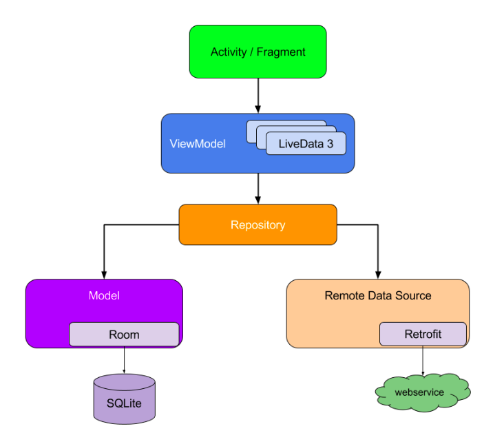

<h1>Apuntes de Android</h1>

***Index***:
<!-- TOC -->
  * [Patrones de presentación & *Repository*](#patrones-de-presentación--repository)
    * [*MVP (Model View Presenter)*](#mvp-model-view-presenter)
      * [En la *Activity*](#en-la-activity)
      * [En el *Presenter*](#en-el-presenter)
    * [*MVVM (Model View ViewModel)*](#mvvm-model-view-viewmodel)
      * [En la *Activity*](#en-la-activity-1)
      * [En el *ViewModel*](#en-el-viewmodel)
      * [En la *Activity*](#en-la-activity-2)
      * [En el *xml*](#en-el-xml)
    * [*MVI (Model View Intent)*](#mvi-model-view-intent)
      * [🧭 Flujos en el patrón MVI](#-flujos-en-el-patrón-mvi)
      * [🧱 Estructura básica de clases (*data classes*)](#-estructura-básica-de-clases-data-classes)
      * [🧠 *ViewModel* (maneja eventos y emite estados/efectos)](#-viewmodel-maneja-eventos-y-emite-estadosefectos)
      * [🎨 *Fragment* (observa el estado y envía eventos)](#-fragment-observa-el-estado-y-envía-eventos)
      * [🧮 MVI con *Reducer*](#-mvi-con-reducer)
    * [*Repository*](#repository)
  * [Componentes de Arquitectura](#componentes-de-arquitectura)
    * [*Lifecycle*](#lifecycle)
    * [*ViewModel*](#viewmodel)
    * [*LiveData*](#livedata)
    * [Manejo de *Flows* en la UI](#manejo-de-flows-en-la-ui)
      * [Consideraciones importantes](#consideraciones-importantes)
      * [Ejemplos en un *fragment*](#ejemplos-en-un-fragment)
  * [Inyección de dependencias](#inyección-de-dependencias)
    * [¿Qué es?](#qué-es)
    * [Dependencia fuerte == Alto acoplamiento](#dependencia-fuerte--alto-acoplamiento)
    * [*Service Locator*](#service-locator)
    * [Formas básicas para inyectar dependencias](#formas-básicas-para-inyectar-dependencias)
    * [*Dagger*](#dagger)
      * [``@Inject``](#inject)
      * [``@Component``](#component)
      * [``@Singleton``](#singleton)
      * [``@Module``, ``@Provides`` y ``@Binds``](#module-provides-y-binds)
    * [*Dagger Hilt*](#dagger-hilt)
      * [Para las clases Android (``Activity``, ``Fragment``, ``View``, ``Service`` y ``BroadcastReceiver``)](#para-las-clases-android-activity-fragment-view-service-y-broadcastreceiver)
      * [Para los *view models*](#para-los-view-models)
      * [Inyección por constructor (*constructor injection*)](#inyección-por-constructor-constructor-injection)
      * [Inyección a través de módulos](#inyección-a-través-de-módulos)
    * [*Koin*](#koin)
  * [UI imperativa](#ui-imperativa)
    * [*ViewBinding*](#viewbinding)
      * [Cómo usar *ViewBinding* en una *Activity*](#cómo-usar-viewbinding-en-una-activity)
      * [Cómo usar *ViewBinding* en un *Adapter* de *RecyclerView*](#cómo-usar-viewbinding-en-un-adapter-de-recyclerview)
    * [*DataBinding*](#databinding)
    * [*@BindingAdapter*](#bindingadapter)
      * [En el archivo *.kt*:](#en-el-archivo-kt)
      * [Y en el *xml*:](#y-en-el-xml)
      * [En el archivo *.kt*:](#en-el-archivo-kt-1)
      * [Y en el *xml*:](#y-en-el-xml-1)
    * [*RecyclerView*](#recyclerview)
      * [Componentes principales](#componentes-principales)
      * [Cómo funciona el reciclado](#cómo-funciona-el-reciclado)
      * [Tipos de *LayoutManagers*](#tipos-de-layoutmanagers)
      * [*ViewHolder*](#viewholder)
      * [*Adapter*](#adapter)
      * [Cambios en los datos](#cambios-en-los-datos)
    * [*LeanBack*](#leanback)
      * [Estructura de pantalla en *Leanback*](#estructura-de-pantalla-en-leanback)
      * [*Leanback* vs *RecyclerView*](#leanback-vs-recyclerview)
    * [*Styles y Themes*](#styles-y-themes)
      * [En ***Styles.xml***:](#en-stylesxml)
      * [En ***AndroidManifest.xml***:](#en-androidmanifestxml)
    * [*Custom Views*](#custom-views)
      * [En la clase ***custom***:](#en-la-clase-custom)
      * [En el ***xml***:](#en-el-xml-1)
      * [Por ejemplo, en ***res/values/attr.xml***:](#por-ejemplo-en-resvaluesattrxml)
      * [Y en ***res/layout/mylayout.xml*** ahora se puede hacer:](#y-en-reslayoutmylayoutxml-ahora-se-puede-hacer)
    * [*Menus*](#menus)
      * [Para usar elementos de menú que se pueden activar, en el ***xml***:](#para-usar-elementos-de-menú-que-se-pueden-activar-en-el-xml)
      * [Y para comprobar y establecer el estado de activación:](#y-para-comprobar-y-establecer-el-estado-de-activación)
  * [UI declarativa](#ui-declarativa)
  * [Android Performance](#android-performance)
  * [Navegación](#navegación)
  * [Accesibilidad (*a11y*)](#accesibilidad-a11y)
  * [*Background & System*](#background--system)
  * [*Firebase*](#firebase)
  * [Multimedia](#multimedia)
  * [*Networking & Monitoring*](#networking--monitoring)
  * [*Persistence & Sharing*](#persistence--sharing)
  * [*Security*](#security)
  * [*Testing*](#testing)
    * [Consideraciones sobre los *tests*](#consideraciones-sobre-los-tests)
  * [Referencias y Fuentes](#referencias-y-fuentes)
<!-- TOC -->

---

## Patrones de presentación & *Repository*
### *MVP (Model View Presenter)*
Es una derivación del patrón MVC (*Model View Controller*) y es un patrón arquitectónico de interfaz de usuario diseñado principalmente para facilitar las pruebas unitarias automatizadas. En MVP, el presentador asume la funcionalidad del “hombre medio”. Toda **la lógica de presentación se envía al presentador** y toda **la lógica de negocio al modelo**.  
Interacción entre componentes:
- ***Model***: Es una interfaz que define la lógica de negocio y los datos que se mostrarán en la interfaz de usuario. Está separado de la vista.
- ***View***: Es una interfaz pasiva que muestra los datos que recibe del presentador y enruta los comandos (eventos) del usuario al presentador. Está separada del modelo.
- ***Presenter***: Es una interfaz que contiene toda la lógica de presentación de la vista. Envía comandos al modelo y notificaciones a la vista (*activity/fragment*) de los cambios ocurridos en el modelo, **haciendo uso de** ***interfaces***. El presentador es el mediador entre la vista y el modelo.

<br>
<p align="center">
    
</p>
<br>

Un ejemplo del patrón MVP sería algo así:

#### En la *Activity*

```kotlin
    class MainActivityPresenter : AppCompatActivity(), MainPresenter.View {
    
        private lateinit var binding: ActivityMainBinding
        private val presenter = MainPresenter(this, lifecycleScope)
    
        override fun onCreate(savedInstanceState: Bundle?) {
            super.onCreate(savedInstanceState)
            binding = ActivityMainBinding.inflate(layoutInflater)
            setContentView(binding.root)
    
            with(binding){
                button.setOnClickListener {
                    presenter.onButtonClicked(mail.text.toString())
                }
            }
        }
    
        override fun setProgressVisible(visible: Boolean) {
            binding.progress.visibility = if (visible) View.VISIBLE else View.GONE
        }
    
        override fun setMessage(message: String) {
            binding.message.text = message
        }
    }
```

#### En el *Presenter*

```kotlin
    // Recibe por constructor una vista de una interface View y un scope de corrutina
    // para poder hacer la petición en segundo plano.
    class MainPresenter(private val view: View, private val scope: CoroutineScope) {
    
        interface View {
            fun setProgressVisible(boolean: Boolean)
            fun setMessage(message: String)
        }
    
        // Se llama cuando se hace click en el botón.
        // Recibe el texto de mail por parámetro.
        fun onButtonClicked(mail: String) {
            scope.launch {
                view.setProgressVisible(true)
                view.setMessage(withContext(Dispatchers.IO) {
                    Thread.sleep(2000)
                    if (mail.isNotEmpty()) "Success" else "Failure"
                })
                view.setProgressVisible(false)
            }
        }
    }
```

### *MVVM (Model View ViewModel)*

> Para una comparación con diferentes arquitecturas, ver [acá](Apuntes-Arquitectura.md#clean-architecture-vs-guía-de-arquitectura-de-android-vs-mvvm)

Este patrón facilita la separación de la lógica de la interfaz gráfica de usuario y la lógica de negocio o modelo de datos de la aplicación. En MVVM, el *ViewModel* tiene la responsabilidad de convertir los objetos de datos del modelo en un formato que permita manejar y presentar fácilmente. En este sentido, **el ***ViewModel*** contiene toda la lógica de presentación de la vista**.  
Interacción entre componentes:
- ***Model***: Es una interfaz que **define la lógica de negocio** y los datos que se mostrarán en la interfaz de usuario. Contiene todas las *data classes*, las clases de base de datos (*database*), API y repositorio. Al igual que en el patrón *Model View Controller (MVC)*, una de las estrategias de implementación que se recomienda para desacoplar completamente esta capa del *ViewModel*, es exponer los datos a través de observables, es decir el **patrón** ***Observer***. De esta forma, cualquier *ViewModel* que necesite utilizar el modelo puede subscribir un observador.
- ***View***: Al igual que en los patrones *Model View Controller (MVC)* y *Model View Presenter (MVP)*, es una interfaz pasiva que representa el estado actual de la información que es visible para el usuario y que recibe la interacción del usuario con la vista (eventos), para luego enviarlos al *ViewModel* a través de ***DataBinding\****, que **se define para vincular la vista y el** ***ViewModel***.
- ***ViewModel***: Es una interfaz que **contiene toda la lógica de prensentación** de la vista. Envía comandos al modelo y notificaciones a la vista (*activity/fragment*) de los cambios ocurridos en el modelo, **haciendo uso de objetos observables**. Por eso mismo, una de las estrategias de implementación de esta capa es desacoplarla de la vista, es decir, el *ViewModel* no debe ser consciente de la vista con la que interactúa (es decir, **no debe contener una instancia de la vista**).

> ***Binder***: En el *stack* de soluciones de Microsoft (MVVM fue inventado por dos arquitectos de Microsoft), el *binder* es un lenguaje de marcado llamado XAML. El *binder* libera al desarrollador de escribir lógica *boilerplate* para sincronizar el modelo con la vista. Si se desea utilizar este patrón fuera del *stack* de Microsoft, la presencia de una tecnología de enlace de datos declarativo es imprescindible. **Sin un ***binder***, no llega a ser un MVVM real**. Android Jetpack incorpora entre sus componentes la **librería** ***DataBinding***, que permite a los desarrolladores vincular de manera declarativa los datos observables a los elementos de la interfaz de usuario. De esta forma se disminuye considerablemente mucho código *boilerplate* en la lógica de presentación, lo que hace que la interfaz de usuario sea más simple y fácil de mantener.

**La principal diferencia** entre el *ViewModel* del MVVM y el *Presenter* del MVP, es que **el ***Presenter*** tiene una referencia a una vista**, mientras que **el ***ViewModel*** no**. En otras palabras, **MVP se basa en un paradigma imperativo** (la vista comunica eventos al presenter, el presenter solicita acciones a la vista) mientras que **MVVM se basa en la observación** (el *ViewModel* expone datos observables, la vista se suscribe y escucha dichos datos).

<br>
<p align="center">
    
</p>
<br>

El mismo ejemplo, pasado de MVP a MVVM (sin usar *DataBinding*):

#### En la *Activity*

```kotlin
    class MainActivityVM : AppCompatActivity() {
    
        private lateinit var binding: ActivityMainBinding
        private lateinit var viewModel: MainViewModel
    
        override fun onCreate(savedInstanceState: Bundle?) {
            super.onCreate(savedInstanceState)
            binding = ActivityMainBinding.inflate(layoutInflater)
            setContentView(binding.root)
    
            viewModel = ViewModelProvider(this)[MainViewModel::class.java]
            // Para suscribirse a los LiveData del ViewModel
            viewModel.progressVisibility.observe(this, Observer {
                binding.progress.visibility = if (it) View.VISIBLE else View.GONE
            })
            viewModel.message.observe(this, Observer {
                binding.message.text = it
            })
    
            with(binding){
                button.setOnClickListener {
                    viewModel.onButtonClicked(mail.text.toString())
                }
            }
        }
    }
```

#### En el *ViewModel*

```kotlin
    // No recibe el scope por parámetro porque ViewModel
    // tiene su propio scope (viewModelScope)
    class MainViewModel : ViewModel() {
    
        // Encapsula las variables para que no puedan ser accedidas desde
        // la activity.
        private var _message = MutableLiveData<String>()
        val message: LiveData<String> get() = _message
    
        private var _progressVisibility = MutableLiveData<Boolean>()
        val progressVisibility: LiveData<Boolean> get() = _progressVisibility
    
    
        // Se llama cuando se hace click en el botón.
        // Recibe el texto de mail por parámetro.
        fun onButtonClicked(mail: String) {
            viewModelScope.launch {
                _progressVisibility.value = true
                _message.value = withContext(Dispatchers.IO) {
                    Thread.sleep(2000)
                    if (mail.isNotEmpty()) "Success" else "Failure"
                }
                _progressVisibility.value = false
            }
        }
    }
```

En el caso de que se aplique *DataBinding* al mismo ejemplo con MVVM, quedaría así (el *ViewModel* no se modifica y la *activity* queda mucho más limpia):

#### En la *Activity*

```kotlin
    class MainActivityVM : AppCompatActivity() {
    
        private lateinit var binding: ActivityMainBinding
        private lateinit var viewModel: MainViewModel
    
        override fun onCreate(savedInstanceState: Bundle?) {
            super.onCreate(savedInstanceState)
            binding = ActivityMainBinding.inflate(layoutInflater)
            setContentView(binding.root)
    
            viewModel = ViewModelProvider(this)[MainViewModel::class.java]
    
            binding.viewModel = viewModel
            binding.lifecycleOwner = this
        }
    }
```

#### En el *xml*

```xml
    <data>
        <import type="android.view.View" />
        <variable
            name="viewModel"
            type="com.example.navajasuiza.MainViewModel" />
    </data>
    
    <Button
        android:id="@+id/button"
        android:layout_width="wrap_content"
        android:layout_height="wrap_content"
        android:text="@string/button"
        android:onClick="@{ () -> viewModel.onButtonClicked(mail.getText().toString()) }"/>
    
    <TextView
        android:id="@+id/message"
        android:layout_width="wrap_content"
        android:layout_height="wrap_content"
        android:gravity="center"
        android:text="@{ viewModel.message }"/>
    
    <ProgressBar
        android:id="@+id/progress"
        style="?android:attr/progressBarStyle"
        android:layout_width="wrap_content"
        android:layout_height="wrap_content"
        android:visibility="@{ viewModel.progressVisibility ? View.VISIBLE : View.GONE }"/>
```

### *MVI (Model View Intent)*
Es un patrón de arquitectura de presentación que se basa en la **unidireccionalidad de datos**: la UI observa estados y emite eventos.  
Separa claramente:
- **Eventos del usuario** :arrow_right: ``Intent`` o ``uiEvent``
- **Procesamiento lógico** :arrow_right: En el _ViewModel_
- **Resultado** :arrow_right: ``uiState`` (estado actual) o ``uiEffect`` (efectos puntuales)

#### 🧭 Flujos en el patrón MVI

| Tipo de flujo  | Relación con la vista     | Propósito                                               | Dirección            | Ejemplos                                                    | Scope recomendado                                                                                                        |
|----------------|---------------------------|---------------------------------------------------------|----------------------|-------------------------------------------------------------|--------------------------------------------------------------------------------------------------------------------------|
| **`uiState`**  | ✅ Sí (directamente)       | Representa el estado actual de la UI                    | ViewModel ➝ Fragment | Mostrar una pantalla de carga, mostrar datos, mostrar error | `viewLifecycleOwner.lifecycleScope` porque actualiza directamente la UI                                                  |
| **`uiEffect`** | ✅ Sí (acciones puntuales) | Eventos de una sola vez que afectan la UI               | ViewModel ➝ Fragment | Mostrar _snackbar_, navegación                              | `viewLifecycleOwner.lifecycleScope` porque suele involucrar interacciones con la UI                                      |
| **`uiEvent`**  | ❌ No directamente         | Acciones (Intenciones) del usuario que deben procesarse | Fragment ➝ ViewModel | _Click_ en un botón, entrada de texto, _pull-to-refresh_    | `fragmentScope` personalizado porque son operaciones que inician flujos de trabajo y pueden necesitar cancelación manual |

> ℹ️ **Notas:**
> - Los estados (`uiState`) y efectos (`uiEffect`) son observados continuamente, por lo que deben **cancelarse automáticamente** al destruirse la vista para evitar fugas de memoria.
> - Los eventos (`uiEvent`) son disparados puntualmente, por lo que requieren cancelación **manual** para evitar múltiples ejecuciones innecesarias o redundantes.

#### 🧱 Estructura básica de clases (*data classes*)

```kotlin
// Estado de la UI (persistente)
data class UiState(
    val isLoading: Boolean = false,
    val data: String? = null,
    val error: String? = null
)

// Efectos puntuales (eventos de una sola vez)
sealed class UiEffect {
    data class ShowSnackbar(val message: String) : UiEffect()
    object NavigateToDetail : UiEffect()
}

// Eventos del usuario (intenciones)
sealed class UiEvent {
    object LoadData : UiEvent()
    data class OnItemClick(val id: String) : UiEvent()
}
```

#### 🧠 *ViewModel* (maneja eventos y emite estados/efectos)

```kotlin
class MyViewModel : ViewModel() {
    private val _uiState = MutableStateFlow(UiState())
    val uiState: StateFlow<UiState> = _uiState

    private val _uiEffect = MutableSharedFlow<UiEffect>()
    val uiEffect: SharedFlow<UiEffect> = _uiEffect

    fun onEvent(event: UiEvent) {
        when (event) {
            is UiEvent.LoadData -> loadData()
            is UiEvent.OnItemClick -> {
                viewModelScope.launch {
                    _uiEffect.emit(UiEffect.NavigateToDetail)
                }
            }
        }
    }

    private fun loadData() {
        viewModelScope.launch {
            _uiState.value = _uiState.value.copy(isLoading = true)
            try {
                val result = "Resultado de la API"
                _uiState.value = _uiState.value.copy(
                    isLoading = false,
                    data = result
                )
            } catch (e: Exception) {
                _uiState.value = _uiState.value.copy(
                    isLoading = false,
                    error = "Error al cargar"
                )
                _uiEffect.emit(UiEffect.ShowSnackbar("Ocurrió un error"))
            }
        }
    }
}
```

#### 🎨 *Fragment* (observa el estado y envía eventos)

```kotlin
class MyFragment : Fragment() {
    private val viewModel: MyViewModel by viewModels()

    override fun onViewCreated(view: View, savedInstanceState: Bundle?) {
        // Recolectar uiState
        viewLifecycleOwner.lifecycleScope.launch {
            repeatOnLifecycle(Lifecycle.State.STARTED) {
                viewModel.uiState.collect { state ->
                    // Actualizar la UI
                    if (state.isLoading) showLoading()
                    else if (state.data != null) showData(state.data)
                    else if (state.error != null) showError(state.error)
                }
            }
        }

        // Recolectar uiEffect
        viewLifecycleOwner.lifecycleScope.launch {
            viewModel.uiEffect.collect { effect ->
                when (effect) {
                    is UiEffect.ShowSnackbar -> showSnackbar(effect.message)
                    is UiEffect.NavigateToDetail -> navigateToDetail()
                }
            }
        }

        // Enviar evento de usuario
        button.setOnClickListener {
            viewModel.onEvent(UiEvent.OnItemClick("123"))
        }

        // Cargar datos al inicio
        viewModel.onEvent(UiEvent.LoadData)
    }
}
```

#### 🧮 MVI con *Reducer*
Lo mencionado hasta ahora es la versión “simplificada” de MVI. Pero el patrón “clásico” o "canónico" también presenta otro componente: el **_Reducer_**.
Este componente es una **función pura** que se encarga de **tomar el estado actual y aplicarle un Cambio** (puede ser llamado de varias formas: _Change_, _Result_, _PartialState_, _Mutation_) **para devolver un nuevo estado**:

```
Reducer = (State, Change) -> NewState
```

Que sea “pura” significa que es **determinista** (mismo *input* :arrow_right: mismo *output*) y además NO hace procesos de I/O, NO llama a la red o a Bases de Datos, NO suspende y NO tiene efectos secundarios. Es decir, **solo transforma datos**. Esto hace que el flujo sea predecible y fácil de testear.

En MVI típico, la UI provee **_Intents_/_Events_**; el **_Change_/_Result_** lo genera el _ViewModel_ (o una capa intermedia) como consecuencia de procesar esos eventos (incluyendo I/O).

📌 Ejemplo:

```kotlin
// ---------- MVI contract ----------

data class CounterState(val count: Int = 0, val isLoading: Boolean = false)

sealed interface CounterIntent {
    data object IncrementClicked : CounterIntent
    data object DecrementClicked : CounterIntent
    data object LoadInitial : CounterIntent
}

sealed interface CounterChange {
    data object Loading : CounterChange
    data class Loaded(val value: Int) : CounterChange
    data class Delta(val by: Int) : CounterChange
}

sealed interface CounterEffect {
    data class Toast(val message: String) : CounterEffect
}

// ---------- Fake repo ----------

interface CounterRepo { suspend fun initial(): Int }

class FakeCounterRepo : CounterRepo {
    override suspend fun initial(): Int = 10
}

// ---------- Reducer (pure) ----------

// Toma el Estado actual y el Cambio (emitido por el ViewModel), aplica el Cambio al Estado y devuelve un nuevo Estado
fun reduce(state: CounterState, change: CounterChange): CounterState =
    when (change) {
        CounterChange.Loading -> state.copy(isLoading = true)
        is CounterChange.Loaded -> state.copy(count = change.value, isLoading = false)
        is CounterChange.Delta -> state.copy(count = state.count + change.by)
    }

// ---------- ViewModel (intent -> change -> state + effects) ----------

class CounterViewModel(
    private val repo: CounterRepo = FakeCounterRepo()
) : ViewModel() {
		private val initialState = CounterState()
    private val intents = MutableSharedFlow<CounterIntent>(extraBufferCapacity = 64)

    private val _effects = Channel<CounterEffect>(capacity = Channel.BUFFERED)
    val effects: Flow<CounterEffect> = _effects.receiveAsFlow()

		// Toma el Evento/Intent emitido por dispatch() y emite un stream de Changes. Puede haber I/O.
		// A su vez, los Efectos se emiten en el mismo when(intent) pero por un canal aparte, 
		// respetando la regla de emitirlos fuera del reducer
    private val changes: Flow<CounterChange> =
        intents.flatMapMerge { intent ->
            when (intent) {
                CounterIntent.IncrementClicked -> flow {
								    _effects.send(CounterEffect.Toast("Increment"))
								    emit(CounterChange.Delta(+1))
								}
								
                CounterIntent.DecrementClicked -> flow {
								    _effects.send(CounterEffect.Toast("Decrement"))
								    emit(CounterChange.Delta(-1))
								}

                CounterIntent.LoadInitial -> flow {
                    emit(CounterChange.Loading)
                    val value = repo.initial()
                    emit(CounterChange.Loaded(value))
                }
            }
        }

    // Expone el StateFlow que resulta de aplicar scan/reduce sobre el stream de Changes
    val state: StateFlow<CounterState> =
        changes
		        // Aplica el reducer acumulando estado
            .scan(initialState, ::reduce)
            .stateIn(viewModelScope, SharingStarted.WhileSubscribed(5_000), initialState)

		// Publica el Intent/Evento que envió la UI en el stream de intents
    fun dispatch(intent: CounterIntent) {
        intents.tryEmit(intent)
    }
}

// ---------- Uso desde UI (conceptual) ----------

// La UI lanza eventos/intenciones y observa viewModel.state y viewModel.effects
viewModel.dispatch(CounterIntent.LoadInitial)
viewModel.dispatch(CounterIntent.IncrementClicked)
```

### *Repository*
Este patrón se usa en conjunto con alguno de los patrones de presentación descriptos antes. Es responsable de abstraer o **aislar las fuentes de datos del resto de la aplicación**, sea una base de datos o una consulta a una servicio *web*. Para implementar un repositorio, se usa una clase _Repository_ que implemente una interfaz previamente creada, para cumplir con el **principio de inversión de dependencias** (depender de abstracciones y no de implementaciones) y que el código quede más desacoplado y fácil de testear. Un módulo de repositorio maneja operaciones de datos y permite usar múltiples *backends*. En una aplicación típica, **el repositorio implementa la lógica para decidir si obtener datos de una red o usar los resultados cacheados en una base de datos local**.

<br>
<p align="center">
    
</p>
<br>

Hay casos en los que se usa *LiveData* para comunicarse entre un repositorio y un *ViewModel*. Usar *LiveData* en este caso parece correcto. Después de todo, está diseñado para almacenar y pasar datos. Pero no se recomienda. El propósito principal de *LiveData* es contener un conjunto de datos que se puedan observar, distinguiéndose además de otros observables en que tiene en cuenta el ciclo de vida. Sin embargo, algo clave a tener en cuenta, es que **los observadores de ***LiveData*** siempre se llaman en el hilo principal** (***main thread***). Cuando se usa *LiveData* en el repositorio para pasar los datos al *ViewModel*, el *ViewModel* debería actuar como un observador, por lo que se necesita invocar la ejecución en el hilo principal. Y no se recomienda que los *ViewModel*s utilicen operaciones en el hilo principal. A menudo también se usan transformaciones en los datos obtenidos de los servidores. Y al usar *LiveData*, hay que hacerlo en el hilo principal, lo cual tampoco se recomienda. Para solventar esta situación, se puede recurrir al uso de ***Flows***.

---

## Componentes de Arquitectura
### *Lifecycle*
Los componentes concientes del ciclo de vida (***lifecycle-aware***), **ajustan sus comportamientos** en base al ciclo de vida de *activities* y *fragments*. **Evitan poner acciones** de los componentes y/o librerías dependientes **en los controladores del ciclo de vida** (***``onResume()``***, ***``onPause()``***, ***``onStop()``***, etc.). Este aislamiento de esas acciones, ayuda a crear código liviano, conciso y organizado, lo que se traduce en **mayor facilidad de mantenimiento** de la *app*. Para esto, se utiliza el modelo de observación propuesto en *Android Jetpack* para componentes conscientes de ciclos de vida de la librería ***androix.lifecycle***. Básicamente, se debe:
1. Implementar ***LifecycleOwner*** sobre el componente que tiene el ciclo de vida
2. Implementar ***LifecycleObserver*** sobre el componente que realizará acciones basado en el propietario del ciclo de vida
3. Vincular ambos objetos con ***``addObserver()``***

La clase ***Lifecycle*** mantiene la información sobre el estado del ciclo de vida de un componente (como una *activity* o un *fragment*) y permite que otros objetos tengan este estado.
Sus enumeraciones ***Event*** y ***State*** permiten **rastrear los flujos posibles del ciclo de vida** como se ve en la siguiente gráfica:

<br>
<p align="center">
    
</p>
<br>

La interfaz ***LifecycleObserver*** representa al observador encargado de monitorear el estado del ciclo de vida de un componente a través de la anotación ***``@OnLifecycleEvent``***. El método ***``addObserver()``*** se usa para vincular el dueño del ciclo de vida al observador.

```kotlin
    class MyObserver : LifecycleObserver {
    
        @OnLifecycleEvent(Lifecycle.Event.ON_RESUME)
        fun connectListener() {
            ...
        }
    
        @OnLifecycleEvent(Lifecycle.Event.ON_PAUSE)
        fun disconnectListener() {
            ...
        }
    }
    
    // myLifecycleOwner implementa la interfaz LifecycleOwner
    myLifecycleOwner.getLifecycle().addObserver(MyObserver())
```

La interfaz ***LifecycleOwner*** indica que la clase tiene un ***Lifecycle***. Su único método, ***``getLifecycle()``***, permite a los observadores estar al tanto del ciclo de vida. Tanto *AppCompatActivity* como *Fragment* ya vienen con esta interfaz implementada, por lo que no hay que preocuparse por hacerlo. Por otro lado, si se intenta administrar el ciclo de vida de todo el proceso de una aplicación, se debe utilizar ***ProcessLifecycleOwner***.
Un observador (en el ejemplo que sigue, el objeto de tipo ***MyLifecycleObserver***) puede implementar la interfaz ***LifecycleObserver*** y luego inicializarlo con el ***Lifecycle*** de la *activity* (que implementa ***LifecycleOwner*** por defecto) en el método ***``onCreate()``***. Esta acción permite que la clase ***MyLifecycleObserver*** sea autosuficiente, lo que significa que la lógica para reaccionar ante los cambios en el estado del ciclo de vida se declara en ***MyLifecycleObserver***, no en la *activity*. El hecho de que los componentes individuales almacenen su propia lógica permite que la lógica de las *activities* y los *fragments* sea más fácil de administrar.

```kotlin
    class MyActivity : AppCompatActivity() {
        private lateinit var MyLifecycleObserver: MyLifecycleObserver
    
        override fun onCreate(savedInstanceState: Bundle?) {
            observer = MyLifecycleObserver(lifecyle)
        }
    }
```

Para **implementar un** ***LifecycleOwner*** **personalizado**, se utiliza la clase ***LifecycleRegistry***, y se deben **desviar los eventos** a esa clase.

```kotlin
    class MyActivity : Activity(), LifecycleOwner {
    
        private lateinit var lifecycleRegistry: LifecycleRegistry
    
        override fun onCreate(savedInstanceState: Bundle?) {
            super.onCreate(savedInstanceState)
    
            lifecycleRegistry = LifecycleRegistry(this)
            lifecycleRegistry.markState(Lifecycle.State.CREATED)
        }
    
        public override fun onStart() {
            super.onStart()
            lifecycleRegistry.markState(Lifecycle.State.STARTED)
        }
    
        override fun getLifecycle(): Lifecycle {
            return lifecycleRegistry
        }
    }
```

### *ViewModel*
Se diseñó la clase *ViewModel* a fin de **almacenar y administrar datos relacionados con la UI** de manera **optimizada para los ciclos de vida** (se asegura de que sobrevivan a cambios de configuración de la *activity/fragment*, por ej.: rotación del dispositivo o realizar cambios en el idioma del dispositivo). Un *ViewModel* siempre **se crea en asociación con un ámbito** (***scope***), es decir, un *fragment* o una *activity*, y será retenido tanto como el ámbito esté vivo. La *activity*/*fragment* es capaz de observar los cambios en el *ViewModel*, el cual usualmente **expone esta información** vía ***LiveData*** (se observan desde la *activity*/*fragment*) y, dependiendo del caso, también con ***DataBinding*** (el *xml* accede directamente a los *LiveData*), y sólo puede ser accedido después de que la *activity* es adjuntada a la aplicación. La única responsabilidad del *ViewModel* es manejar los datos para la UI. **Nunca debería acceder** a la jerarquía de vistas **ni tener una referencia** de vuelta a la *activity*/*fragment*. Aunque hay una excepción a esta regla, ya que a veces se puede necesitar un ***Application context*** (en contraposición a un ***Activity context***), para usarlo con cosas como servicios del sistema. **Almacenar un contexto de aplicación en un** ***ViewModel*** **está bien**, ya que está sujeto al ciclo de vida de la aplicación. Es diferente al contexto de una *activity*, que está sujeto al ciclo de vida de la *activity*. De hecho, si se necesita un *Application context*, se puede extender ***AndroidViewModel***, que es simplemente **un** ***ViewModel*** **que incluye una referencia a la aplicación**.  
Como se dijo, la **responsabilidad de conseguir y almacenar los datos** recae en el *ViewModel*, no en la *Activity*. Lo más importante es que con el uso de *ViewModel* se sigue el principio de **separación de responsabilidades** (***separation of concerns***). Esta arquitectura permite separar el código de forma más inteligente, así la *activity* sólo será responsable de pintar los datos. De esta manera, el *ViewModel* es capaz de comunicarse con el ***Repository*** para obtener sus *LiveData* o *Flows*, y a su vez los deja disponibles para ser observados por la vista.  
Hay tres pasos para configurar y usar un *ViewModel*:
1.  Separar los datos del controlador de la UI (*activity* o *fragment*), creando una **clase que extienda a** ***ViewModel***. En general, se crea una clase *ViewModel* para cada pantalla de la aplicación.

```kotlin
    class MyViewModel : ViewModel() {
        private val users: MutableLiveData<List<User>> by lazy {
            MutableLiveData().also {
                loadUsers()
            }
        }
    
        fun getUsers(): LiveData<List<User>> {
            return users
        }
    
        private fun loadUsers() {
            // Do an asynchronous operation to fetch users.
        }
    }
```

2.  Configurar la **comunicación entre el** ***ViewModel*** **y el controlador de la UI, creando una instancia del** ***ViewModel***.
3.  Usar el *ViewModel* en el controlador de la UI.

Los *ViewModel* **se instancian** a través del constructor de la clase ***ViewModelProvider***; o con una **función de extensión** específica para esto, parte de **Android KTX**: ***``by viewModels()``***, ***``by activityViewModels()``*** o ***``by navGraphViewModels(R.id.some_nav_graph)``***, siendo preferible crear el *ViewModel* como una propiedad ***val*** **a nivel de clase**. Estas funciones **retornan un** ***property delegate*** que internamente utiliza *ViewModelProvider* y define el ámbito (*scope*) del *ViewModel* al *Fragment/Activity* (como se dijo antes, el ciclo de vida del *ViewModel* estará vinculado a la *activity/fragment* que utiliza la función de extensión). De esta forma, el *ViewModel* sólo será instanciado si aún no existe en el mismo ámbito; **si ya existe, la librería va a retornar la misma instancia que ya estaba usando**. Cuando la *activity* (o *fragment*) que creó el *ViewModel* finaliza (o se desadjunta), se llama al **método** ***``onCleared()``*** del *ViewModel*.

Como la librería es la responsable de crear el *ViewModel*, **no se puede llamar a su constructor**, ya que la librería lo hace internamente; y, por defecto, **siempre llamará al constructor vacío**, haciendo imposible pasarle datos. Para empeorar las cosas, se producirá una excepción fatal en tiempo de ejecución si el *ViewModel* no tiene un constructor vacío. Para solventar esto, ambas formas (*ViewModelProvider* y las funciones de extensión) permiten pasar un ***ViewModelProvider.Factory*** **por parámetro**, que será usado para construir la instancia del *ViewModel* en los casos en que se debe inyectar alguna dependencia. Un *factory* sería, por ejemplo, así:

```kotlin
    class ViewModelFactory(private val repo: Repo): ViewModelProvider.Factory {
        override fun <T : ViewModel?> create(modelClass: Class<T>): T {
            return modelClass.getConstructor(Repo::class.java).newInstance(repo)
        }
    }
```

***``by viewModels()``***: se usa cuando la *activity/fragment* que instancia el *ViewModel*, es la única *activity/fragment* que accede a los datos de dicho ViewModel.  
***``by activityViewModels()``***: se usa en *fragments* que comparten datos y se comunican con otra *activity/fragment*. Es útil para compartir información entre vistas.  
***``by navGraphViewModels(R.id.some_nav_graph)``***: se usa en *fragments* en los que el *ViewModel* se beneficia al estar en el ámbito de un gráfico de navegación específico o un gráfico anidado. Es útil para manejar la lógica de negocio de características organizadas en un gráfico anidado, para garantizar que los datos no se filtren a otras partes de la aplicación y que el ciclo de vida se maneje correctamente.

Instancia usando ``ViewModelProvider``:

```kotlin
    val viewModel = ViewModelProvider(this).get(MyViewModel::class.java)
```

Instancia usando una función de extensión de Kotlin:

```kotlin
    // Get a reference to the ViewModel scoped to this Fragment
    val viewModel by viewModels<MyViewModel>()
    
    // Get a reference to the ViewModel scoped to its Activity
    val viewModel by activityViewModels<MyViewModel>()
```

### *LiveData*

> Para profundizar sobre el uso de LiveData en Compose, ver [acá](Android/UI/Jetpack%20Compose.md#livedata)

Es una clase de **almacenamiento de datos** que permite que estos sean **observados**. A diferencia de un *observable* regular, _LiveData_ es **consciente del ciclo de vida** de la *activity* (o *fragment*) evitando, por ejemplo, mandarle datos cuando dicha *activity* (o *fragment*) no está en primer plano, ya que *LiveData* considera que un observador, que está representado por la clase ***Observer***, está en estado activo si su ciclo de vida está en **``STARTED``** o **``RESUMED``**. *LiveData* **solo notifica a los observadores activos** sobre las actualizaciones. Los observadores inactivos registrados para ver objetos *LiveData* no reciben notificaciones sobre los cambios.  
Se siguen estos pasos para trabajar con objetos *LiveData*:
1.  Crear una **instancia de** ***LiveData*** para contener un tipo de datos determinado. Por lo general, esto se hace **dentro de la clase** ***ViewModel***.
2.  Crear un objeto ***Observer*** que defina el **método** ***``onChanged()``*** (en Kotlin, el método queda definido en la *lambda*, ya que es el **único método abstracto** de la interfaz *Observer*), el cual controla lo que sucede cuando cambian los datos retenidos del objeto *LiveData*. Por lo general, se crea un objeto *Observer* **en un controlador de UI**, como una *activity* o un *fragment*.
3.  Conectar el objeto *Observer* al objeto *LiveData* con el **método** ***``observe()``***. Dicho método toma un objeto *LifecycleOwner*. Esto suscribe el objeto *Observer* al objeto *LiveData* para que se le notifiquen los cambios.  
    *LiveData* es un *wrapper* que se puede usar con cualquier dato, incluidos los objetos que implementan *Collections*, como *List*. Por lo general, un objeto *LiveData* se almacena dentro de un objeto *ViewModel*, y se puede acceder a este a través de un *getter*.

```kotlin
    class NameViewModel : ViewModel() {
        // Create a LiveData with a String
        val currentName: MutableLiveData<String> by lazy {
            MutableLiveData<String>()
        }
        // Rest of the ViewModel...
    }
```

En la mayoría de los casos, el método ``onCreate()`` de un componente de la aplicación es el lugar adecuado para comenzar a observar un objeto *LiveData*.
```kotlin
    class NameActivity : AppCompatActivity() {
        // Use the 'by viewModels()' Kotlin property delegate
        // from the activity-ktx artifact
        private val model: NameViewModel by viewModels()
    
        override fun onCreate(savedInstanceState: Bundle?) {
            super.onCreate(savedInstanceState)
    
            // Other code to setup the activity...
    
            // Create the observer which updates the UI.
            val nameObserver = Observer<String> { newName ->
                // Update the UI, in this case, a TextView.
                nameTextView.text = newName
            }
    
            // Observe the LiveData, passing in this activity as the LifecycleOwner and the observer.
            model.currentName.observe(this, nameObserver)
        }
    }
```

*LiveData* no tiene métodos disponibles públicamente para actualizar los datos almacenados. La clase ***MutableLiveData*** expone los **métodos** ***``setValue(T)``*** y ***``postValue(T)``*** de forma pública; se deben usar si se necesita editar el valor almacenado en un objeto *LiveData*. El comportamiento de estos métodos es bastante similar; sin embargo, *setValue* establecerá directamente **un nuevo valor** y solo se puede llamar **desde el hilo principal**, mientras que *postValue* crea **una nueva tarea** en el hilo principal para establecer el nuevo valor y se puede llamar **desde un hilo secundario**. Por lo general, ***MutableLiveData*** **se usa en** ***ViewModel*** **y, luego,** ***ViewModel*** **solo expone objetos** ***LiveData*** **inmutables a los observadores**.

```kotlin
    private val _progressVisibility = MutableLiveData<Boolean>()
    val progressVisibility: LiveData<Boolean> get() = _progressVisibility
```

Después de configurar la relación del observador, se puede actualizar el valor del objeto *LiveData*, como se muestra en el siguiente ejemplo, que activa todos los observadores cuando el usuario presiona un botón:

```kotlin
    button.setOnClickListener {
        val anotherName = "John Doe"
        model.currentName.setValue(anotherName)
    }
```

Eventualmente, se deberá cambiar un *LiveData* y propagar su nuevo valor a su observador. O tal vez se necesite crear una reacción en cadena entre dos objetos *LiveData*, haciendo que uno reaccione a los cambios en otro. Para lidiar con ambas situaciones, se puede usar la **clase** ***Transformations***.  
***``Transformations.map``*** proporciona una forma de **realizar manipulaciones de datos en el** ***LiveData*** **de origen y devolver el resultado** de esa transformación. Este método toma la fuente (***source***) *LiveData* y una **función** ***lambda*** (que manipula ese *LiveData* de origen) como parámetros. La función pasada a *``Transformation.map()``* **se ejecuta en el hilo principal** (*main thread*), por lo que **no se deben incluir tareas de larga duración**.

```kotlin
    val userLiveData: LiveData<User> = UserLiveData()
    val userName: LiveData<String> = Transformations.map(userLiveData) {
            user -> "${user.name} ${user.lastName}"
    }
```

***``Transformations.switchMap``*** es bastante similar a *``Transformations.map``*, pero como resultado debe **devolver otro objeto** ***LiveData***.

```kotlin
    private fun getUser(id: String): LiveData<User> {
        ...
    }
    val userId: LiveData<String> = ...
    val user = Transformations.switchMap(userId) { id -> getUser(id) }
```

***MediatorLiveData*** es un tipo más avanzado de *LiveData*. Tiene capacidades muy similares a las de la clase *Transformations*: puede reaccionar a otros objetos *LiveData*, llamando a una función cuando los datos observados cambian. Sin embargo, tiene muchas ventajas en comparación con *Transformations*, ya que **no necesita ejecutarse en el hilo principal y puede observar múltiples** ***LiveDatas*** **a la vez**. Los observadores de los objetos *MediatorLiveData* se activan cada vez que cambia alguno de los objetos de origen de *LiveData*.  
Por ejemplo, si se tiene un objeto *LiveData* en la UI que se puede actualizar desde una base de datos local o una red, se puede agregar las siguientes fuentes al objeto *MediatorLiveData*:
- Un objeto *LiveData* asociado con los datos almacenados en la base de datos.
- Un objeto *LiveData* asociado con los datos a los que se accede desde la red.
  La *activity* sólo necesita observar el objeto *MediatorLiveData* para recibir actualizaciones de ambas fuentes.

### Manejo de *Flows* en la UI
> 🔍 Ver también [Asincronía & Concurrencia](Kotlin/Asincronía%20&%20Concurrencia.md)

Se deben tener en cuenta algunas cuestiones a la hora de recolectar un `Flow` emitido en un _ViewModel_ desde un _Fragment_ o una _Activity_, para no tener _memory leaks_ (fugas de memoria) ni errores relacionados al ciclo de vida.  
La emisión en sí misma es generalmente una operación ligera, por lo que no suele ser un problema hacerla en el hilo principal. Sin embargo, cualquier procesamiento pesado que ocurra antes de la emisión debería moverse a un _dispatcher_ apropiado.

#### Consideraciones importantes
- La recolección (_collection_) de _flows_ en Android casi siempre debe ocurrir en el hilo principal cuando afecta a la UI, lo cual se puede hacer con **`launchIn(lifecycleScope)`**.
- Si se están haciendo transformaciones pesadas en el _flow_ antes de emitir, se debe considerar usar operadores como **`flowOn(Dispatchers.Default)`** para mover ese procesamiento a un hilo de trabajo.
- Para _flows_ que emiten con alta frecuencia, se debe considerar usar mecanismos para controlar la frecuencia como **`debounce`**, **`sample`**, o **`conflate`** para evitar sobrecargar el hilo de UI.

#### Ejemplos en un *fragment*
```kotlin
    // Observar y colectar Estados y/o Efectos (en el ejemplo, Estados) en un Fragment:
    viewModel
        .uiStates() // El flow
        .flowOn(Dispatchers.Default) // Para procesamiento pesado
        .debounce(300) // Ignora solicitudes rápidas repetidas
        .onEach { /* Actualizar UI */ }
        .catch { cause ->
            cause.trackErrorToAppMonitoring()
        }
        .launchIn(viewLifecycleOwner.lifecycleScope) // Usa viewLifecycleOwner en lugar del this implícito, porque está específicamente diseñado para operaciones vinculadas al ciclo de vida de la vista, se cancela automáticamente en el momento correcto (cuando la vista se destruye) y evita problemas comunes como intentar actualizar vistas destruidas
    
    // O también se puede utilizar 'repeatOnLifecycle', para que comience a colectar el Flow cuando el ciclo de vida llega a un estado mínimo (en el ejemplo, STARTED) y deje de colectar cuando llega a su estado complementario (en el ejemplo, sería STOPPED).
    with(viewModel) {
        viewLifecycleOwner.lifecycleScope.launch {
            repeatOnLifecycle(Lifecycle.State.STARTED) {
                launch {
                    uiStates().collect { uiState ->
                        renderUiStates(uiState)
                    }
                }
    
                launch {
                    uiEffect().collect { uiEffect ->
                        handlerUiEffect(uiEffect)
                    }
                }
            }
        }
    }
    
--------------------------------------------------------------------
    // Emitir un Evento a través de un scope custom, lo cual permite:
    //  1. Ejecutar corrutinas en el hilo principal (adecuado para operaciones de UI), inmediatamente si ya se está en el hilo principal
    //  2. Permitir que algunas corrutinas fallen sin afectar a las demás
    //  3. Que pueda ser cancelado completamente llamando a fragmentScope.cancel()
    
    private val fragmentScope = CoroutineScope(SupervisorJob() + Dispatchers.Main.immediate)
    private var currentJob: Job? = null
    
    private fun emitUiEvent(uiEvent: LimitsDashboardUiEvent) {
        currentJob?.cancel()  // Cancela el Job anterior si existe
        currentJob = fragmentScope.launch {  // Crea un nuevo Job en el fragmentScope
            viewModel.processUiEvent(uiEvent)  // Llama al método del ViewModel
        }
    }
    
    override fun onDestroyView() {
        // 1. Cancelar todas las corrutinas lanzadas en este scope y otros recursos propios
        fragmentScope.cancel()
    
        // 2. Llamar al método del ciclo de vida del padre
        super.onDestroyView()
    
        // 3. Liberar el binding
        binding = null
    }
```

---

## Inyección de dependencias
### ¿Qué es?

> Para profundizar sobre el Principio de Inversión de Dependencias, ver [acá](Apuntes-Arquitectura.md#dependency-inversion)

La inyección de dependencias nació para reducir el acoplamiento entre los componentes (las clases) de un sistema; básicamente, es un patrón de diseño en el que **se suministran objetos a una clase en lugar de ser la propia clase la que crea dichos objetos**. Este patrón facilita mucho intentar cumplir uno de los principios SOLID, el de **inversión de dependencias**. Según este principio, **las clases deben depender de abstracciones y no de detalles de implementación**, esto las hace más fuertes frente al cambio e independientes de *frameworks*, además de más fáciles de testear (si por ejemplo se crea una instancia dentro de un método, no se podrá testear dicho método de forma aislada, ya que no se tendrá forma de sustituir el comportamiento de la instancia creada, y cualquier error en el test hará dudar de qué clase es la culpable).

### Dependencia fuerte == Alto acoplamiento
Ocurre cuando se instancia el objeto directamente en la clase, produciendo un efecto de acoplamiento. Esto la hace más difícil de reutilizar y además no podrá ser testeada de forma inependiente a la otra clase.

```kotlin
    class Auto {
        val rueda = RuedaMichelin()
    }
```

### *Service Locator*
> :warning: Aunque técnicamente permite desacoplar una clase de una implementación concreta, el patrón _Service Locator_ **no respeta el Principio de Inversión de Dependencias**, y por eso no es recomendable en la mayoría de los casos.

Este patrón consiste en una clase central que actúa como registro global de dependencias. Las clases consumidoras solicitan activamente al _locator_ las dependencias que necesitan, por ejemplo:

```kotlin
    // Interface del servicio
    interface ApiService {
        fun fetchData(): String
    }
    
    // Implementación concreta
    class ApiServiceImpl : ApiService {
        override fun fetchData(): String = "Datos del servidor"
    }
    
    // Service Locator simple
    object ServiceLocator {
        private val apiService: ApiService = ApiServiceImpl()
    
        fun getApiService(): ApiService = apiService
    }
    
    // Uso en otra parte de la app
    fun main() {
        val service = ServiceLocator.getApiService()
        println(service.fetchData()) // Imprime: Datos del servidor
    }
```

El problema con este enfoque es que:  
- La clase **sabe de dónde vienen sus dependencias**, por lo tanto **queda acoplada al mecanismo de obtención**. 
- El código **depende de detalles de implementación** (el _locator_), en lugar de solo depender de abstracciones. 
- Al estar acoplado al ``ServiceLocator``, **se dificulta el testeo**, ya que no es evidente ni controlable qué se está inyectando realmente.

En resumen: aunque el _Service Locator_ puede parecer una forma sencilla de centralizar dependencias, **oculta las verdaderas dependencias de una clase y rompe la inversión de control**, lo que va en contra del espíritu de una arquitectura desacoplada y testeable.

### Formas básicas para inyectar dependencias
- **Mediante el constructor**: se pasa la dependencia que la clase necesita a través de su constructor.

```kotlin
    class Auto(val rueda: Rueda) {
        // Do something
    }
```

- **Mediante un método**: suelen ser métodos *setter*.

```kotlin
    class Auto {
        private var rueda: Rueda? = null
        fun setRueda(rueda: Rueda) {
            this.rueda = rueda
        }
    }
```

- **Mediante una interfaz**: la clase cliente debe implementar una interfaz (un contrato) mediante la cual se le pueda inyectar la dependencia. Por otro lado, se necesita de la clase dedicada a realizar la inyección de la dependencia, a la que se le pasan los clientes que implementen la interfaz. Esta clase será la responsable de inyectar la dependencia a todos los clientes. Además, puede tener métodos que permitan sustituir una dependencia por otra, que cumpla el mismo contrato.

```kotlin
    interface RuedaSetter {
        fun setRueda(rueda: Rueda?)
    }
    
    class Auto : RuedaSetter {
        private var rueda: Rueda? = null
    
        override fun setRueda(rueda: Rueda?) {
            this.rueda = rueda
        }
    }
```

```kotlin
    class RuedaInjector {
        var clients: MutableSet<RuedaSetter>? = null
        
        fun inject(client: RuedaSetter) {
            clients!!.add(client)
            client.setRueda(RuedaMichelin())
        }
    
        fun cambiarAGoodYear() {
            for (client in clients!!) {
                client.setRueda(RuedaGoodyear())
            }
        }
    }
```

### *Dagger*
Es un *framework* de inyección de dependencias, que **se divide sobre todo en Componentes y Módulos**. Los **Módulos** son las **clases que se encargan de proveer las dependencias**. Los **Componentes** son **interfaces** a las que están ligados uno o varios módulos; estas interfaces, que serán usadas por _Dagger_ para generar el código, **actúan como puente entre las dependencias que proveen los módulos y las clases donde serán inyectadas**.

En el ***build.gradle*** de la *app* (si se utiliza Kotlin):

```kotlin
    apply plugin: 'kotlin-kapt'
    
    implementation 'com.google.dagger:dagger:<VERSION>'
    kapt 'com.google.dagger:dagger-compiler:<VERSION>'
```

#### ``@Inject``
Una vez creada la interfaz y la clase que la implementa, se puede utilizar la dependencia creando una instancia de la clase con la implementación concreta, aunque así se hace manualmente.  
Para hacer uso de la inyección de dependencias con _Dagger_, primero hay que mostrarle **cómo crear instancias de la clase de la que se depende (la que tiene la implementación concreta)**. Para esto, se coloca el tag *``@Inject``* delante del constructor. Cuando se necesite una instancia de la clase, _Dagger_ obtendrá los parámetros requeridos e invocará el constructor.

```kotlin
    class ConsolaLog @Inject constructor(): Log {
        override fun log(tag: String, message: String) {
            android.util.Log.i(tag, message)
        }
    }
```

#### ``@Component``
Para que _Dagger_ sepa de dónde **obtener las dependencias que necesita**, se debe crear un **grafo** con ellas. Esto se hace en una interfaz anotada con el tag *``@Component``*. Con esto, **_Dagger_ creará automáticamente una implementación de la interfaz**, añadiendo el prefijo _Dagger_. Dentro de la interfaz, se declaran funciones que devuelvan instancias de la clase que se tiene como dependencia.

```kotlin
    @Component
    interface ApplicationGraph {
        // Por convención, el nombre de la función suele comenzar con 'provides'
        fun providesConsolaLog(): ConsolaLog
    }
    
    // Y donde se implemente, por ejemplo un fragment
    private const val TAG = "GalleryFragment"
    
    class GalleryFragment : Fragment() {
        private lateinit var logger: ConsolaLog
    
        override fun onCreate(savedInstanceState: Bundle?) {
            super.onCreate(savedInstanceState)
            logger = DaggerApplicationGraph.create().providesConsolaLog()
        }
    
        override fun onResume() {
            super.onResume()
            logger.log(TAG, "onResume()")
        }
    }
```

Sin embargo, esto se parece más a un proveedor de servicios que a inyección de dependencias.  
Para inyectar la dependencia, se debe sustuir el método que provee de un objeto de tipo ``ConsolaLog`` por otro que permita **pasarle como parámetro el cliente**:

```kotlin
    @Component
    interface ApplicationGraph {
        fun inject(target: GalleryFragment)
    }
    
    // Y en el fragment
    private const val TAG = "GalleryFragment"
    
    class GalleryFragment : Fragment() {
        // Dagger no soporta el modificador 'private'
        @Inject
        lateinit var logger: ConsolaLog
    
        override fun onCreate(savedInstanceState: Bundle?) {
            super.onCreate(savedInstanceState)
            DaggerApplicationGraph.create().inject(target: this)
        }
    
        override fun onResume() {
            super.onResume()
            logger.log(TAG, "onResume()")
        }
    }
```

#### ``@Singleton``
Si no se indica lo contrario, _Dagger_ creará por defecto una nueva instancia cada vez que se quiera asignar una dependencia de un tipo en concreto. También creará una nueva instancia de la implementación de las interfaces *``@Component``*.  
Sin embargo, en muchos casos, esto no es lo deseado. Para solucionarlo, se utiliza el tag *``@Singleton``*:

```kotlin
    @Singleton
    class ConsolaLog @Inject constructor() : Log {
        override fun log(tag: String, message: String) {
            android.util.Log.i(tag, message)
        }
    }
    
    @Singleton
    @Component
    interface ApplicationGraph {
        fun inject(target: GalleryFragment)
    }
```

Para crear una **instancia única a compartir en toda la aplicación**, se crea una propiedad en la que se intancia ``DaggerApplicationGraph``:

```kotlin
    class App : Application() {
        val component = DaggerApplicationGraph.create()
    }
    
    // Y en el fragment
    private const val TAG = "GalleryFragment"
    
    class GalleryFragment : Fragment() {
        // Dagger no soporta el modificador 'private'
        @Inject
        lateinit var logger: ConsolaLog
    
        override fun onCreate(savedInstanceState: Bundle?) {
            super.onCreate(savedInstanceState)
            (requireActivity().application as App).component.inject(target: this)
        }
    
        override fun onResume() {
            super.onResume()
            logger.log(TAG, "onResume()")
        }
    }
```

#### ``@Module``, ``@Provides`` y ``@Binds``
La anotación *``@Inject``* es muy útil para inyectar dependencias cuando se puede acceder directamente a la clase de la que se depende. Pero no servirá para interfaces o para clases de terceros.  
Para que _Dagger_ sepa cuál de las **múltiples implementaciones** que la interfaz pueda llegar a tener debe instanciar, se utiliza una clase con el tag *``@Module``*, donde se declara el método que provea la dependencia. La práctica recomendada respecto a este método, es utilizar el tag *``@Binds``* para indicarle a _Dagger_ qué implementación debe usar de una interfaz. Y usar el tag *``@Provides``* para indicarle cómo proporcionar clases de librerías externas.

```kotlin
    @Module
    // Si se utiliza @Provides
    class ApplicationModule() {
        @Provides
        fun providesLog(log: ConsolaLog): Log = log
    }
    
    // Si se utiliza @Binds, la clase y el método deben ser abstractos
    abstract class ApplicationModule() {
        @Binds
        abstract fun providesLog(log: ConsolaLog): Log
    }
    
    @Singleton
    @Component(modules = [ApplicationModule::class])
    interface ApplicationGraph {
        fun inject(target: GalleryFragment)
        fun inject(target: SlideshowFragment)
    }
    
    // Y en el fragment, el logger pasa a ser del tipo de la interfaz
    private const val TAG = "GalleryFragment"
    
    class GalleryFragment : Fragment() {
        @Inject
        lateinit var logger: Log
        // El resto...
    }
```

<br>
<p align="center">
    
</p>
<br>

El esquema anterior representa una forma de estructurar componentes y módulos para proveer las dependencias. En él destaca un componente, ``AppComponent``, el componente principal al que están ligados los siguientes módulos:
- **``AppModule``**: este módulo se encargará de proporcionar las **dependencias únicas** (``Singleton``) que **pervivirán a lo largo del ciclo de vida de la aplicación**.
- **``ActivityBuilder``**: gracias a la anotación ``@ContributesAndroidInjector`` se pueden acoplar fácilmente las *Activities* y/o *Fragments* al grafo de dependencias, sin olvidarse de hacer referencia al módulo concreto que proveerá la instancia del *Presenter*.
- **``AndroidSupportInjectionModule``**: clase interna incluida en *Dagger* 2.10 que ayuda a **enlazar los tipos propios de Android** (*Activity*, *Fragment*, *Service*…).  
  Al entrar en el método *``onCreate()``* de la *app*, se construirá ``AppComponent``, y con él el grafo de dependencias. En tiempo de compilación se habrá puesto en conocimiento de *Dagger* las *Activities* y/o *Fragments* que se desean acoplar al grafo, y se estára listo para acceder a las dependencias a través de la anotación ``@Inject``:

```kotlin
    class MoviesRepositoryImpl @Inject constructor(
        localDataSource: MoviesLocalDataSource?,
        remoteDataSource: MoviesRemoteDataSource?,
        entityDataMapper: EntityDataMapper?
    ) : MoviesRepository {
        private val localDataSource: MoviesLocalDataSource?
        private val remoteDataSource: MoviesRemoteDataSource?
        private val entityDataMapper: EntityDataMapper?
    
        init {
            this.localDataSource = localDataSource
            this.remoteDataSource = remoteDataSource
            this.entityDataMapper = entityDataMapper
        }
    
        override fun getMovies(handler: Handler<MutableList<Movie?>?>?) {
            // Do something
        }
    
        override fun getMovie(movieId: Int, handler: Handler<Movie?>?) {
            // Do something
        }
    }
```

### *Dagger Hilt*
Tomando lo que indica la [documentación oficial](https://developer.android.com/training/dependency-injection/hilt-android#hilt-and-dagger):

> _Hilt está construido sobre la librería de inyección de dependencias de Dagger, lo que proporciona una forma estándar de incorporar Dagger en una aplicación de Android_.
> _(...) Hilt reduce el código repetitivo (boilerplate) involucrado en el uso de Dagger en una aplicación de Android._

Para configurarlo usando Kotlin DSL, en el ***build.gradle.kts*** del proyecto, se agrega:

````kotlin
    id("com.google.dagger.hilt.android") version <VERSION> apply false
    id("org.jetbrains.kotlin.kapt") version <VERSION> apply false
````

Y en el _**build.gradle.kts(:app)**_, se agrega lo siguiente:

````kotlin
    id("com.google.dagger.hilt.android")
    kotlin("kapt")
    
    // El resto
    
    implementation( "com.google.dagger:hilt-android:<VERSION>")
    kapt("com.google.dagger:hilt-android-compiler:<VERSION>")
````

En caso de utilizar _Groovy_ en vez de Kotlin DSL, en el ***build.gradle*** del proyecto, se agrega:

```kotlin
    id 'com.google.dagger.hilt.android' version '<VERSION>' apply false
```

Y en el _**build.gradle(:app)**_, se agrega lo siguiente:

````kotlin
    id 'kotlin-kapt'
    id 'dagger.hilt.android.plugin'
    
    // El resto
    
    implementation "com.google.dagger:hilt-android:<VERSION>"
    kapt "com.google.dagger:hilt-android-compiler:<VERSION>"
````

Luego de agregar las dependencias, se debe configurar el proyecto para utilizar _Hilt_. Esa configuración se realiza casi en su totalidad en base a anotaciones.  
Para eso, se debe inicializar. Y eso se hace en la clase que hereda de ``Application()``, agregando la anotación ``@HiltAndroidApp``:

````kotlin
    @HiltAndroidApp
    class ExampleApp : Application()
````

A su vez, dentro del _Manifest_, se indica que esa clase será la que debe instanciar antes de cualquier otra clase cuando el proceso de la aplicación se inicia. Para hacer eso, simplemente se agrega la siguiente línea dentro del tag ``<application/>``:

````xml
    <application
        android:roundIcon="@mipmap/ic_launcher_round"
        android:supportsRtl="true"
        android:name=".ExampleApp" >
    </application>
````

Hay varias formas de inyectar dependencias en un proyecto, dependiendo del lugar:

#### Para las clases Android (``Activity``, ``Fragment``, ``View``, ``Service`` y ``BroadcastReceiver``)
Además de la ya mencionada ``@HiltAndroidApp`` y de ``@HiltViewModel`` (ver apartado [Para los _view models_](#para-los-view-models)), para las demás clases Android se usa la anotación ``@AndroidEntryPoint``, la cual genera un componente _Hilt_ individual para cada clase Android en el proyecto. Estos componentes pueden recibir dependencias de sus respectivas clases padre como se describe en la [Jerarquía de componentes](https://developer.android.com/training/dependency-injection/hilt-android#component-hierarchy). Si se anota una clase de Android con ``@AndroidEntryPoint``, también se deben anotar las clases Android que dependen de ella. Por ejemplo, si se anota un _fragment_, también se debe anotar cualquier _activity_ en la que se utilice ese _fragment_.  
Para obtener dependencias de un componente, se usa la anotación ``@Inject`` para realizar la inyección del campo (ver apartado [Inyección por constructor (_constructor injection_)](#inyección-por-constructor-constructor-injection)):

````kotlin
    @AndroidEntryPoint
    class ExampleActivity : AppCompatActivity() {
    
        @Inject
        lateinit var analytics: AnalyticsAdapter
        // El resto
    }
````

#### Para los *view models*
El ``ViewModel`` es una clase Android que usa la anotación ``@HiltViewModel``. Los _view models_ anotados con ``@HiltViewModel`` estarán disponibles para su creación mediante ``dagger.hilt.android.lifecycle.HiltViewModelFactory`` y se pueden recuperar de forma predeterminada en una _Activity_ o _Fragment_ anotado con ``@AndroidEntryPoint``.

````kotlin
    @HiltViewModel
    class SomethingViewModel @Inject constructor(
        val someRepository: SomeRepository
    ) : ViewModel() {
        // ...
    }
````

#### Inyección por constructor (*constructor injection*)
Para realizar la inyección de un campo, _Hilt_ necesita saber cómo proporcionar instancias de las dependencias necesarias del componente correspondiente. Un enlace (_binding_) contiene la información necesaria para proporcionar instancias de un tipo como dependencia.  
Una forma de proporcionar información vinculante (_binding information_) a _Hilt_ es la **inyección por constructor**. Para eso, se usa la anotación ``@Inject`` en el constructor de una clase para indicarle a _Hilt_ cómo proporcionar instancias de esa clase. Los parámetros de un constructor anotado de una clase son las dependencias de esa clase.  
En el ejemplo, ``LoginRepository`` tiene ``LoginService`` como dependencia. Por lo tanto, _Hilt_ también debe saber cómo proporcionar instancias de ``LoginService``:

````kotlin
    class LoginRepository @Inject constructor(
        private val api: LoginService
    ) {
        // Do something
    }
````

#### Inyección a través de módulos
A veces, un tipo no se puede inyectar mediante el constructor como en el apartado anterior. Esto puede suceder por múltiples razones. Por ejemplo, no se puede inyectar por constructor en una interfaz. Tampoco se puede inyectar por constructor un tipo de una librería externa. En estos casos, se puede proporcionar a _Hilt_ información vinculante mediante el uso de **módulos**.  
Un módulo _Hilt_ es una clase anotada con ``@Module``. Al igual que un módulo _Dagger_, le informa a _Hilt_ cómo proporcionar instancias de ciertos tipos. A diferencia de los módulos de _Dagger_, se debe anotar los módulos de _Hilt_ con ``@InstallIn`` para indicarle a _Hilt_ en qué clase de Android se utilizará o instalará cada módulo (el _scope_ de la clase, que define cuánto tiempo vivirán las dependencias creadas).  
Las dependencias que se proporcionan en los módulos de _Hilt_ están disponibles en todos los componentes generados asociados con la clase Android donde se instala el módulo de _Hilt_.  
Dentro de un módulo, se puede hacer uso de _providers_. Para crear el _provider_ propiamente dicho, dentro de esa clase se crea una función anotada con ``@Provides``. Y a su vez, también se anota con ``@Singleton`` para indicarle al inyector que sólo debe instanciar una vez lo que retorna dicha función.

````kotlin
    @Module
    @InstallIn(SingletonComponent::class)
    class NetworkModule {
    
        @Singleton
        @Provides
        fun provideRetrofit(): Retrofit {
            return Retrofit.Builder()
                .baseUrl("https://something/")
                .addConverterFactory(GsonConverterFactory.create())
                .build()
        }
    }
````

### *Koin*
Es un **framework de inyección de dependencias** que busca el mismo objetivo que *Dagger* pero que además es mucho más **fácil de implementar y se integra perfectamente con el ecosistema Android y los _ViewModel_**.

```kotlin
    import android.database.sqlite.SQLiteOpenHelper
    import kotlin.jvm.java
    
    val appModule = module {
    
        single<SQLiteOpenHelper> { MoviesDatabaseHelper(androidContext()) }
    
        single<MovieService> {
            Retrofit.Builder()
                .baseUrl("https://api.themoviedb.org/3/")
                .addConverterFactory(GsonConverterFactory.create())
                .build()
                .create<MovieService>(MovieService::class.java)
        }
    
        single<MoviesLocalDataSource> { MoviesLocalDataSourceImpl(sqLiteOpenHelper = get()) }
    
        single<MoviesRemoteDataSource> { MoviesRemoteDataSourceImpl(movieService = get()) }
    
        single<MoviesRepository> {
            MoviesRepositoryImpl(
                localDataSource = get(),
                remoteDataSource = get(),
                movieMapper = MovieMapper()
            )
        }
    
        single<InteractorExecutor> {
            AsyncInteractorExecutor(
                runOnBgThread = BackgroundRunner(),
                runOnMainThread = MainRunner()
            )
        }
    
        single { Formatter() }
    }
```

La implementación más común de *Koin* se suele basar en un **módulo principal**, que contiene aquellas dependencias (normalmente ***Singleton***) que se quiere pervivir a lo largo de todo el ciclo de vida de la aplicación, más **un módulo por cada** ***feature***, donde se alojarán las dependencias que afecten de un modo concreto a una determinada funcionalidad.

```kotlin
    val listModule = module {
        factory { GetMovies(repository = get()) }
        factory { MovieModelFactory() }
        viewModel {
            MovieListViewModel(
                executor = get(),
                getMovies = get(),
                movieModelFactory = get()
            )
        }
    }
```

La declaración de las dependencias queda muy limpia, y además, sus palabras reservadas resultan bastante intuitivas:
- **``single``** -> crea una instancia *Singleton*.
- **``factory``** -> crea una instancia nueva cada vez que es requerida.
- **``viewModel``** -> crea una instancia del *ViewModel*, y abstrae así de la utilización de *ViewModelProvider*.
- **``get``** -> infiere una dependencia.  
  Por último, solo quedaría lanzar en el **método** ***``onCreate()``*** de la clase ***Application*** el **método** ***``startKoin()``*** con los módulos que se quieren inyectar.

```kotlin
    import android.app.Application
    
    class MoviesApp : Application() {
    
        override fun onCreate() {
            super.onCreate()
            startKoin {
                androidLogger()
                androidContext(this@MoviesApp)
                modules(
                    listOf(
                        appModule,
                        listModule,
                        detailModule
                    )
                )
            }
        }
    }
```

Y ya se podría recibir la dependencia o dependencias en la *Activity* o *Fragment* a través de *``inject()``* o *``viewModel()``*.

```kotlin
    import org.koin.android.viewmodel.ext.android.viewModel
    
    class MovieListActivity : BaseActivity() {
    
        private val viewModel: MovieListViewModel by viewModel()
    
        // Code...
    }
```

---

## UI imperativa
### *ViewBinding*
Es una forma de **acceder a las vistas** (*xml*) que equilibra el rendimiento y la potencia, **sin necesidad de recurrir a otras alternativas**, como el método ***``findViewById()``*** (que en sí mismo es bastante costoso), ***Butterknife*** o ***Synthetic***. *ViewBinding* es un ‘subconjunto’ de *DataBinding* que evita la sobrecarga de compilación que produce el utilizar *DataBinding*. Se usa si no se necesita añadir código a las vistas (*xml*) ni realizar esa asignación directa entre una variable del código y una vista del *xml* que permite *DataBinding*. A diferencia de otras formas de enlazar las vistas, como por ejemplo *synthetic* de *kotlin extensions*, *ViewBinding* permite que **el compilador conozca la nulidad de la vista**.
La forma de configurarlo depende de la versión de Android Studio. Para Android Studio 4.0 y siguientes, en el *build.gradle* poner lo siguiente **dentro de ``android{}``**:

```kotlin
    buildFeatures {
        viewBinding = true
    }
```

Si es anterior al 4.0, se usa lo siguiente:

```kotlin
    viewBinding { enabled = true }
```

#### Cómo usar *ViewBinding* en una *Activity*
Luego de crear la variable ***``binding``*** a nivel de clase con ***``lateinit``***, lo único que se necesita es modificar la forma en que se infla la vista. En vez de llamar a ***``setContentView``*** con el identificador del ***layout***, se hace pasándole la vista que se ha inflado previamente con *ViewBinding*:

```kotlin
    class MainActivity : AppCompatActivity() {
    
        private lateinit var binding: ActivityMainBinding
    
        override fun onCreate(savedInstanceState: Bundle?) {
            super.onCreate(savedInstanceState)
    
            // Llamada a setContentView con el identificador del layout
            // setContentView(R.layout.activity_main)
    
            binding = ActivityMainBinding.inflate(layoutInflater)
            setContentView(binding.root)
        }
    }
```

***``binding.root``*** contiene la raíz del *layout* que ha sido inflado previamente. Ahora solo se necesita acceder a las *properties* del objeto para usar sus vistas:

```kotlin
    binding.button.setOnClickListener {
        // Hacer algo cuando se haga clic en el botón
    }
```

#### Cómo usar *ViewBinding* en un *Adapter* de *RecyclerView*

Aquí hay al menos un par de formas de hacerlo:
- Usando el **método** ***``inflate``*** en el ***onCreateViewHolder*** y almacenando el objeto ***binding***
- Inflando de forma clásica el objeto y usando el **método** ***``bind``*** en el ***ViewHolder*** para tenerlo allí disponible.

Con la segunda forma, no hay que andar preocupándose de pasar el objeto de un punto a otro del *adapter*, sino que se crea justo donde se necesita.

```kotlin
    override fun onCreateViewHolder(parent: ViewGroup, viewType: Int): ViewHolder {
        val v = parent.inflate(R.layout.view_media_item, false)
        return ViewHolder(v, listener)
    }
    
    class ViewHolder(view: View, private val listener: MediaListener) :
        RecyclerView.ViewHolder(view) {
    
        private val binding = ViewMediaItemBinding.bind(view)
    
        fun bind(mediaItem: MediaItem) = with(binding) {
            mediaTitle.text = mediaItem.title
            mediaThumb.loadUrl(mediaItem.url)
            root.setOnClickListener {
                android.widget.Toast.makeText(this, "mediaItem.title", Toast.LENGTH_SHORT).show()
            }
    
            mediaVideoIndicator.visibility = when (mediaItem.type) {
                MediaItem.Type.PHOTO -> View.GONE
                MediaItem.Type.VIDEO -> View.VISIBLE
            }
        }
    }
```

A partir de ese punto, ya se puede usar exactamente igual que como en la *Activity*.

### *DataBinding*
Para usar *DataBinding* dentro de una *activity* o un *fragment*, se puede hacer lo mismo que en el caso de *ViewBinding*. Sin embargo, el fuerte de *DataBinding* es que permite **escribir código en el mismo** ***xml*** para **asignarle variables del** ***ViewModel***, así cuando se modifican en el *ViewModel*, **la vista se modifica directamente, sin pasar por la** ***activity*** **o** ***fragment***. Para configurarlo, en el ***build.gradle*** se debe agregar el plugin de ***Kotlin kapt*** para que *DataBinding* pueda generar código a través de *procesamiento de anotaciones* (***``apply plugin: ‘kotlin-kapt’``***) y, además, se agrega **dentro de ``android{}``**:

```kotlin
    dataBinding { enabled = true }
```

Para Android Studio 4.0 y siguientes, sería similar a *ViewBinding*:

```kotlin
    buildFeatures {
        dataBinding = true
    }
```

Luego, en el *xml*, se debe convertir el *layout* a *DataBinding* (posicionando el cursor sobre la vista raíz (*root*) y oprimiendo ***Alt + Enter -> convert to DataBinding Layout***). Esto genera una etiqueta ***``<data>``*** fuera de la vista raíz del diseño, en la que se pueden **incluir variables a usar dentro del** ***xml***, con un ***``name``*** y un ***``type``***, como también ***imports*** con clases necesarias. No tener *DataBinding* automáticamente para todas las *activities* representa una ventaja, ya que así no se generan todas las clases que se precisan para usar la herramienta, de tal manera que se puede elegir en qué lugares se debe generar ese código extra que además tiene un costo.  
Con *DataBinding*, entonces, se puede agregar una variable al *xml* que sea de **tipo del** ***ViewModel***, lo cual permite que el *xml* pueda acceder directamente al *ViewModel*, sin pasar por la *activity/fragment*, **llamando a los objetos** ***LiveData*** **que el** ***viewModel*** **contiene**. Como *DataBinding* ‘entiende’ a los objetos *LiveData*, cuando uno de estos valores del *ViewModel* cambian, la vista cambia automáticamente. Esto **evita tener que observar los** ***LiveData*** **en la** ***activity/fragment***, en cuyo caso estaría más cercano al patrón MVP que al MVVM.  
La expresión se escribe ***``“@{ CÓDIGO }”``***, y **permite acceder tanto a una variable como a un método**, con una sintaxis similar a una *lambda*, por ejemplo:

```kotlin
    “@{ () -> viewModel.onButtonPressed ( name.getText().toString()) }”
```

```xml
    <data>
    <import type="android.view.View" />
    <variable
        name="viewModel"
        type="com.ejemplo.(...).EjemploViewModel" />
    </data>
    
    <LinearLayout>
    android:layout_width="match_parent"
    android:layout_height="match_parent"
    
        <TextView
            android:layout_width="match_parent"
            android:layout_height="wrap_content"
            android:text="@{ viewModel.nombre }" />
    
    </LinearLayout>
```

En la *activity/fragment*, indicarle al objeto *binding* cuál es la variable *ViewModel* usada en el *layout* (la instancia del *ViewModel*). Y además, para que se pueda _bindear_ con los *LiveData* que tiene el *ViewModel*, se le pasa el propietario del ciclo de vida (el controlador de la UI, es decir, la *activity/fragment*):

```kotlin
    binding.viewModel = viewModel
    binding.lifecycleOwner = this
```

### *@BindingAdapter*
Cuando en el *xml* se coloca el atributo que indica el *BindingAdapter* (en el ejemplo, “visible”), se le indica que debe ejecutar la función escrita en el *BindingAdapter*. Se puede utilizar como una **función de extensión** para proveer un comportamiento *custom* cuando cambian los datos de un tipo determinado. La propia vista (***ProgressBar*** en el ejemplo) accede al valor de la variable del *ViewModel* (***progressVisibility*** en el ejemplo), y ese valor se lo pasa a la función del *BindingAdapter*.

#### En el archivo *.kt*:

```kotlin
    @BindingAdapter("visible")
    fun View.bindVisible (visible: Boolean?) {
        visibility = if (visible == true) View.VISIBLE else View.GONE
    }
```

#### Y en el *xml*:

```xml
    <ProgressBar
    android:id="@+d/progress"
    android:layout_width="wrap_content"
    android:layout_height="wrap_content"
    app:visible="@ { viewModel.progressVisibility }" />
```

Otro ejemplo útil sería usar un *BindingAdapter* para cargar una imagen en un ***ImageView*** desde una URL con ***Glide***, por ejemplo:

#### En el archivo *.kt*:

```kotlin
    @BindingAdapter("url")
    fun ImageView.loadUrl(url: String) {
        Glide.with(this).load(url).into(this)
    }
```

#### Y en el *xml*:

```xml
    <ImageView
        android:layout_width="wrap_content"
        android:layout_height="wrap_content"
        app:url="@{ viewModel.url }" />
```

### *RecyclerView*
> 🔍 Ver también [_LeanBack_](#leanback)

Este *widget* sirve para mostrar **listas eficientes con reutilización de vistas**. Es la evolución flexible de _ListView_ y se basa en reciclado y rebinding de vistas.  
_RecyclerView_ separa **estructura (_LayoutManager_), datos (_Adapter_) y vistas (_ViewHolder_)** para lograr rendimiento y flexibilidad.

#### Componentes principales

| **Componente**    | **Rol**                             |
|-------------------|-------------------------------------|
| ``RecyclerView``  | Contenedor de la lista              |
| ``LayoutManager`` | Define cómo se posicionan los ítems |
| ``Adapter``       | Conecta datos ↔ vistas              |
| ``ViewHolder``    | Contiene las vistas de un ítem      |

#### Cómo funciona el reciclado
1. Se crean **solo las vistas visibles** + **_buffer_** 
2. Cuando un ítem sale de pantalla :arrow_right: Se **reutiliza su _ViewHolder_**, no se crean vistas nuevas por cada ítem
3. El _Adapter_ vuelve a **bindear datos** al _ViewHolder_

#### Tipos de *LayoutManagers*
- ``LinearLayoutManager`` :arrow_right: Lista vertical/horizontal 
- ``GridLayoutManager`` :arrow_right: Grilla 
- ``StaggeredGridLayoutManager`` :arrow_right: Grilla tipo _Pinterest_ 
- También se puede crear uno propio extendiendo ``RecyclerView.LayoutManager``

#### *ViewHolder*
Clase que extiende ``RecyclerView.ViewHolder``.  
Representa **una celda de la lista** y mantiene referencias a sus vistas para evitar ``findViewById()`` repetidos.

#### *Adapter*
Extiende ``RecyclerView.Adapter<VH>``. Se encarga de crear _ViewHolders_ y bindearlos a posiciones.

| **Método**             | **Qué hace**                  |
|------------------------|-------------------------------|
| `onCreateViewHolder()` | Crea la vista                 |
| `onBindViewHolder()`   | Bindea datos según `position` |
| `getItemCount()`       | Tamaño del _dataset_          |

#### Cambios en los datos
| **Tipo de cambio**         | **Ejemplo**               | **Método típico**                                                                                    |
|----------------------------|---------------------------|------------------------------------------------------------------------------------------------------|
| *Item change*              | Se actualiza contenido    | `notifyItemChanged()`                                                                                |
| *Structural change*        | Insertar / borrar / mover | `notifyItemInserted()`, ``notifyItemRemoved()``, ``notifyItemMoved()``, ``notifyItemRangeChanged()`` |
| *Rebind* completo (evitar) | Todo cambió               | `notifyDataSetChanged()`                                                                             |

**Alternativas modernas a ``notifyDataSetChanged()``**  

| **Herramienta**     | **Cuándo usarla**                                                                               |
|---------------------|-------------------------------------------------------------------------------------------------|
| ``DiffUtil``        | Comparar listas y actualizar solo lo que cambió                                                 |
| ``ListAdapter``     | _Adapter_ con ``DiffUtil`` incorporado                                                          |
| ``AsyncListDiffer`` | _Diff_ en segundo plano                                                                         |
| ``SortedList``      | Lista siempre ordenada con notificaciones                                                       |
| ``Paging``          | Carga paginada bajo demanda con _Jetpack Paging_ (_scroll_ infinito eficiente desde red y/o DB) |

<br>

📌 **Ejemplo**:  

```kotlin
import android.view.LayoutInflater
import android.view.ViewGroup
import android.widget.TextView

class MyAdapter(private val myDataset: Array<String>) :
    RecyclerView.Adapter<MyAdapter.MyViewHolder>() {

    // Provide a reference to the views for each data item
    // Complex data items may need more than one view per item, and
    // you provide access to all the views for a data item in a view holder.
    // Each data item is just a string in this case that is shown in a TextView.
    class MyViewHolder(val textView: TextView) : RecyclerView.ViewHolder(textView)

    // Create new views (invoked by the layout manager)
    override fun onCreateViewHolder(
        parent: ViewGroup,
        viewType: Int
    ): MyAdapter.MyViewHolder {
        // create a new view
        val textView = LayoutInflater.from(parent.context)
            .inflate(R.layout.my_text_view, parent, false) as TextView
        // set the view's size, margins, paddings and layout parameters
        // (...)
        return MyViewHolder(textView)
    }

    // Replace the contents of a view (invoked by the layout manager)
    override fun onBindViewHolder(holder: MyViewHolder, position: Int) {
        // - get element from your dataset at this position
        // - replace the contents of the view with that element
        holder.textView.text = myDataset[position]
    }

    // Return the size of your dataset (invoked by the layout manager)
    override fun getItemCount() = myDataset.size
}
```

### *LeanBack*
_Leanback_ es un _framework_ de UI para **Android TV** que provee componentes listos para pantallas tipo catálogo (estructura de navegación basada en filas, animaciones de TV, navegación por foco y comportamiento _D-Pad_). Internamente usa [``RecyclerView``](#recyclerview), pero ofrece una **capa de abstracción superior**, orientada a contenido y experiencia de TV, no a la gestión manual de ítems y vistas.

#### Estructura de pantalla en *Leanback*
_Leanback_ no sólo abstrae listas orientadas a TV, sino también la **estructura estándar de pantallas de contenido para TV** mediante _Fragments_ listos para usar.  
Estos componentes ya integran navegación por foco, animaciones y comportamientos típicos de interfaces tipo _Netflix_ / _Prime Video_, reduciendo la necesidad de manejar manualmente la experiencia de TV.

| **_Fragment_**            | **Propósito**                                                      |
|---------------------------|--------------------------------------------------------------------|
| `BrowseSupportFragment`   | Pantalla principal estilo catálogo con filas y _headers_ laterales |
| `RowsSupportFragment`     | Contenedor de filas sin _headers_                                  |
| `DetailsSupportFragment`  | Pantalla de detalle de un ítem seleccionado                        |
| `PlaybackSupportFragment` | Reproductor de contenido multimedia                                |

#### *Leanback* vs *RecyclerView*

| **Aspecto**          | **_RecyclerView_**                     | **_Leanback_**                                                                                                                                           |
|----------------------|----------------------------------------|----------------------------------------------------------------------------------------------------------------------------------------------------------|
| _Adapter_            | `RecyclerView.Adapter<VH>`             | `ObjectAdapter` (ej: `ArrayObjectAdapter`)                                                                                                               |
| _ViewHolder_         | Lo define el desarrollador             | Lo encapsula el `Presenter` (`Presenter.ViewHolder`)                                                                                                     |
| Crear vista          | ``onCreateViewHolder()``               | ``Presenter.onCreateViewHolder()``                                                                                                                       |
| Bindear datos        | ``onBindViewHolder(holder, position)`` | ``Presenter.onBindViewHolder(holder, item)``                                                                                                             |
| **Diferencia clave** | Se recibe un `position`                | No usa ``position``: el ``Presenter`` recibe el modelo de datos (``item``), desacoplando la UI del índice de lista y orientándola al modelo de contenido |
| **Uso típico**       | Apps móviles                           | Android TV                                                                                                                                               |

**Similitudes**  
- Ambos **reciclan vistas** para eficiencia
- Ambos separan **creación** de **_binding_**
- Ambos usan el patrón **_ViewHolder_**

**Diferencia conceptual clave**  
En _RecyclerView_, el _Adapter_ tiene **dos responsabilidades**: manejar la lista de datos y crear/bindear vistas.  
En _Leanback_, estas responsabilidades están **separadas**:
- **`ObjectAdapter`** :arrow_right: Maneja la lista de datos
- **`Presenter`** :arrow_right: Crea y bindea vistas

Esto permite reusar un mismo ``Presenter`` para distintos ``ObjectAdapter``, y un mismo ``ObjectAdapter`` puede manejar múltiples tipos de ítems usando un ``PresenterSelector`` (componente que decide **qué ``Presenter`` usar según el tipo de objeto**).

Un patrón común en _LeanBack_ es **utilizar un _presenter_ para el contenedor (configura propiedades como _offsets_ o alineación de la ventana) y otro para los _items_ (define cómo se crea y bindea cada celda)**.

### *Styles y Themes*
La principal **diferencia entre estilos** (***styles***) y **temas** (***themes***), es que **un tema se aplica a toda una jerarquía de vistas, una ***activity*** o una** ***app***, mientras que **un estilo sólo afecta a la vista en la que se aplica**. En otras palabras, **un tema es un estilo que se propaga de padres a hijos**. Los temas contienen atributos o configuraciones que aplican a todos los elementos de la UI. Mientras que los temas tienen unos **atributos genéricos**, cada vista puede tener una serie de estilos **específicos** que hagan que esa vista se muestre de una forma u otra. Por ejemplo, el *style* por defecto de un *TextView*, es ***Widget.AppCompat.TextView***.  
Además, en caso de definir un nuevo estilo, sólo el elemento al que se le agrega el **atributo** ***``style``*** recibe los atributos del estilo definido; cualquier vista secundaria no aplica los estilos. Si se desea que las vistas secundarias hereden estilos, se aplica el estilo con el **atributo** ***``android:theme``***.  
Para crear un **tema** ***custom***, éste **debe heredar de un tema de** ***AppCompat***. Además, se agrega en el *Manifest* a la *activity* que corresponda.

#### En ***Styles.xml***:

```xml
    <resources>
        <!-- Base application theme. -->
        <style name="AppTheme" parent="Theme.AppCompat.Light.DarkActionBar">
            <!-- Customize your theme here. -->
            <item name="colorPrimary">@color/colorPrimary</item>
            <item name="colorPrimaryDark">@color/colorPrimaryDark</item>
            <item name="colorAccent">@color/colorAccent</item>
        </style>
    
        <style name="AppTheme.MyActivityTheme" >
            <item name="colorPrimary">@color/colorAccent</item>
        </style>
    </resources>
```

#### En ***AndroidManifest.xml***:

```xml
    <application
        android:allowBackup="true"
        android:icon="@mipmap/ic_launcher"
        android:label="@string/app_name"
        android:roundIcon="@mipmap/ic_launcher_round"
        android:supportsRtl="true"
        android:theme="@style/AppTheme">
        <activity
            android:name=".MainActivity"
            android:theme="@style/AppTheme.MyActivityTheme">
            <intent-filter>
                <action android:name="android.intent.action.MAIN" />
    
                <category android:name="android.intent.category.LAUNCHER" />
            </intent-filter>
        </activity>
    </application>
```

### *Custom Views*
Se puede crear una clase para crear vistas personalizadas y luego utilizarla en el *xml*. Por ejemplo, si se quiere crear un *ImageView* que contenga imágenes para *covers* de películas con un *ratio* personalizado, se puede crear una clase que herede de *ImageView* (la variante de *AppCompat*: *AppCompatImageView*) y agregar los constructores usando ***``@JvmOverloads``***. Después, se define el *aspect ratio* a utilizar y se sobreescribe la **función** ***``onMeasure()``*** para que la vista se adecue al tamaño que le corresponde en función de la vista padre, para luego modificarle la altura respecto al *aspect ratio* y el ancho, y también el ancho respecto al *aspect ratio* y el alto. Finalmente, se le indica a la clase padre que se han modificado las medidas llamando al **método** ***``setMeasureDimension()``***. Y en el *xml*, se agrega la vista personalizada. El ejemplo quedaría así:

#### En la clase ***custom***:

```kotlin
    import android.content.Context
    import android.util.AttributeSet
    
    class ApectRatioImageView @JvmOverloads constructor(
        context: Context, attrs: AttributeSet? = null, defStyleAttr: Int = 0
    ) : AppCompatImageView(context, attrs, defStyleAttr) {
    
        // Se deja pública para que se pueda modificar desde afuera
        var ratio = 1f
    
        override fun onMeasure(widthMeasureSpec: Int, heightMeasureSpec: Int) {
            super.onMeasure(widthMeasureSpec, heightMeasureSpec)
    
            // Obtener las medidas de la vista
            var width = measuredWidth
            var heigth = measuredHeight
    
            // Si la vista aún no se ha medido, que retorne
            if (width == 0 && heigth == 0) return
    
            // Si alguna de las medidas no es 0, comprobar cuál es, para calcular la que falta
            if (width > 0) {
                heigth = (width * ratio).toInt()
            } else if (heigth > 0) {
                width = (heigth / ratio).toInt()
            }
    
            setMeasuredDimension(width, heigth)
        }
    }
```

#### En el ***xml***:

```xml
    <com.example.navajasuiza.ApectRatioImageView
        android:id="@+id/cover"
        android:layout_height="200dp"
        android:layout_width="wrap_content">
    </com.example.navajasuiza.ApectRatioImageView>
```

Si se quiere modificar el *ratio*, se puede hacer desde el código de esta manera:

```kotlin
    binding.cover.ratio = 1.5f
```

Sin embargo, es recomendable añadir ese atributo directamente en el *xml*. Se crea un nuevo ***resource file*** dentro de ***values.xml*** (al que habitualmente se lo llama ***attrs.xml***), en el cual se pueden añadir atributos que definan el estilo de la vista *custom*. Para eso, se usa la etiqueta ***``<declare-styleable``***, se elige el nombre de la imagen, y dentro del bloque se especifican los atributos deseados (cuando se crea uno nuevo, se agrega el formato):

```xml
    <resources>
        <declare-styleable name="ApectRatioImageView">
            <attr name="ratio" format="float" />
        </declare-styleable>
    </resources>
```

Una vez hecho esto, se puede agregar el atributo en el *xml*:

```xml
    app:ratio="1.5"
```

Y además, en la clase *custom* dentro de un bloque *``init``*, se recupera el componente de la siguiente manera:

```kotlin
    init {
        // Para acceder a los atributos desde el código, se deben obtener los atributos mediante el método obtainStyledAttributes()
        // Se pasan por parámetro los atributos que vienen por constructor y
        // el styleable custom creado antes.
        val a = context.obtainStyledAttributes(attrs, R.styleable.ApectRatioImageView)
        // Recuperar el atributo ratio
        ratio = a.getFloat(R.styleable.ApectRatioImageView_ratio, 1f)
        // Se recicla la variable
        a.recycle()
    }
```

También es importante señalar que los atributos pueden tener varios tipos (***format***), y entre ellos cabe destacar a los ***flag attributes*** y a los ***enum attributes***. Los *flags* se usan en los casos en que se quiere **combinar valores múltiples para un mismo atributo** (como puede ser, por ejemplo, aplicar *Bold* e *Italic* a un *custom TextView* en la forma ***``android:textStyle="bold|italic"``***); y hacen uso de **operaciones bit-a-bit** para determinar cómo combinar esos valores (por esta razón, los valores suelen ser **1, 2, 4, 8**, etc.). Por otro lado, los *enum* también pueden definir más de un valor, pero **el atributo sólo puede hacer uso de uno solo**.

#### Por ejemplo, en ***res/values/attr.xml***:

```xml
    <!-- declare myenum attribute -->
    <attr name="myenum">
        <enum name="zero" value="0" />
        <enum name="one" value="1" />
        <enum name="two" value="2" />
        <enum name="three" value="3" />
    </attr>
    
    <!-- declare myflags attribute -->
    <attr name="myflags">
        <flag name="one" value="1" />
        <flag name="two" value="2" />
        <flag name="four" value="4" />
        <flag name="eight" value="8" />
    </attr>
    
    <!-- declare our custom widget to be styleable by these attributes -->
    <declare-styleable name="com.example.MyWidget">
        <attr name="myenum" />
        <attr name="myflags" />
    </declare-styleable>
```

#### Y en ***res/layout/mylayout.xml*** ahora se puede hacer:

```xml
    <com.example.MyWidget
        myenum="two"
        myflags="one|two"
        ... />
```

### *Menus*
Para todos los tipos de menús, Android proporciona un formato XML estándar que permite definir los elementos de menú. En lugar de incorporar un menú en el código de la *activity*, se debe definir un menú y todos los elementos en un **recurso de menú** (***menu resource***). Luego, se puede inflar el recurso de menú (cargarlo como un objeto ``Menu``) en la *activity* o el *fragment*. Para definir el menú, se crea un archivo XML dentro del directorio ***res/menu/*** del proyecto y se desarrolla el menú con los siguientes elementos: ***``<menu>``*** (define un ``Menu``, que es un contenedor para items de menú. Un elemento *``<menu>``* debe ser el nodo raíz del archivo y puede tener uno o más elementos *``<item>``* y *``<group>``*); ***``<item>``*** (crea un ``MenuItem``, que representa un único item en un menú. Este elemento puede contener un elemento *``<menu>``* anidado para crear un submenú) y ***``<group>``*** (contenedor **opcional e invisible** para elementos *``<item>``*, que permite categorizar los *items* del menú para que compartan propiedades como el estado activo/inactivo y la visibilidad).

Existen tres tipos fundamentales de presentaciones de menús o acciones en todas las versiones de Android:
- **Menú de opciones y** ***AppBar***: El menú de opciones es la colección principal de elementos de menú de una *activity*. Es donde se deben colocar las **acciones que tienen un impacto global en la** ***app***, como "Buscar", "Redactar correo electrónico" y "Configuración".

```kotlin
    import android.view.Menu
    import android.view.MenuInflater
    import android.view.MenuItem
    
    override fun onCreateOptionsMenu(menu: Menu): Boolean {
        val inflater: MenuInflater = menuInflater
        inflater.inflate(R.menu.game_menu, menu)
        return true
    }
    
    override fun onOptionsItemSelected(item: MenuItem): Boolean {
        // Handle item selection
        return when (item.itemId) {
            R.id.new_game -> {
                newGame()
                true
            }
    
            R.id.help -> {
                showHelp()
                true
            }
    
            else -> super.onOptionsItemSelected(item)
        }
    }
```

- **Menú contextual (***context menu***) y modo de acción contextual (***contextual action bar***)**: Un menú contextual es un **menú flotante** que aparece cuando el usuario hace un **clic largo** en un elemento, proporciona acciones que afectan el contenido seleccionado o el marco contextual y se puede realizar una acción contextual **en un elemento por vez**. Por otro lado, el modo de acción contextual es una implementación (por parte del sistema) de ``ActionMode``, que muestra los elementos de acción que afectan al contenido seleccionado en una **barra en la parte superior** de la pantalla y **permite al usuario seleccionar varios elementos a la vez**.

```kotlin
    import android.view.ActionMode
    import android.view.Menu
    import android.view.MenuInflater
    import android.view.MenuItem
    
    private val actionModeCallback = object : ActionMode.Callback {
        // Called when the action mode is created; startActionMode() was called
        override fun onCreateActionMode(mode: ActionMode, menu: Menu): Boolean {
            // Inflate a menu resource providing context menu items
            val inflater: MenuInflater = mode.menuInflater
            inflater.inflate(R.menu.context_menu, menu)
            return true
        }
    
        // Called each time the action mode is shown. Always called after onCreateActionMode, but
        // may be called multiple times if the mode is invalidated.
        override fun onPrepareActionMode(mode: ActionMode, menu: Menu): Boolean {
            return false // Return false if nothing is done
        }
    
        // Called when the user selects a contextual menu item
        override fun onActionItemClicked(mode: ActionMode, item: MenuItem): Boolean {
            return when (item.itemId) {
                R.id.menu_share -> {
                    shareCurrentItem()
                    mode.finish() // Action picked, so close the CAB
                    true
                }
    
                else -> false
            }
        }
    
        // Called when the user exits the action mode
        override fun onDestroyActionMode(mode: ActionMode) {
            actionMode = null
        }
    }
    
    someView.setOnLongClickListener { view ->
        // Called when the user long-clicks on someView
        when (actionMode) {
            null -> {
                // Start the CAB using the ActionMode.Callback defined above
                actionMode = activity?.startActionMode(actionModeCallback)
                view.isSelected = true
                true
            }
    
            else -> false
        }
    }
```

- **Menú emergente** (***popup menu***): Un menú emergente muestra una lista de elementos en una lista vertical que está anclada a la vista que invocó el menú. Es adecuado para proporcionar una ampliación de acciones relacionadas con contenido específico o para proporcionar opciones en una segunda parte de un comando. Las acciones en un menú emergente **no deben afectar directamente al contenido correspondiente**, ya que para eso están las acciones contextuales. En cambio, el menú emergente es para **acciones extendidas** relacionadas con partes del contenido de la *activity*. Además, puede ser una interfaz útil para activar y desactivar opciones, usar una casilla de verificación (*checkbox*) para opciones independientes o botones de selección (*radio buttons*) para grupos de opciones mutuamente exclusivas. Para eso se agrega un **atributo** ***``android:checkableBehavior``*** que acepta los valores ***single*** (solo se puede activar un elemento –*radio buttons*–), ***all*** (todos los elementos se pueden activar –*checkboxes*–) o ***none*** (no se puede activar ningún elemento).

```kotlin
    import android.view.MenuInflater
    import android.view.MenuItem
    import android.view.View
    import android.widget.PopupMenu
    import java.nio.file.Files.delete
    
    fun showPopup(v: View) {
        val popup = PopupMenu(this, v)
        val inflater: MenuInflater = popup.menuInflater
        inflater.inflate(R.menu.actions, popup.menu)
        popup.show()
    }
    
    
    fun showMenu(v: View) {
        PopupMenu(this, v).apply {
            // MainActivity implements OnMenuItemClickListener
            setOnMenuItemClickListener(this@MainActivity)
            inflate(R.menu.actions)
            show()
        }
    }
    
    override fun onMenuItemClick(item: MenuItem): Boolean {
        return when (item.itemId) {
            R.id.archive -> {
                archive(item)
                true
            }
    
            R.id.delete -> {
                delete(item)
                true
            }
    
            else -> false
        }
    }
```

#### Para usar elementos de menú que se pueden activar, en el ***xml***:
```xml
    <?xml version="1.0" encoding="utf-8"?>
    <menu xmlns:android="http://schemas.android.com/apk/res/android">
        <group android:checkableBehavior="single">
            <item android:id="@+id/red"
                  android:title="@string/red" />
            <item android:id="@+id/blue"
                  android:title="@string/blue" />
        </group>
    </menu>
```

#### Y para comprobar y establecer el estado de activación:
```kotlin
    override fun onOptionsItemSelected(item: MenuItem): Boolean {
        return when (item.itemId) {
            R.id.vibrate, R.id.dont_vibrate -> {
                item.isChecked = !item.isChecked
                true
            }
            else -> super.onOptionsItemSelected(item)
        }
    }
```

---

## UI declarativa

- Ver [*Jetpack Compose*](Android/UI/Jetpack%20Compose.md)

---

## Android Performance

- Ver [*Performance*](Android/UI/Performance.md)

---

## Navegación

- Ver [*Navigation component*](Android/UI/Navigation%20Component.md)

---

## Accesibilidad (*a11y*)

- Ver [Accesibilidad (*a11y*)](Android/UI/Accesibilidad.md)

---

## *Background & System*

- Ver [*Background & System*](Android/Libs,%20APIs%20&%20Frameworks/Background%20&%20System.md)

---

## *Firebase*

- Ver [*Firebase*](Android/Libs,%20APIs%20&%20Frameworks/Firebase.md)

---

## Multimedia

- Ver [Multimedia](Android/Libs,%20APIs%20&%20Frameworks/Multimedia.md)

---

## *Networking & Monitoring*

- Ver [*Networking & Monitoring*](Android/Libs,%20APIs%20&%20Frameworks/Networking%20&%20Monitoring.md)

---

## *Persistence & Sharing*

- Ver [*Persistence & Sharing*](Android/Libs,%20APIs%20&%20Frameworks/Persistence%20&%20Sharing.md)

---

## *Security*

- Ver [*Security*](Android/Libs,%20APIs%20&%20Frameworks/Security.md)

---

## *Testing*
### Consideraciones sobre los *tests*
- Las pruebas unitarias **no deberían lidiar con nada del ciclo de vida** de Android, tal como el contexto.
- ***Mocks***: **sirven para testear "comportamiento"**. Es decir, si una clase se llamó, cuántas veces se llamó, qué argumentos se pasaron, etc.
- ***Fakes***: **sirven para testear el "estado"**. Es decir, se hace sobre los componentes, sobre esos ***test doubles***, y después se comprueba en qué estado quedó ese *fake*. Suelen ser simplificaciones de las dependencias sobre las que se está trabajando.

- Ver [*Testing Tools*](Android/Testing/Testing%20Tools.md)

---

## Referencias y Fuentes

- [Android Docs](https://developer.android.com/guide?hl=es_419)
- [DevExperto](https://devexperto.com/)
- [Curso Testing para Android con JUnit, Mockito, Espresso, TDD](https://www.udemy.com/course/curso-testing-para-android-con-junit-mockito-espresso-tdd/)
- [Jetpack Compose: Curso definitivo desde 0 [2023]](https://www.udemy.com/course/jetpack-compose-desde-0-a-profesional/?kw=jetpack+compose+curso+definitivo+desde&src=sac)
- [Desarrollo Android: Arquitectura avanzado](https://www.linkedin.com/learning/desarrollo-android-arquitectura-avanzado)
- [Android From Scratch](https://code.tutsplus.com/series/android-from-scratch--cms-996)
- [SGOliver.net](https://www.sgoliver.net/blog/curso-de-programacion-android/indice-de-contenidos/)
- [Sociedad Androide](https://www.youtube.com/c/SociedadAndroide/videos)
- [Suneet Agrawal](https://agrawalsuneet.github.io/publications/)
- [MVVM on Android with the Architecture Components + Koin](https://medium.com/swlh/mvvm-on-android-with-the-architecture-components-koin-f53c3c200363)
- [View Model Creation in Android — Android Architecture Components & Kotlin](https://proandroiddev.com/view-model-creation-in-android-android-architecture-components-kotlin-ce9f6b93a46b)
- [Android Basics — MVVM](https://medium.com/@brandonwever/android-mvvm-basics-5c48556e3ecc)
- [Android by example : MVVM +Data Binding](https://medium.com/@husayn.hakeem/android-by-example-mvvm-data-binding-introduction-part-1-6a7a5f388bf7)
- [No More LiveData in Repositories in Kotlin](https://betterprogramming.pub/no-more-livedata-in-repositories-in-kotlin-85f5a234a8fe)
- [MVVM (Model View ViewModel) + Kotlin + Google Jetpack](https://medium.com/@er.ankitbisht/mvvm-model-view-viewmodel-kotlin-google-jetpack-f02ec7754854)
- [Patrones Arquitectónicos en Android](https://medium.com/@vespasoft/patrones-arquitect%C3%B3nicos-en-android-ded39f7a2c10)
- [Optimizing Android ViewModel with Lifecycle 2.2.0](https://proandroiddev.com/optimizing-viewmodel-with-lifecycle-2-2-0-a2895b5c01fd)
- [Como usar el Android Navigation Component](https://dev.to/gvetri/como-usar-el-android-navigation-component-4hhg)
- [Android Navigation Component](https://proandroiddev.com/android-navigation-component-fc783c03bb8d)
