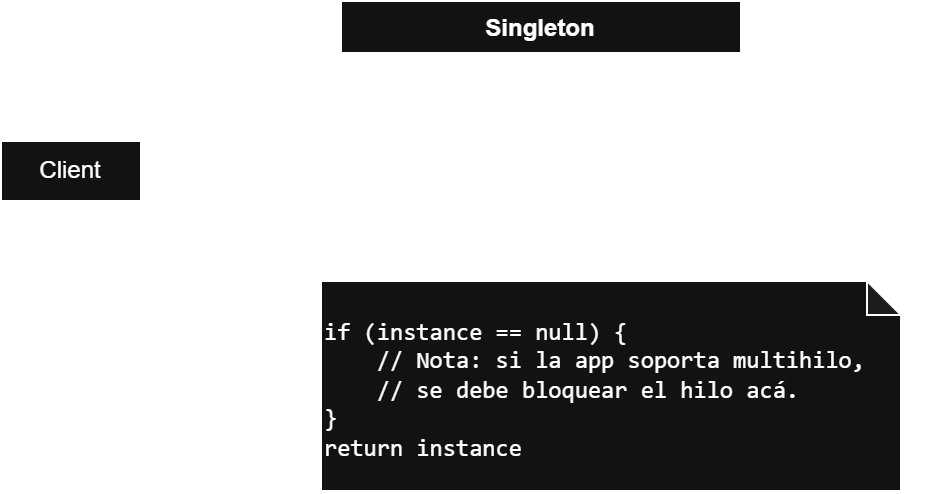
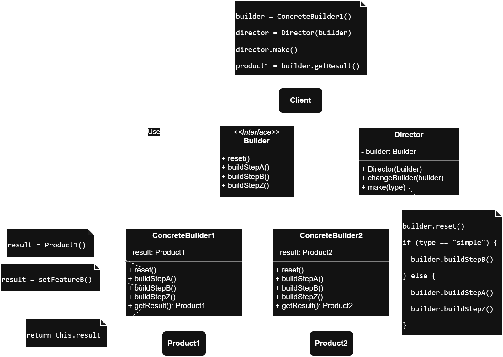
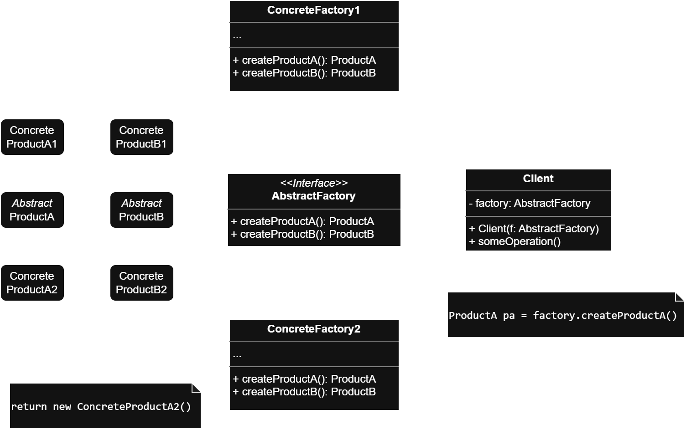

<h1>Apuntes de Arquitectura</h1>

***Index***:
<!-- TOC -->
  * [Principios SOLID](#principios-solid)
    * [Qué son los Principios de Diseño](#qué-son-los-principios-de-diseño)
    * [*Single Responsibility*](#single-responsibility)
    * [*Open/Closed*](#openclosed)
    * [*Liskov Substitution*](#liskov-substitution)
    * [*Interface Segregation*](#interface-segregation)
    * [*Dependency Inversion*](#dependency-inversion)
  * [Patrones de Diseño](#patrones-de-diseño)
    * [Qué es un Patrón de Diseño](#qué-es-un-patrón-de-diseño)
    * [Clasificación de los Patrones](#clasificación-de-los-patrones)
    * [*Singleton*](#singleton)
      * [Ejemplo](#ejemplo)
    * [*Builder*](#builder)
      * [Ejemplo](#ejemplo-1)
    * [*Abstract Factory*](#abstract-factory)
      * [Ejemplo](#ejemplo-2)
    * [*Factory Method*](#factory-method)
      * [Ejemplo](#ejemplo-3)
    * [*Adapter*](#adapter)
      * [Ejemplo](#ejemplo-4)
    * [*Facade*](#facade)
      * [Ejemplo](#ejemplo-5)
    * [*Decorator*](#decorator)
      * [Ejemplo](#ejemplo-6)
    * [*Strategy*](#strategy)
      * [Ejemplo](#ejemplo-7)
    * [*Observer*](#observer)
      * [Ejemplo](#ejemplo-8)
    * [*State*](#state)
      * [Ejemplo](#ejemplo-9)
    * [Referencias](#referencias)
  * [*Clean Architecture* vs Guía de Arquitectura de Android vs MVVM](#clean-architecture-vs-guía-de-arquitectura-de-android-vs-mvvm)
    * [Resumen General](#resumen-general)
    * [Desglose de las funciones de cada capa](#desglose-de-las-funciones-de-cada-capa)
      * [MVVM](#mvvm)
      * [Guía de Arquitectura (Google/Android)](#guía-de-arquitectura-googleandroid)
      * [*Clean Architecture*](#clean-architecture)
    * [Diferencia entre Modelos de Datos y Modelos de Dominio](#diferencia-entre-modelos-de-datos-y-modelos-de-dominio)
      * [Modelos de Datos (DTOs - Data Transfer Objects)](#modelos-de-datos-dtos---data-transfer-objects)
      * [Modelos de Dominio](#modelos-de-dominio)
    * [Ejemplo estructura](#ejemplo-estructura)
<!-- TOC -->

---

## Principios SOLID
### Qué son los Principios de Diseño
> :warning: Es importante destacar que **_estos principios están interrelacionados y se consideran como un todo_**. Y también **_es posible que en el intento de cumplir uno, se incumpla otro_**.

Los Principios de Diseño de _Software_ en general, son **_guías o pautas para escribir código_** que han demostrado ser eficaces a lo largo del tiempo.  
Su principal característica es que ayudan a escribir un **código limpio** (**_clean code_**). Es decir, permiten lo siguiente:

- Hacer un código entendible, no solo para el autor.
- Mantener y desarrollar una pieza de _software_ rápidamente a largo plazo.
- Crear tests legibles, rápidos, independientes y repetibles.
- Lograr una **alta cohesión** y un **bajo acoplamiento**.

Los SOLID no son los únicos. Ejemplos de otros Principios de Diseño pueden ser **DRY** (**_Don't Repeat Yourself_**), **KISS** (**_Keep It Simple, Stupid_**) o **YAGNI** (**_You Aren't Gonna Need It_**).

### *Single Responsibility*
Una clase debe tener **_una sola razón para cambiar_**. Es decir, debe ocuparse de una **_única parte del comportamiento del sistema_**.  
**Ejemplo**: La clase ``User``, que representa a un usuario, no tiene por qué manejar una base de datos. Esa responsabilidad se debería sacar a otro componente.

```kotlin
// ❌ DON'T
class User {
    private val db = Room.databaseBuilder(
        applicationContext,
        AppDatabase::class.java, "database-name"
    ).build()

    var firstName: String = "Javi"
        set(value) {
            if (value.count() <= 3) println("'$value' no llega ni a 3 letras") else field = value
        }

    fun getUser(): User = db.userDao().getAll()
}

// ✅ DO
class User {
    var firstName: String = "Javi"
        set(value) {
            if (value.count() <= 3) println("'$value' no llega ni a 3 letras") else field = value
        }
}
```

### *Open/Closed*
Una clase debe estar **_abierta a la extensión_** (**_de su comportamiento_**) pero **_cerrada a la modificación_** (**_de su código_**).  
**Ejemplo**: Si la función ``greeting()`` debe modificarse cada vez que se agrega un país, se viola este principio.

```kotlin
// ❌ DON'T
enum class Country {
    ARGENTINA, COLOMBIA, MEXICO
}

class User(val birthPlace: Country) {
    fun greeting() {
        when (birthPlace) {
            Country.ARGENTINA -> println("Qué pasa che")
            Country.COLOMBIA -> println("Qué más parce")
            Country.MEXICO -> println("Qué onda wey")
        }
    }
}

fun main() {
    val userArg = User(Country.ARGENTINA)
    userArg.greeting() // Qué pasa che

    val userCol = User(Country.COLOMBIA)
    userCol.greeting() // Qué más parce
}

// ✅ DO
interface User {
    fun greeting()
}

class UserArgentina : User {
    override fun greeting() = println("Qué pasa che")
}

class UserColombia : User {
    override fun greeting() = println("Qué más parce")
}

class UserMexico : User {
    override fun greeting() = println("Qué onda wey")
}

fun main() {
    val userArg = UserArgentina()
    userArg.greeting() // Qué pasa che

    val userCol = UserColombia()
    userCol.greeting() // Qué más parce
}
```

### *Liskov Substitution*
Si una clase es extendida (heredada), **_se debe poder usar cualquiera de sus clases hijas_** en su lugar **_sin alterar el comportamiento esperado del programa_**.  
**Ejemplo**: Si al usar una clase hija se rompe el comportamiento del programa, no se cumple con este principio. En este ejemplo, ``RegularUser`` no debería redefinir ``retrieveId()`` si no puede garantizar el mismo contrato que su clase base.

```kotlin
// ❌ DON'T
open class User {
    private var firstName: String = "Nombre: Javi"
    private var idClient: Int = 12345
    open fun retrieveName() = println(firstName)

    open fun retrieveId() = println(idClient)
}

class RegularUser : User() {
    override fun retrieveId() = throw Exception("Un usuario regular no puede acceder al ID")
}

fun main() {
    val user = User()
    val regular = RegularUser()

    user.retrieveName() // Nombre: Javi
    regular.retrieveName() // Nombre: Javi
    user.retrieveId() // 12345
    regular.retrieveId() // Exception in thread "main" java.lang.Exception: Un usuario regular no puede acceder al ID
}

// ✅ DO
open class User {
    private var firstName: String = "Nombre: Javi"
    open fun retrieveName() = println(firstName)
}

class RegularUser : User()

open class Admin : User() {
    private var idClient: Int = 12345
    open fun retrieveId() = println(idClient)
}

class Owner : Admin()

fun main() {
    val user = User()
    val regular = RegularUser()
    val admin = Admin()
    val owner = Owner()

    user.retrieveName() // Nombre: Javi
    regular.retrieveName() // Nombre: Javi
    admin.retrieveName() // Nombre: Javi
    owner.retrieveName() // Nombre: Javi

    // user.retrieveId() -> No tiene acceso a este método
    // regular.retrieveId() -> No tiene acceso a este método
    admin.retrieveId() // 12345
    owner.retrieveId() // 12345
}
```

### *Interface Segregation*
Una clase **_nunca debería depender de métodos que no usa_**. Es mejor tener más interfaces pequeñas que pocas interfaces grandes. Esto ayuda a **_reducir el acoplamiento_** innecesario y **_facilitar el mantenimiento_**.  
**Ejemplo**: Crear una nueva interfaz para evitar el comportamiento por defecto de una función que no se necesita. Luego, que cada clase implemente la interfaz que necesite.

```kotlin
// ❌ DON'T
interface User {
    val name: String
    val address: String
    val isFullAge: Boolean
}

class RegularUser : User {
    override val name: String
        get() = "Beto A Saber"
    override val address: String
        get() = "Calle Falsa 123"
    override val isFullAge: Boolean
        get() = true
}

class Admin : User {
    override val name: String
        get() = "Javi"
    override val address: String
        get() = "Av Siempre Viva"
    override val isFullAge: Boolean
        get() = throw UnsupportedOperationException()
}

// ✅ DO
interface User {
    val name: String
    val address: String
}

interface ValidateAge {
    val isFullAge: Boolean
}

class RegularUser : User, ValidateAge {
    override val name: String
        get() = "Beto A Saber"
    override val address: String
        get() = "Calle Falsa 123"
    override val isFullAge: Boolean
        get() = true
}

class Admin : User {
    override val name: String
        get() = "Javi"
    override val address: String
        get() = "Dr Moreno"
}
```

### *Dependency Inversion*
Una clase debe **_depender de abstracciones y no de implementaciones concretas_**. Este principio promueve un diseño desacoplado y facilita la prueba unitaria (_mocking_/_stubbing_).  

> ℹ️ La **_inyección de dependencias_** es una técnica que permite implementar este principio

**Ejemplo**: En lugar de depender de implementaciones, se deberían crear abstracciones (interfaces) que definan el contrato, y luego inyectar las implementaciones concretas según la necesidad.

```kotlin
// ❌ DON'T
class Greeting {
    fun greet() = print("Hola. ")
}

class Claim {
    fun claim() = println("Estoy haciendo un reclamo.")
}

class Whatever(
    private val greeting: Greeting,
    private val claim: Claim
) {
    fun communicate() {
        greeting.greet()
        claim.claim()
    }
}

fun main() {
    val greeting = Greeting()
    val claim = Claim()
    val whatever = Whatever(greeting, claim)

    whatever.communicate() // Hola. Estoy haciendo un reclamo.
}

// ✅ DO
interface MessageType {
    fun giveMessage()
}

interface ReasonType {
    fun giveReason()
}

class Greeting : MessageType {
    override fun giveMessage() {
        print("Hola. ")
    }
}

class SayBye : MessageType {
    override fun giveMessage() {
        print("Hasta nunca. ")
    }
}

class Claim : ReasonType {
    override fun giveReason() {
        println("Estoy haciendo un reclamo.")
    }
}

class Threat : ReasonType {
    override fun giveReason() {
        println("¡Volveré con mi abogado!")
    }
}

class Whatever(
    private val messageType: MessageType,
    private val reasonType: ReasonType
) {
    fun communicate() {
        messageType.giveMessage()
        reasonType.giveReason()
    }
}

fun main() {
    val messageTypeGreeting: MessageType = Greeting()
    val reasonTypeClaim: ReasonType = Claim()
    var whatever = Whatever(messageTypeGreeting, reasonTypeClaim)
    whatever.communicate() // Hola. Estoy haciendo un reclamo.

    val messageTypeBye: MessageType = SayBye()
    val reasonTypeThreat = Threat()
    whatever = Whatever(messageTypeBye, reasonTypeThreat)
    whatever.communicate() // Hasta nunca. ¡Volveré con mi abogado!
}
```

---

## Patrones de Diseño
### Qué es un Patrón de Diseño
Es una **_solución reutilizable y comprobada_** que muestra **_cómo estructurar el código_** para solucionar **_problemas de diseño comunes y habituales_**.  
A menudo los patrones se confunden con algoritmos porque ambos conceptos describen soluciones típicas a problemas conocidos. Mientras que un algoritmo siempre define un grupo claro de acciones para lograr un objetivo, un patrón es una descripción de más alto nivel de una solución. El código del mismo patrón aplicado a dos programas distintos puede ser diferente.  
Una analogía de **_un algoritmo sería una receta de cocina_**: ambos cuentan con pasos claros para alcanzar una meta. Por su parte, **_un patrón es más similar a un plano_**, ya que se puede observar cómo son su resultado y sus funciones, pero el orden exacto de la implementación depende del desarrollador.

### Clasificación de los Patrones
> :warning: Los ejemplos de cada patrón presentados más abajo representan implementaciones genéricas extrapolables a cualquier lenguaje orientado a objetos, no necesariamente son una versión idiomática en Kotlin, que para algunos casos podría resolverlo más fácilmente debido a las facilidades del lenguaje (ver [Design Patterns with Kotlin](Code%20Snippets%20with%20Kotlin/Design%20Patterns.md))

Los Patrones de Diseño se suelen clasificar en tres grandes grupos:

- **Patrones Creacionales** :arrow_right: Proporcionan mecanismos de creación de objetos que incrementan la flexibilidad y la reutilización de código existente. Agrupa a: _Factory Method_, _Abstract Factory_, _Builder_, _Singleton_ y _Prototype_.
- **Patrones Estructurales** :arrow_right: Explican cómo ensamblar objetos y clases en estructuras más grandes a la vez que se mantiene la flexibilidad y eficiencia de la estructura. Agrupa a: _Adapter_, _Bridge_, _Composite_, _Decorator_, _Facade_, _Flyweight_ y _Proxy_.
- **Patrones de Comportamiento** :arrow_right: Se encargan de una comunicación efectiva y la asignación de responsabilidades entre objetos. Agrupa a: _Chain of Responsibility_, _Command_, _Iterator_, _Mediator_, _Memento_, _Observer_, _State_, _Strategy_, _Template Method_ y _Visitor_.

### *Singleton*
Permite asegurarse de que **_una clase tenga una única instancia_**, a la vez que **_proporciona un punto de acceso global a dicha instancia y evita que otro código la sobreescriba_**.

El motivo más habitual es **_controlar el acceso a algún recurso compartido_**; por ejemplo, una base de datos o un archivo.

<div style="text-align: center; margin-top: 2em; margin-bottom: 4em;">
    
</div>

#### Ejemplo

🧠 Idea clave: el constructor es privado y el acceso se hace a través de un método estático.

```kotlin
// Clase Singleton
class Logger private constructor() {

    fun log(message: String) {
        println("Log: $message")
    }

    companion object {
        private var instance: Logger? = null

        fun getInstance(): Logger {
            if (instance == null) {
                // Nota: si la app soporta multihilo, se debería sincronizar este bloque
                instance = Logger()
            }
            return instance!!
        }
    }
}

// Cliente
fun main() {
    val logger1 = Logger.getInstance()
    val logger2 = Logger.getInstance()

    println(logger1 == logger2) // true
    logger1.log("Aplicación iniciada.") // Log: Aplicación iniciada.
}
```

### *Builder*
Permite **_construir objetos complejos paso a paso_** y producir distintos tipos y representaciones de un objeto empleando el mismo código de construcción. A su vez, **_no permite a otros objetos acceder al producto mientras se construye_**. Para eso, se extrae el código de construcción del objeto de su propia clase a **_objetos independientes llamados builders_**. Cada uno de esos _builders_ representa un "paso" de la construcción del objeto. Y lo importante, es que no es necesario llamarlos a todos: se pueden invocar solo aquellos que sean necesarios para producir una configuración particular del objeto.

Opcionalmente, también se puede utilizar una clase **_director_**, la cual puede **_definir el orden en el que se deben ejecutar los pasos_** para la construcción de objetos "habituales" o más usados, mientras que el _builder_ proporciona la implementación de dichos pasos.

Este patrón es util para **_evitar que los constructores de las clases tengan una enorme cantidad de parámetros_** (incluso cuando no se necesitan todos en todo momento) o la necesidad de crear **_múltiples subclases_** que cubran todas las combinaciones posibles de los parámetros.

<div style="text-align: center; margin-top: 2em; margin-bottom: 4em;">
    
</div>

#### Ejemplo

🧠 Idea clave: el ``Director`` orquesta el proceso; el ``Builder`` encapsula los pasos concretos.

```kotlin
// Producto final
class Product {
    private val parts = mutableListOf<String>()

    fun addPart(part: String) = parts.add(part)

    fun show() {
        println("Partes del producto: ${parts.joinToString()}")
    }
}

// Interfaz Builder
interface Builder {
    fun reset()
    fun buildPartA()
    fun buildPartB()
    fun buildPartZ()
    fun getResult(): Product
}

// Builder concreto
class ConcreteBuilder : Builder {
    private var product = Product()

    override fun reset() {
        product = Product()
    }

    override fun buildPartA() {
        product.addPart("Parte A")
    }

    override fun buildPartB() {
        product.addPart("Parte B")
    }

    override fun buildPartZ() {
        product.addPart("Parte Z")
    }

    override fun getResult(): Product = product
}

// Director opcional: define el orden de construcción
class Director(private var builder: Builder) {

    fun changeBuilder(builder: Builder) {
        this.builder = builder
    }

    fun make(type: String) {
        builder.reset()
        if (type == "simple") {
            builder.buildPartB()
        } else {
            builder.buildPartA()
            builder.buildPartB()
            builder.buildPartZ()
        }
    }
}

// Cliente
fun main() {
    val builder = ConcreteBuilder()
    val director = Director(builder)

    director.make("complejo")
    val product = builder.getResult()
    product.show() // Partes del producto: Parte A, Parte B, Parte Z
}
```

### *Abstract Factory*
Permite producir **_familias de objetos relacionados (y sus variantes)_** sin especificar sus clases concretas, ya sea porque no se conozcan de antemano o sencillamente porque se quiere permitir una futura extensibilidad.

El patrón sugiere declarar de forma explícita **_interfaces para cada producto diferente de la familia de productos_** y hacer que todas **_las variantes de los productos sigan esas interfaces_**.  
Luego, declarar la *Abstract Factory*: una **_interfaz con una lista de métodos de creación para todos los productos que son parte de la familia de productos_**, los cuales deben devolver productos abstractos representados por las interfaces que extraídas previamente.  
A su vez, para cada variante de una familia de productos, se crea una **_clase de fábrica independiente_** basada en la interfaz *Abstract Factory*, la cual devuelve productos de un tipo particular (variantes específicas de los productos).

En resumen, se crean dos niveles de abstracción: uno para los objetos creados y otro para las fábricas.

<div style="text-align: center; margin-top: 2em; margin-bottom: 4em;">
    
</div>

#### Ejemplo

🧠 Idea clave: se crean familias completas de productos relacionados (botones y checkboxes) sin conocer sus clases concretas.

```kotlin
// Interfaces abstractas para los productos
interface Button {
    fun paint()
}

interface Checkbox {
    fun paint()
}

// Implementaciones concretas
class WinButton : Button {
    override fun paint() = println("Renderizando botón estilo Windows")
}

class MacButton : Button {
    override fun paint() = println("Renderizando botón estilo macOS")
}

class WinCheckbox : Checkbox {
    override fun paint() = println("Renderizando checkbox estilo Windows")
}

class MacCheckbox : Checkbox {
    override fun paint() = println("Renderizando checkbox estilo macOS")
}

// Fábrica abstracta
interface GUIFactory {
    fun createButton(): Button
    fun createCheckbox(): Checkbox
}

// Fábricas concretas
class WinFactory : GUIFactory {
    override fun createButton(): Button = WinButton()
    override fun createCheckbox(): Checkbox = WinCheckbox()
}

class MacFactory : GUIFactory {
    override fun createButton(): Button = MacButton()
    override fun createCheckbox(): Checkbox = MacCheckbox()
}

// Cliente
class Application(private val factory: GUIFactory) {

    private val button = factory.createButton()
    private val checkbox = factory.createCheckbox()

    fun render() {
        button.paint() // Renderizando botón estilo macOS
        checkbox.paint() // Renderizando checkbox estilo macOS
    }
}

fun main() {
    val factory: GUIFactory = MacFactory()
    val app = Application(factory)
    app.render()
}
```

### *Factory Method*
TODO...

#### Ejemplo

🧠 Idea clave:
```kotlin

```

### *Adapter*
TODO...

#### Ejemplo

🧠 Idea clave:
```kotlin

```

### *Facade*
TODO...

#### Ejemplo

🧠 Idea clave:
```kotlin

```

### *Decorator*
TODO...

#### Ejemplo

🧠 Idea clave:
```kotlin

```

### *Strategy*
TODO...

#### Ejemplo

🧠 Idea clave:
```kotlin

```

### *Observer*
TODO...

#### Ejemplo

🧠 Idea clave:
```kotlin

```

### *State*
TODO...

#### Ejemplo

🧠 Idea clave:
```kotlin

```

### Referencias
- [Design Patterns In Kotlin](https://medium.com/@michalankiersztajn/list/design-patterns-in-kotlin-12e52466affe)
- [Refactoring Guru - Patrones de diseño](https://refactoring.guru/es/design-patterns/catalog)

---

## *Clean Architecture* vs Guía de Arquitectura de Android vs MVVM

### Resumen General
Cada capa en estas arquitecturas tiene un propósito específico y ayuda a mantener un diseño limpio y organizado que facilita la mantenibilidad y escalabilidad de la aplicación.

- **MVVM** se enfoca en la separación de la lógica de presentación y la UI a través de un *ViewModel*.  
- **La arquitectura propuesta por Google** introduce una gestión clara de la UI y la lógica de datos, con una opción para incluir una capa de dominio.  
- ***Clean Architecture*** promueve una estructura altamente desacoplada, donde **_las dependencias fluyen desde las capas exteriores hacia las interiores_**, permitiendo un alto grado de flexibilidad y reutilización. Para evitar que se “crucen los límites” entre las capas, se utiliza el **_Principio de Inversión de Dependencia_** (ver [Dependency Inversion](#dependency-inversion)).

### Desglose de las funciones de cada capa

#### MVVM

| **Capa**      | **Descripción**                                                                                                                                                                   |
|---------------|-----------------------------------------------------------------------------------------------------------------------------------------------------------------------------------|
| **Model**     | Se encarga de la **_lógica de negocio y de la gestión de los datos_**. Puede incluir acceso a bases de datos, servicios web y otros recursos de datos.                            |
| **View**      | Representa la UI. Escucha los cambios en el *ViewModel* y se actualiza en consecuencia. Normalmente consiste en *activities*, *fragments* y *Views*.                              |
| **ViewModel** | Actúa como intermediario entre las capas de Model y de View. Contiene datos que la vista necesita y maneja la lógica de presentación. También gestiona el ciclo de vida de la UI. |

#### Guía de Arquitectura (Google/Android)

| **Capa**               | **Descripción**                                                                                                                                                                                                                                                                                                                                                                                                                                                                                                                                                                                        |
|------------------------|--------------------------------------------------------------------------------------------------------------------------------------------------------------------------------------------------------------------------------------------------------------------------------------------------------------------------------------------------------------------------------------------------------------------------------------------------------------------------------------------------------------------------------------------------------------------------------------------------------|
| **UI**                 | La función de la capa de UI (o capa de presentación) es mostrar los datos de la aplicación en la pantalla. **_Se compone de dos cosas: elementos de la UI_** que representan los datos en la pantalla (hechos con *Views* o con Compose) **_y state holders (como los ViewModel)_** que contienen datos, los exponen a la UI y manejan la lógica de presentación.                                                                                                                                                                                                                                      |
| **Data**               | **_Contiene la lógica de negocio_**, la cual está compuesta por reglas que determinan cómo la aplicación crea, almacena y cambia datos. Está formada por **_Repositorios_**, que pueden contener desde cero hasta muchas Fuentes de Datos (***Data Sources***). Se debería crear una clase de Repositorio para cada tipo diferente de dato que se maneja en la aplicación y a su vez, cada clase de Fuente de Datos debe tener la responsabilidad de trabajar con una sola fuente de datos, que puede ser un archivo, una fuente de red (solicitudes a una API en internet) o una Base de Datos local. |
| **Dominio (opcional)** | Se encarga de encapsular la lógica de negocio compleja, o la lógica de negocio simple que reutilizan varios *ViewModels*. Esta capa es opcional, ya que no todas las aplicaciones cumplen estos requisitos. Se encuentra entre la capa de UI y la capa de Data. Las clases de esta capa se denominan comúnmente **_Casos de Uso o interactors_**. Cada Caso de Uso debe ser **_responsable de una única funcionalidad_**.                                                                                                                                                                              |

#### *Clean Architecture*

| **Capa**                                   | **Descripción**                                                                                                                                                                                                                                                                                                                                                              |
|--------------------------------------------|------------------------------------------------------------------------------------------------------------------------------------------------------------------------------------------------------------------------------------------------------------------------------------------------------------------------------------------------------------------------------|
| **Enterprise Business Rules / Entities**   | Contiene las **_Reglas de Negocio de alto nivel (lo más abstracto), encapsulando la lógica que es específica del Dominio del Negocio_**. Es independiente de la tecnología y las librerías externas. Las Entidades podrían ser utilizadas por muchas aplicaciones diferentes en la empresa y ningún cambio operativo en ninguna aplicación en particular debería afectarlas. |
| **Application Business Rules / Use Cases** | Define la **_lógica específica de la aplicaciónm encapsulando e implementando todos los Casos de Uso del sistema_**. Se encarga de coordinar el flujo de datos entre las capas superiores e inferiores.                                                                                                                                                                      |
| **Interface Adapters**                     | Esta capa **_convierte datos del formato más conveniente para los Casos de Uso y Entidades, al formato más conveniente para los componentes de la capa más externa (y viceversa)_**. Aquí se encuentran implementaciones de repositorios, APIs y controladores de UI.                                                                                                        |
| **Frameworks & Drivers / Infrastructure**  | Contiene **_elementos externos como Bases de Datos, frameworks de UI, servicios web, etc_**. Esta capa puede incluir las tecnologías que se utilizan para construir la aplicación. Su objetivo es ser **_reemplazable o intercambiable_**.                                                                                                                                   |

<br>

### Diferencia entre Modelos de Datos y Modelos de Dominio

#### Modelos de Datos (DTOs - Data Transfer Objects)

- **Propósito**: **_Representar la estructura de datos tal como viene de fuentes externas (API, base de datos)_**
- **Características**:
    - Suelen ser clases simples con propiedades y sin lógica de negocio
    - Sus nombres y estructura reflejan exactamente lo que devuelve la API o lo que requiere la base de datos
    - Pueden contener anotaciones específicas para serialización/deserialización (como `@SerializedName` en Retrofit)
    - Ejemplo: `MovieDto` con campos exactamente como los devuelve la API

#### Modelos de Dominio

- **Propósito**: **_Representar Entidades de Negocio independientes de la infraestructura externa_**
- **Características**:
    - Contienen la lógica de negocio relevante para la entidad
    - Su estructura está diseñada para las necesidades de la aplicación, no para adaptarse a fuentes externas
    - Son independientes de frameworks y librerías externas
    - No tienen anotaciones específicas de infraestructura
    - Ejemplo: `Movie` con solo los campos relevantes para la lógica de la aplicación

En la práctica, los repositorios suelen transformar los modelos de datos (DTOs) en modelos de dominio al obtener información, y viceversa al guardarla, manteniendo así la capa de dominio aislada de los detalles de implementación de las fuentes de datos.

### Ejemplo estructura
Estructura de paquetes para una supuesta app destinada a mostrar una lista de películas, ver el detalle de una película, agregar una película a favoritos, etc.

```
com.example.movieapp/
├── data/
│   ├── remote/
│   │   ├── api/
│   │   └── models/
│   ├── local/
│   │   ├── dao/
│   │   └── entities/
│   └── repositories/
├── domain/
│   ├── models/
│   ├── repositories/
│   └── usecases/
└── presentation/
    ├── common/
    │   ├── components/
    │   └── theme/
    ├── movielist/
    ├── moviedetail/
    └── favorites/
```
