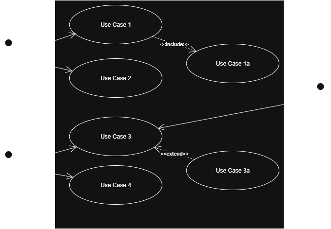
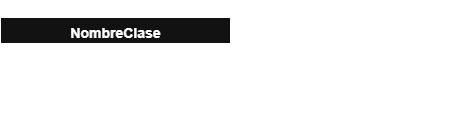
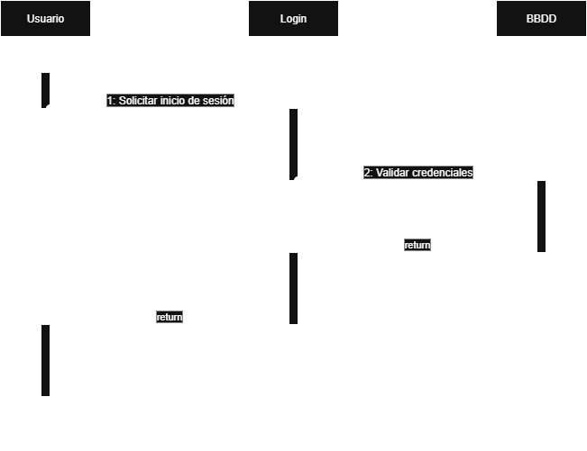
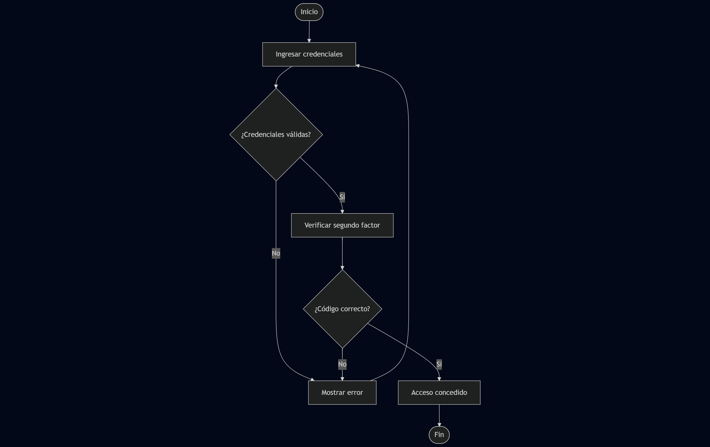
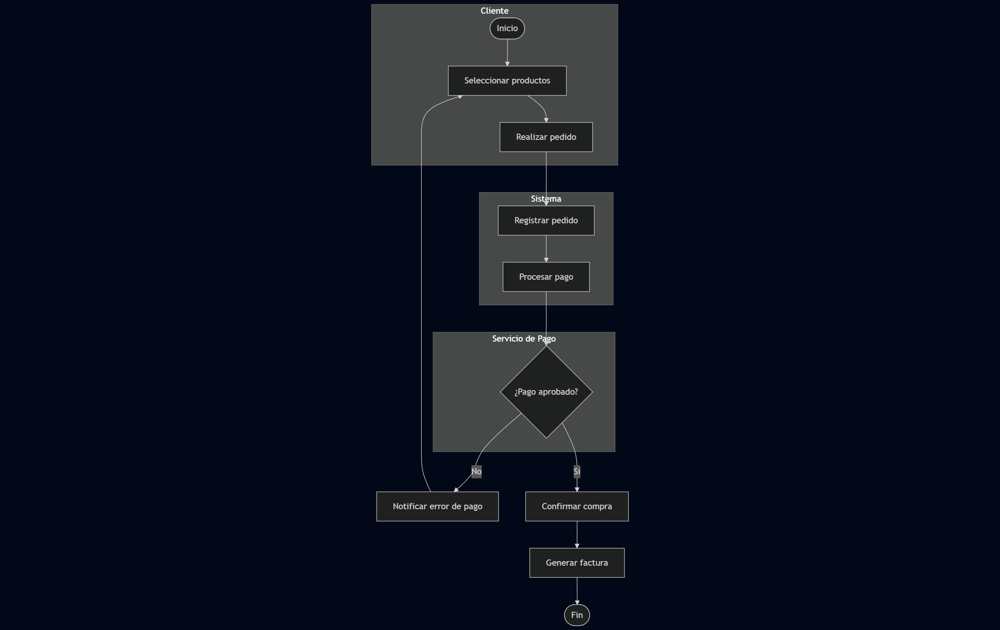
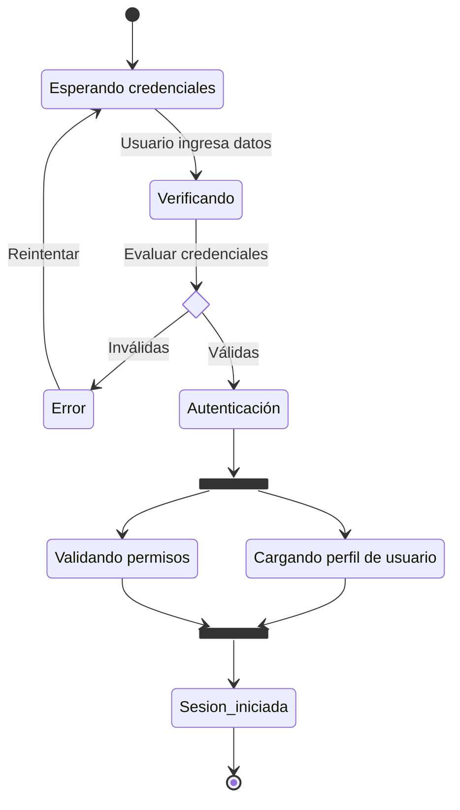
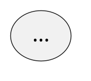
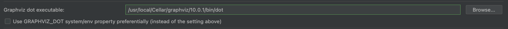

<h1>Diagramas & Modelos</h1>

***Index***:
<!-- TOC -->
  * [Diagramas UML (algunos)](#diagramas-uml-algunos)
    * [Diagrama de Casos de Uso](#diagrama-de-casos-de-uso)
    * [Diagrama de Clases](#diagrama-de-clases)
    * [Diagrama de Secuencia](#diagrama-de-secuencia)
    * [Diagrama de Actividades](#diagrama-de-actividades)
      * [Ejemplo de **Flujo de Control**](#ejemplo-de-flujo-de-control)
      * [Ejemplo de **Flujo de Trabajo**](#ejemplo-de-flujo-de-trabajo)
    * [Diagrama de Estados (o Máquinas de Estados)](#diagrama-de-estados-o-máquinas-de-estados)
  * [Generar un diagrama de Clases desde AS con PlantUML](#generar-un-diagrama-de-clases-desde-as-con-plantuml)
    * [Instalación y configuración de *PlantUML*](#instalación-y-configuración-de-plantuml)
    * [Generar un diagrama](#generar-un-diagrama)
    * [*Troubleshooting*](#troubleshooting)
  * [Links útiles](#links-útiles)
<!-- TOC -->

---

## Diagramas UML (algunos)

### Diagrama de Casos de Uso
Funcionalidad del sistema desde la perspectiva del usuario. Muestra interacción de un usuario o
actor (persona, otra app, etc.) con el sistema y sus roles.

- ¿Quiénes van a utilizar e interactuar con la aplicación? :arrow_right: Actores (personas, apps)
- Principales funciones que debe realizar la aplicación :arrow_right: Casos de Uso. Qué hace, no
  cómo lo hace
- Relaciones entre Casos de Uso:
    - ``include`` :arrow_right: Caso Base depende (es obligatorio) de otro caso
    - ``extend`` :arrow_right: Caso Base puede depender o no (es opcional) de otro caso
        - ``extension point`` :arrow_right: Lo que determina que se va a usar el caso extendido.
          Ej.: un _checkbox_ para recibir sugerencias.
    - _Generalización_ :arrow_right: Concepto de herencia en POO. Relación "es un". La flecha apunta
      al caso "gneral" (o "padre") desde el caso "especializado" (o "hijo")



### Diagrama de Clases
Los más comunes en el modelado de sistemas orientados a objetos. Representa clases (u objetos) y sus
relaciones.

- Muestra cómo se organiza y estructura un sistema internamente. Describe cómo se implementa desde
  una perspectiva orientada a objetos.
- **_Clasificador_** :arrow_right: Representación gráfica



- **_Asociación_** :arrow_right: Representa una relación entre clases. Implica que una clase "
  conoce" a otra y tiene una referencia a ella. Opcionalmente, se puede indicar un tipo con un
  verbo, una **_direccionalidad_** y una **_multiplicidad_**.
- **_Generalización_** :arrow_right: Al igual que en otros diagramas, relacionado con la herencia.
  También llamada **_extensión_**.
- **_Agregación & Composición_** :arrow_right: Relaciones entre las "partes" y el "todo". Son casos
  espcíficos de asociación.
    - **_Agregación_** :arrow_right: El "hijo" puede existir independientemente del "padre".
      Ejemplo: "Aula" y "Estudiante". Si se elimina el "Aula", el "Estudiante" sigue existiendo.
    - **_Composición_** :arrow_right: El "hijo" no puede existir sin el "padre". Ejemplo: "Casa y "
      Habitación". Si se elimina la "Casa", la "Habitación" deja de existir.

### Diagrama de Secuencia
Representa la secuencia de interacciones entre los objetos en el tiempo. Muestran cómo los mensajes
pasan entre los objetos.

¿Para qué se usan?
- Visualizar el **_flujo de mensajes_** y su orden entre objetos
- Especificar el **_comportamiento de un Caso de Uso_**
- Diseñar la **_lógica de procesos o funciones complejas_**
- Detectar **_responsabilidades de clases y objetos_**

Elementos
- **_Participantes_** u **_Objetos_**, también llamados **_Actores_**
- Líneas de vida
- Mensajes (opcionales) :arrow_right: Inovación de métodos, envío de mensajes de un objeto a otro,
  etc.
- Activaciones (opcionales) :arrow_right: Barras sobre las líneas de vida que muestran el tiempo
  durante el cual el objeto va a estar realizando una acción.
- Retornos (opcionales) :arrow_right: Líneas punteadas que indican respuestas



### Diagrama de Actividades
Similares a los diagramas de Flujo. Se utilizan para mostrar el flujo de control de una actividad a
otra.
- Describe el **_flujo de control_** o el **_flujo de trabajo_** de un sistema. Se centra en las
  tareas, los procesos.

| Aspecto          | Flujo de Control                                                                               | Flujo de Trabajo                                                                             |
|------------------|------------------------------------------------------------------------------------------------|----------------------------------------------------------------------------------------------|
| Foco Principal   | Secuencia lógica de ejecución de tareas                                                        | Proceso global con roles y transiciones                                                      |
| Nivel de detalle | Más técnico, enfocado en la lógica interna                                                     | Más amplio, enfocado en la colaboración entre sistemas y actores                             |
| Incluye          | - Secuencia de Actividades<br>- Decisiones (ramificaciones)<br>- Concurrencia<br>- Condiciones | - Roles o Responsables<br>- Transiciones entre etapas<br>- Resultados esperados en cada paso |
| Ejemplo típico   | Verificar condiciones, tomar decisiones                                                        | Completar un proceso empresarial o usuario-sistema                                           |

#### Ejemplo de **Flujo de Control**
Autenticación de un usuario en el sistema.



#### Ejemplo de **Flujo de Trabajo**
Proceso de compra online con interacción entre Cliente, Sistema y un Servicio de Pago externo.



### Diagrama de Estados (o Máquinas de Estados)
Describe el comportamiento de un sistema en cuanto a sus **_estados_** (situaciones o condiciones en las que puede estar un objeto) y **_transiciones_** (cambios de un estado a otro desencadenados por eventos o condiciones específicas).

Elementos básicos:
- Estado inicial
- Estados intermedios
- Transiciones
- Estado final
- _Choice_
- _Join_
- _Fork_



## Generar un diagrama de Clases desde AS con PlantUML

### Instalación y configuración de [*PlantUML*](https://plantuml.com/es/class-diagram)
- Instalar ***PlantUML*** y ***Graphviz*** (ver [acá](https://medium.com/@shivam.gosavi340_58315/productivity-hack-visual-documentation-using-plantuml-2f9562890a42))
    - *Plugin* → `PlantUML integration`
    - [*Mac*] → `brew install graphviz`

- Configuración de [***MetaView***](https://github.com/xcporter/MetaView):
    - En el `build.gradle.kts(:module)`. Tomar la versión preferiblemente de https://plugins.gradle.org/plugin/com.xcporter.metaview

```kotlin
    plugins {
        // (...)
        id("com.xcporter.metaview") version "<VERSION>"
    }
    
    android {
        // (...)
    
        generateUml {
            classTree {
                outputFile = "<NOMBRE DEL ARCHIVO>.md"
                style = listOf("skinparam BackgroundColor LightBlue")
                target =
                    file(projectDir.path + "/src/main/<RUTA DEL PAQUETE DE LOS ARCHIVOS A GENERAR EL DIAGRAMA>")
            }
        }
    }
```

### Generar un diagrama
- Generar diagrama (se guarda en `<MODULO>/build/docs/`):

```bash
  ./gradlew generateUmlDiagrams
```

- Adicionalmente, se puede agregar un tamaño en DPI's para guardar el diagrama como imagen:



### *Troubleshooting*
- Problemas con versiones de Java al correr el comando para generar un diagrama :arrow_right: Validar si se está usando la última versión del *plugin*

```bash
  com/xcporter/KotlinLexer has been compiled by a more recent version of the Java Runtime (class file version 58.0), this version of the Java Runtime only recognizes class file versions up to 55.0
```

- No se genera el diagrama por algún error en la ruta → Agregar la ruta correcta del archivo `dot` ejecutable en `Open Settings` > `Graphviz dot executable`



<br>

## Links útiles

- [C4 model](https://c4model.com/)
- [Structurizr](https://docs.structurizr.com/)
- [*Plugin* Structurizr para Kotlin](https://github.com/Catalysts/structurizr-extensions/blob/master/structurizr-kotlin/README.md)
