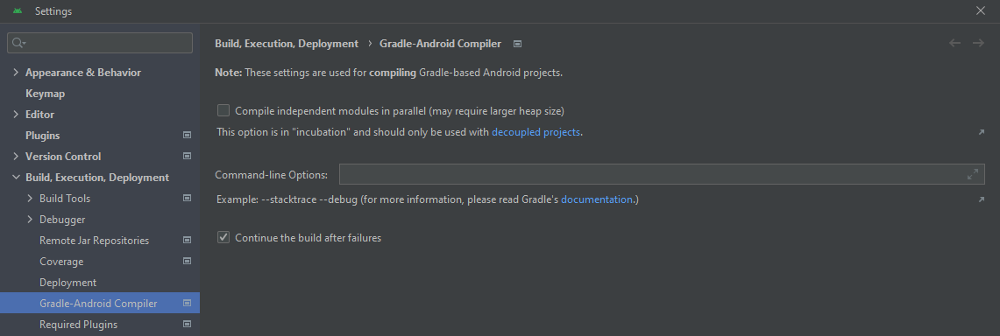
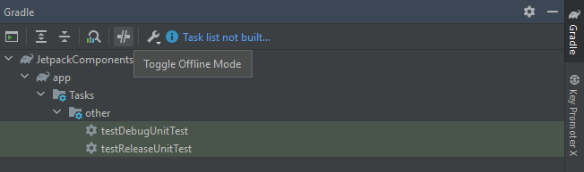

<h1>Gradle</h1>

***Index***:
<!-- TOC -->
  * [What is Gradle](#what-is-gradle)
  * [Incremental Builds and Build Caching with Gradle](#incremental-builds-and-build-caching-with-gradle)
  * [Gradle Build Cache deep dive](#gradle-build-cache-deep-dive)
    * [Fundamentals](#fundamentals)
    * [Troubleshooting build cache issues](#troubleshooting-build-cache-issues)
    * [Runtime API](#runtime-api)
  * [Develocity (former Gradle Enterprise)](#develocity-former-gradle-enterprise)
    * [Speed up builds and tests](#speed-up-builds-and-tests)
    * [Improve troubleshooting and reliability](#improve-troubleshooting-and-reliability)
    * [Metrics and data](#metrics-and-data)
    * [Validation script to identify build caching issues](#validation-script-to-identify-build-caching-issues)
  * [About using Gradle in Android](#about-using-gradle-in-android)
    * [About Gradle Wrapper Script in Android Studio](#about-gradle-wrapper-script-in-android-studio)
    * [Compilation process with Gradle](#compilation-process-with-gradle)
    * [Build configurations](#build-configurations)
      * [How Flavors and Build Types combine](#how-flavors-and-build-types-combine)
      * [Gradle Merge Rule](#gradle-merge-rule)
    * [Some Gradle tasks in Android](#some-gradle-tasks-in-android)
    * [Common Errors with Gradle](#common-errors-with-gradle)
      * [*Gradle* does not recognize a dependency](#gradle-does-not-recognize-a-dependency)
      * [*Clean cache and restart*, *Sync with Gradle*, *Clean & Rebuild*, *Make project*, `--refresh-dependencies` don't work](#clean-cache-and-restart-sync-with-gradle-clean--rebuild-make-project---refresh-dependencies-dont-work)
  * [Comandos útiles](#comandos-útiles)
    * [Dependency tree](#dependency-tree)
    * [Specific dependency](#specific-dependency)
    * [Ver tareas disponibles en un módulo de Android](#ver-tareas-disponibles-en-un-módulo-de-android)
  * [Useful Links](#useful-links)
<!-- TOC -->

---

## What is Gradle

- Gradle is a tool for automation, building, and dependency management.
- It allows you to automate processes such as compiling, collecting and packaging resources.
- Packages and builds deployment artifacts (`.apk`, `.jar`, `.war`), publishes them, and manages both internal and external dependencies.
- ***Build*** → Sequence of steps, known as ***Tasks***, such as compile, test or package. The lifecycle of a Gradle build consists of three stages:
    - ***Initialization***: Gradle determines how many modules are part of the build and creates an instance for each one.
    - ***Configuration***: All build scripts are executed.
    - ***Execution***: Gradle determines which set of created and configured tasks will be executed, based on the task names and directory location.
- ***Tasks*** → Have ***Inputs*** such as files or configurations options, execute ***Action*** and produce ***Outputs***. The outputs of a task can be the inputs to another task.
    - Most of them, are ***Deterministic*** (the same inputs would always produce the same outputs).
    - When a deterministic task is run, if the outputs from the previous execution are still there and the inputs haven’t changed, the outputs could be reused, saving time from running the Action.
- ***Dependencies*** → It is a necessary component for another component to function.
    - ***Project Dependencies***: These are necessary for the execution and development of the application code.
    - ***Build Dependencies***: These are required for the project build process itself, but are not part of the runtime code.
- Project Structure: Gradle is a multi-project build tool. Therefore, you can have multiple *sub-projects* (AKA *modules*) within a project.
    - *settings.gradle.kts* → It has the global settings that will be applied in each module.
    - *build.gradle.kts* → Each module has its own file with specific settings.

## Incremental Builds and Build Caching with Gradle

1. **Incremental Build Support**
    - It only looks at existing task output from the previous execution to see if was created with the current inputs and can be reused. That means if you make a change to the source code, compile it, make another change, compile it again, and then decide to revert to the previous change, the task is run again because the previous output is different.
    - Inputs can be:
        - Files (including outputs from other tasks).
        - Configuration options.
2. **Local Cache**
    - Store historical deterministic task action output locally, referenced by the hash keys of inputs.
    - Don't repeat deterministic task action work that has been previously done locally.
    - Enable verbose mode to show outcome labels (`UP-TO-DATE` for incremental builds, `FROM-CACHE` for local and remote caches, `NO-SOURCE`, etc):
        - Add `org.gradle.console=verbose` to the *gradle.properties* file.
    - Enable the local cache:
        - Add `org.gradle.caching=true` to the *gradle.properties* file.
    - Configure the retention duration for the Gradle build cache:

        ```kotlin
        // In *settings.gradle.kts*
        buildCache {
            local {
                directory = File(rootDir, "build-cache")
                // isEnabled = false
                removeUnusedEntriesAfterDays = 30
        		}
        }
        
        // [Recommended] In ~/.gradle/*init.gradle.kts* file
        gradle.settingsEvaluated {
        		buildCache {
        				local {
        						removeUnusedEntriesAfterDays = 30
        				}
        		}
        }
        ```

3. **Remote Cache**
    - Store historical deterministic task action output in a remote cache, referenced by the hash keys of inputs.
    - Only CI machines should publish to the remote cache, since there is no need for the remote cache to be updated with input-output entries for all the work done before a pull request is created. After that, a continuous integration build will run, and at that point it can update the remote cache.
    - Configure project to use remote cache:

        ```kotlin
        // Add this to *settings.gradle.kts*
        val isCiServer = System.getenv().containsKey("CI")
        
        buildCache {
        		// local {...}
        		
            remote<HttpBuildCache> {
        		    url = uri("https://something.gradle.com/cache/")
        		    isPush = isCiServer
        		    credentials {
        				    username = System.getenv("CACHE_USERNAME")
        				    password = System.getenv("CACHE_PASSWORD")
        		    }
            }
        }
        ```

## Gradle Build Cache deep dive

> 🔍 Referencias:  
> - [Implementing Custom Tasks](https://docs.gradle.org/current/userguide/implementing_custom_tasks.html)  
> - [Better reuse via input normalization](https://docs.gradle.org/current/userguide/build_cache_concepts.html#normalization)
>

### Fundamentals

- Properties have to be annotated as inputs in the task type so that Gradle knows what the inputs of a task are.
- You will get an error when trying to run a task of a task type if you don't declare a property as an input, output or internal in that task type.
- Input normalization: Informing Gradle that a certain part of an input is not relevant to the behavior of the task and can be ignored with regards to cache key creation. And there isn't a default normalization strategy - you have to specify.
- Some usual annotations:

    ```kotlin
    @CacheableTask
    @get:Input
    @get:InputDirectory
    @get:PathSensitive(PathSensitive.RELATIVE)
    @get:Output
    @get:OutputDirectory
    @TaskAction
    ```


### Troubleshooting build cache issues

- When debugging build cache issues, you can gain insights with:
    - Use build scans and build scan comparisons
    - Use the `-i` flag
    - Use `-Dorg.gradle.caching.debug=true`
- Common causes:
    - A file input may be using the absolute path instead of the relative path with regards to cache key generation.
    - Inputs may contain timestamps, which constanty change.
    - Inputs that are collections, such as lists, may contain the same elements, but in different order (non-deterministic ordering).
    - Tasks may have overlapping outputs.
    - There may be some external inputs, such as system properties, that are often changing.
    - File encodings and line endings may cause different cache key generation on Unix versus Windows machines.
    - Symlinks don’t work on Windows machines.
    - Machines may have different versions of Java, which may be an input to the task.
        - Default behavior only tracks major version: For tasks like compileJava, only the major version of Java is used, not the minor version.
        - Recommend using toolchains: Using Java toolchains would help ensure the same major version of Java is used across machines.
- **Unstable inputs**: Irrelevant information that keeps changing may produce the cache key for the task will keep changing from build to build, resulting in never getting cache hits. It could be corrected ignoring the attribute that is causing the instability:

    ```kotlin
    // In the build.gradle.kts from de consuming project (module)
    normalization {
        runtimeClasspath {
            metaInf {
                ignoreAttribute("Some-Attribute")
            }
        }
    }
    ```

- **Overlapping outputs**: Copy-pasting task configuration without taking care can result in tasks having overlapping outputs, hence Gradle will not use the build cache for these tasks to ensure correctness.
- Any of the following (and more) can accidentally write outputs to input locations, causing build cache issues:
    - Tests
    - Custom report generation
    - Custom code generating tools

### Runtime API

- The Build Cache Runtime API:
    - Can be useful to declare missing inputs and outputs of tasks or task types authored by others which you cannot modify.
    - Can be used to enable caching.

    ```kotlin
    // In the module's build.gradle.kts, assuming that SrcDirHash is not ours
    tasks.register<SrcDirHash>("hashSrcAlt") {
    		hashMethod.set("MD5")
    		
    		inputs.dir(layout.projectDirectory.dir("src"))
    				.withPropertyName("contents")
    				.withPathSensitivity(PathSensitivity.RELATIVE)
    		
    		outputs.dir(layout.buildDirectory.dir("src-dir-hash"))
    				.withPropertyName("outputDir")
    		
    		outputs.cacheIf { true }
    }
    ```

## Develocity (former Gradle Enterprise)

### Speed up builds and tests

The acceleration technologies provide you with faster feedback loops wich leads to less context switching and more productive developers.

1. Build Cache (Local and Remote)
2. Test Distribution
3. Predictive Test Selection
    1. Is a machine learning technique that allows Develocity to select only a subset of your tests so that the whole test suite doesn’t have to be run.
    2. It analyzes which tests are most likely to give a useful result based on the specific code changes made and runs only the tests which will give a helpful result.
    3. This saves time as only a subset of the tests of the build will have to be run.
    4. PTS simulations are estimated savings for your test suite based on actual builds reported to your Develocity instance.
4. Performance Dashboards
    1. It shows the the performance of different types of builds and different projects all together.
    2. Local and remote build caches and up to date checks, might be responsible for avoidance savings.
    3. Uploading to cache, downloading from cache and Packing-Unpacking, can contribute to the build cache overhead.
    4. Four reasons why might a task or goal be run instead of being retrieved from the build cache:
        1. The task or goal is not cacheable
        2. The task or goal has not been run before
        3. There is no build cache or it is not enabled
        4. Changes were made that impact that task or goal
    5. Wall clock time and Serial time: Wall clock time is the amount of actual time the build takes; Serial time is the amount of time it would take if all tasks and goals ran serially instead of in parallel.

### Improve troubleshooting and reliability

Using build scans and Develocity to share information about a problem and to collaborate on it can help us fix problems more quickly. Develocity can also help you see common failures and flakines that can’t be spotted at the individual build level.

1. Build Scan
2. Build Failure Analytics
    1. Verification Failures
        1. Syntax errors
        2. Code style violations
        3. Incorrectly working code
    2. Non-Verification Failures
        1. Paths or files not found
        2. Connection issues
        3. Incorrectly set up environments
        4. Out of memory exceptions
3. Test Analytics
    1. Flaky Test: Passes and fails with the same code and same inputs
    2. Two mechanisms used to detect flaky tests in Develocity
        1. Retrying a failed test during a build: if it passes and fails in the same build, it's classed as flaky
        2. Tests with the same inputs that both pass and fail in different builds are classed as flaky
    3. Three valid ways to reach the test class history page:
        1. Selecting a specific test from the list on the Tests tab of Develocity
        2. Clicking "test history" from a test failure on an individual build scan
        3. Typing the test name in the filter above the chart in the Tests tab

### Metrics and data

Provides metrics and data to help maintain good performance and help you identify issues that affect many developers. Fixing these kinds of issues can improve productivity across the whole organization.

1. Trends dashboard
    1. Shows:
        1. Build performance over time
        2. How much time is saved due to parallelisation or avoidance
        3. How much time is spent downloading dependencies
    2. Using filters can show:
        1. Build time trends for sepecific projects, tasks or goals
        2. How build time varies between local and CI builds
        3. How much time a team, or an individual, is spending on building and testing
    3. Can identify performance regressions
2. Develocity API
    1. Provides access to the data in Develocity
    2. Supports querying the data
    3. Gives flexibility for using the data
3. Data Platform

### Validation script to identify build caching issues

> 🔍 Referencia:  
[Build validation scripts](https://github.com/gradle/develocity-build-validation-scripts)
>

To identify a build caching issue cause and take corrective measures to fix the task, there are quite a few steps involved when we do this check manually: run seccessive builds, generate scans, perform build scan comparisons with the correct filters to identify the problematic tasks or do build scan comparisons and then follow up and investigate further.

The build validation scripts automate much of this work. It is an automated job that performs checks using build scans and alerts if build cache performance issues found.

## About using Gradle in Android

### About Gradle Wrapper Script in Android Studio

This is a file called `gradlew` (or `gradlew.bat` on Windows) located in the root of the project and serves as a “wrapper” for Gradle. Using the `./gradlew` command, this script downloads and uses the Gradle version specified in the project's `gradle/wrapper/gradle-wrapper.properties` file. When run from Android Studio, this script is called in the context of the current project. This ensures that the project uses the same version of Gradle wherever it is located and that there are **no conflicts with the global Gradle installation**, if any.

### Compilation process with Gradle

Android tasks are primarily provided by the Android Gradle Plugin, which is required for both apps and libraries. These tasks relate to compilation, packaging, signing, and so on. It also has a DSL that allows you to configure it.

The plugin takes every local module, every external dependency, compilation resources and AIDL (Android Interface Definition Language) interfaces, and introduces them to different compilers in order to leave DEX (Dalvik EXecutables) files plus the compiled resources.

1. ***Code Compilation***:
    1. The application source code is compiled into DEX (Dalvik EXecutable) files using the `dsec` (Dalvik Executable Compiler).
2. ***Resources Compilation***:
    1. AAPT (Android Asset Packaging Tool) takes your app's resources (images, videos, XML files, Manifest, etc.) and compiles them into a binary format.
    2. AAPT also generates the `R.java` file, which contains references to all the resources available in the application, making them easy to access in the code.
3. ***APK Build***:
    1. Once the DEX files are ready and the resources have been processed by AAPT, the APK Builder does its work.
    2. The APK Builder takes the DEX files, compiled resources, and the keystore for signing the APK and combines them into a single APK file.
4. ***Final result***:
    1. The result is an APK file containing the complete application, ready to be distributed and installed on Android devices.

### Build configurations

- ***Build types***: They define certain properties that Gradle uses when building and packaging an app or library. Typically, they are configured for each stage of the development process. → E.g.: `debug`, `release`
- ***Product Flavors***: They represent different versions of the app or library that will be published to different users, not necessarily end users. Different `dimensions` can also be set to differentiate `productFlavors` from each other. → E.g.: `free`, `paid`
- ***Build Variants***: It is the cartesian product between build types and product flavors. → E.g.: **`DebugFree`, `DebugPaid`, `ReleaseFree`, `ReleasePaid`**
- ***Manifest***: App definition. The Android Gradle Plugin calculates the difference between the *Manifest* used for all builds and the variant-specific *Manifest*, and "adds" the specifics at build time. For example, if the `debug` *Manifest* specifies disabling a feature, that feature will be disabled when the app is compiled in the `debug` variant.
- ***Dependencies***: Dependencies can be defined for a specific variant, build type, or flavor.
- ***Signing***: It refers to the signature of an APK, which allows certifying that the APK can be uploaded to the PlayStore.
- ***Optimization***: Allows you to configure which files should or should not be taken into account. R8 replaced ProGuard.

#### How Flavors and Build Types combine

| Flavor | Build Type | Build Variant | Qué incluye             |
|--------|------------|---------------|-------------------------|
| free   | debug      | freeDebug     | `main + free + debug`   |
| free   | release    | freeRelease   | `main + free + release` |
| paid   | debug      | paidDebug     | `main + paid + debug`   |
| paid   | release    | paidRelease   | `main + paid + release` |

#### Gradle Merge Rule

```
main < flavor < buildType
```

This means:
- Code and resources in ``main/`` are **always used**. 
- Code and resources in ``flavor/`` are **only used for that flavor**. 
- Code and resources in ``buildType/`` are **only used for that build type**. 
- If there is a conflict (same file), **buildType takes precedence over flavor**, **which in turn takes precedence over main**.

### Some Gradle tasks in Android

- ***Assembling tasks*:** Compilation and packaging. → `assemble`
- ***Linting tasks***: Static code verification and test execution. → `check`, `lint`, `test`
- ***Devices tasks***: Using devices to perform other tasks, such as instrumentation tests. → `connected check`, `device check`
- ***APK/AAB tasks***: Handling artifacts on a device, such as installing. → `install`, `uninstall`

### Common Errors with Gradle

#### *Gradle* does not recognize a dependency
- For errors of the type:

````bash
No cached version of androidx.navigation:navigation-compose:<VERSION> available for offline mode
````

- Validate that `Command-lines Options` is empty:

<br>
<p align="center">
    
</p>
<br>

- Open the *Gradle* window and disable *offline mode*:

<br>
<p align="center">
    
</p>
<br>

#### *Clean cache and restart*, *Sync with Gradle*, *Clean & Rebuild*, *Make project*, `--refresh-dependencies` don't work
- **Delete Gradle User Home Cache**:
    - Close Android Studio.
    - Locate your Gradle user home directory (usually `~/.gradle` on Linux/macOS or `C:\Users\<YourUser>\.gradle` on Windows) and delete the `caches` and `daemon` directories.
    - Restart Android Studio, Sync with Gradle, Clean and Rebuild.

## Comandos útiles

### Dependency tree
Get the tree of dependencies being resolved. Useful for **`NoSuchMethodError`** errors.  
Optionally, add `--refresh-dependencies` to refresh the dependencies.

````bash
./gradlew <MODULE>:dependencies --refresh-dependencies
````

### Specific dependency
Get information about a specific dependency (in the example, `something`).  
You can also get information about a module (for example, `com.example.something:example-module`).

````bash
./gradlew <MODULE>:dependencyInsight  --configuration releaseRuntimeClasspath --dependency com.example.something
````

### Ver tareas disponibles en un módulo de Android
> ℹ️ **Nota:**  
> Esto **no compila nada**; solo lista tareas.

- Devolver una lista con **todas las tareas del módulo** (incluidas internas/no agrupadas)

```bash
./gradlew <MODULE>:tasks --all
```

- Devolver una lista **solo con las tareas visibles por defecto** (oculta las internas y las que no tienen un ``group`` asignado) y además solo las que contienen ``<SOMETHING>`` en el texto; si no aparecen ahí, ``grep`` no encuentra nada.
    - Desglose:
        - `./gradlew` :arrow_right: Ejecuta el *Gradle Wrapper* del proyecto (usa la versión de Gradle del repo).
        - `<MODULE>:tasks` :arrow_right: Lista las **tareas Gradle disponibles** del módulo que corresponda.
        - `|` (pipe) :arrow_right: Envía esa lista como entrada al siguiente comando.
        - `grep -i <SOMETHING>` :arrow_right: Filtra y muestra solo líneas que contienen ``<SOMETHING>`` en el texto (sin distinguir mayúsculas/minúsculas por `i`).

```bash
# Mac
./gradlew <MODULE>:tasks | grep -i <SOMETHING>

# Ejemplo:
./gradlew app:tasks | grep -i apk

# Windows (PowerShell) equivalente
./gradlew <MODULE>:tasks | Select-String apk
```

## Useful Links

- [Gradle Build Tool - Home](https://gradle.org/)
- [Gradle Build Tool Docs - Gradle User Manual](https://docs.gradle.org/current/userguide/userguide.html)
- [Gradle Inc - Home](https://gradle.com/)
- [Gradle Inc - Create a Build Scan](https://gradle.com/scans/gradle/)
- [DPE University - Dashboard](https://dpeuniversity.gradle.com/app/dashboard)
- [Gradle Docs - Develocity API User Manual](https://docs.gradle.com/develocity/api-manual/)
